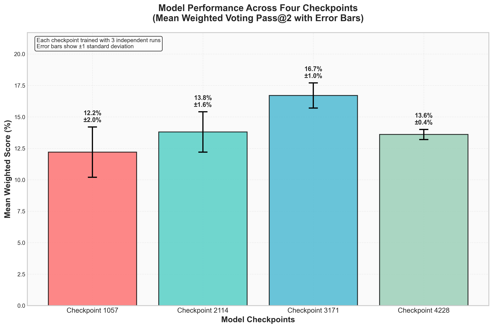

# Experiment Notes

Lewis Reminders:
- There are small differences between submission scoring and task based. 0.5%. Possibly it's due to the odd case of a duplicate program only being written once. Not clear though.
- Mathieu.
- Re incorrect programs:
  - 94.15% of programs are all incorrect.
  - 93.81% of non-transductive programs are all incorrect.
- "code" vs "program" in parquet vs hf.


---
## Aug 27

Key learnings:
- Can use 64 workers no problem for SGLang on Qwen with L4. Means we could do around 150 attempts in 5 hours.
- Possibly can do 16, maybe even 32 attempts in 5 hours on OSS. Probably 8 workers is ok, but not tested just yet.

### Inspect vllm metrics
Quickly test out the 20B OSS model on vllm running on tcp - 


### Compare vllm to sglang

Start a pod and run the task runner on arc-prize-2025 evaluation with --template vllm:

```bash
uv run python -m runpod.create_pod_and_run_tasks arc-prize-2024 Trelis/Qwen3-4B_ds-arc-agi-1-partial-100-c1542 --template vllm --subset evaluation --max-attempts 4 --max-workers 32
```
Dataset: arc-prize-2024
Subset: evaluation
Model: Trelis/Qwen3-4B_ds-arc-agi-1-partial-100-c1542
Total tasks: 400
Total time: 185.8s
Successful API calls: 400/400 (100.0%)
Total tokens used: 6,391,982
Total cost: $1.162664

📊 CORE METRICS:
  Pass@2 (Weighted Voting): 7.2% (7.2% excl. trans)
  Pass@2 (Train Majority):  7.2% (7.2% excl. trans)
  Oracle (Best Attempt):    7.2% (7.2% excl. trans)
  All Train Correct:        6.0% (6.0% excl. trans)
  Min 1 Train Correct:      13.8% (13.5% excl. trans)
  Min 1 Code Success:       100.0%
  Max Length Responses:     0.1%
  Timeout Responses:        0.0%
  API Failure Responses:    0.0%
All sampled programs saved to /Users/ronanmcgovern/TR/arc-agi-2025/llm_python/datasets/inference/20250827_151543_Trelis_Qwen3-4B_ds-arc-agi-1-partial-100-c1542_arc-prize-2024_evaluation.parquet

and start one with sglang as well:
```bash
uv run python -m runpod.create_pod_and_run_tasks arc-prize-2024 Trelis/Qwen3-4B_ds-arc-agi-1-partial-100-c1542 --template sglang --subset evaluation --max-attempts 4 --max-workers 32
```
Dataset: arc-prize-2024
Subset: evaluation
Model: Trelis/Qwen3-4B_ds-arc-agi-1-partial-100-c1542
Total tasks: 400
Total time: 201.6s
Successful API calls: 400/400 (100.0%)
Total tokens used: 6,392,530
Total cost: $1.162993

📊 CORE METRICS:
  Pass@2 (Weighted Voting): 6.0% (6.0% excl. trans)
  Pass@2 (Train Majority):  6.0% (6.0% excl. trans)
  Oracle (Best Attempt):    6.2% (6.2% excl. trans)
  All Train Correct:        4.5% (4.5% excl. trans)
  Min 1 Train Correct:      11.5% (10.8% excl. trans)
  Min 1 Code Success:       99.8%
  Max Length Responses:     0.1%
  Timeout Responses:        0.0%
  API Failure Responses:    0.0%


and try out two gpus with vllm:

```bash
uv run python -m runpod.create_pod_and_run_tasks arc-prize-2024 Trelis/Qwen3-4B_ds-arc-agi-1-partial-100-c1542 --template vllm --gpu-count 2 --subset evaluation --max-attempts 8 --max-workers 64
```
Dataset: arc-prize-2024
Subset: evaluation
Model: Trelis/Qwen3-4B_ds-arc-agi-1-partial-100-c1542
Total tasks: 400
Total time: 208.7s
Successful API calls: 400/400 (100.0%)
Total tokens used: 12,768,107
Total cost: $2.315815

📊 CORE METRICS:
  Pass@2 (Weighted Voting): 7.0% (7.0% excl. trans)
  Pass@2 (Train Majority):  6.5% (6.5% excl. trans)
  Oracle (Best Attempt):    7.8% (7.8% excl. trans)
  All Train Correct:        5.5% (5.5% excl. trans)
  Min 1 Train Correct:      15.0% (15.0% excl. trans)
  Min 1 Code Success:       100.0%
  Max Length Responses:     0.0%
  Timeout Responses:        0.0%
  API Failure Responses:    0.0%

and two with sglang:

```bash
uv run python -m runpod.create_pod_and_run_tasks arc-prize-2024 Trelis/Qwen3-4B_ds-arc-agi-1-partial-100-c1542 --template sglang --gpu-count 2 --subset evaluation --max-attempts 8 --max-workers 64
```
Dataset: arc-prize-2024
Subset: evaluation
Model: Trelis/Qwen3-4B_ds-arc-agi-1-partial-100-c1542
Total tasks: 400
Total time: 209.3s
Successful API calls: 400/400 (100.0%)
Total tokens used: 12,787,772
Total cost: $2.327614

📊 CORE METRICS:
  Pass@2 (Weighted Voting): 9.0% (9.0% excl. trans)
  Pass@2 (Train Majority):  9.0% (9.0% excl. trans)
  Oracle (Best Attempt):    9.2% (9.2% excl. trans)
  All Train Correct:        6.0% (6.0% excl. trans)
  Min 1 Train Correct:      15.8% (15.2% excl. trans)
  Min 1 Code Success:       100.0%
  Max Length Responses:     0.1%
  Timeout Responses:        0.0%
  API Failure Responses:    0.0%


## Aug 26

### Test metrics with vllm pod

We'll hit a qwen/qwen3-4b model with a vllm client and see if "reasoning" gets logged, we'll start a pod first with create_pod:

```bash
uv run python -m runpod.create_pod vllm Qwen/Qwen3-4B
```
now hit http://103.196.86.181:56252/v1 with 8 attempts and 32 workers and arc prize 2025 evaluation, just run tasks because we have the endpoint:
```bash
uv run python -m llm_python.run_arc_tasks_soar --dataset arc-prize-2025 --subset evaluation --unsafe-executor --base-url http://103.196.86.181:56252/v1 --max_workers 128 --max_attempts 64 --model Qwen/Qwen3-4B --max-tokens 32000
```
Seems I can even do 256 concurrent requests...

Let's now try the arc agi partial 100 model:
```bash
uv run python -m llm_python.run_arc_tasks_soar --dataset arc-prize-2025 --subset evaluation --unsafe-executor --base-url http://213.181.111.2:57538/v1 --max_workers 2 --max_attempts 16 --model Trelis/Qwen3-4B_ds-arc-agi-1-partial-100-c1542 --max-tokens 2000 --qwen-no-think
```

BIG issue, fp8 kv cache is not supported by vllm v1. And v0 does not support data parallel!

So let's hit an sglang endpoint - 157.157.221.29:43539:

```bash
uv run python -m llm_python.run_arc_tasks_soar --dataset arc-prize-2025 --subset evaluation --unsafe-executor --base-url http://157.157.221.29:43478/v1 --max_workers 2 --max_attempts 16 --model Trelis/Qwen3-4B_ds-arc-agi-1-partial-100-c1542 --max-tokens 2000 --qwen-no-think
```
Ok we can hit that on 157.157.221.29:43522:

```bash
uv run python -m llm_python.run_arc_tasks_soar --dataset arc-prize-2025 --subset evaluation --unsafe-executor --base-url http://157.157.221.29:43469/v1 --max_workers 64 --max_attempts 4 --model Trelis/Qwen3-4B_ds-arc-agi-1-partial-100-c1542 --max-tokens 2000 --qwen-no-think
```


### Test out an openai oss endpoint with sglang
Start a pod with openai/gpt-oss-20b:
```bash
uv run python -m runpod.create_pod sglang openai/gpt-oss-20b
```
we can now hit it on - 103.196.86.181:29850:
```bash
uv run python -m llm_python.run_arc_tasks_soar --dataset arc-prize-2025 --subset evaluation --unsafe-executor --base-url http://103.196.86.181:29850/v1 --max_workers 2 --max_attempts 16 --model openai/gpt-oss-20b --max-tokens 32000
```
This garbage because mxfp8 isn't supported yet...

### Test out an openai oss endpoint with vllm
Start a pod with openai/gpt-oss-20b:
```bash
uv run python -m runpod.create_pod vllm openai/gpt-oss-20b
```
we can now hit it on - 103.196.86.181:51416:
```bash
uv run python -m llm_python.run_arc_tasks_soar --dataset arc-prize-2025 --subset evaluation --unsafe-executor --base-url http://103.196.86.181:51416/v1 --max_workers 16 --max_attempts 4 --model openai/gpt-oss-20b --max-tokens 32000
```


### Generate data on arc-prize-2025 missing_1_solution subset

We'll use openrouter. Starting off with one attempt and 32 workers with o4-mini:

```bash
uv run python -m llm_python.run_arc_tasks_soar --dataset arc-prize-2025 --subset missing_1_solution --unsafe-executor --base-url https://openrouter.ai/api/v1 --max_workers 32 --max_attempts 1 --model gpt-5-mini --max-tokens 32000
```
Dataset: arc-prize-2025
Subset: missing_1_solution
Model: gpt-5-mini
Total tasks: 514
Total time: 1966.3s
Successful API calls: 514/514 (100.0%)
Total tokens used: 5,898,802
Total cost: $7.614638

📊 CORE METRICS:
  Pass@2 (Weighted Voting): 9.7% (5.1% excl. trans)
  Pass@2 (Train Majority):  9.7% (5.1% excl. trans)
  Oracle (Best Attempt):    9.7% (5.1% excl. trans)
  All Train Correct:        8.8% (5.1% excl. trans)
  Min 1 Train Correct:      26.1% (12.5% excl. trans)
  Min 1 Code Success:       95.9%
  Max Length Responses:     0.0%
  Timeout Responses:        0.0%
  API Failure Responses:    0.0%

and then run with gpt-5-nano:

```bash
uv run python -m llm_python.run_arc_tasks_soar --dataset arc-prize-2025 --subset missing_1_solution --unsafe-executor --base-url https://openrouter.ai/api/v1 --max_workers 32 --max_attempts 1 --model gpt-5-nano --max-tokens 32000
```
Dataset: arc-prize-2025
Subset: missing_1_solution
Model: gpt-5-nano
Total tasks: 514
Total time: 1864.8s
Successful API calls: 514/514 (100.0%)
Total tokens used: 9,248,435
Total cost: $2.865717

📊 CORE METRICS:
  Pass@2 (Weighted Voting): 1.9% (1.6% excl. trans)
  Pass@2 (Train Majority):  1.9% (1.6% excl. trans)
  Oracle (Best Attempt):    1.9% (1.6% excl. trans)
  All Train Correct:        2.7% (1.6% excl. trans)
  Min 1 Train Correct:      15.2% (10.1% excl. trans)
  Min 1 Code Success:       96.7%
  Max Length Responses:     0.0%
  Timeout Responses:        0.0%
  API Failure Responses:    0.0%

So the conclusion is to run with 8 attempts on gpt-5-mini:
```bash
uv run python -m llm_python.run_arc_tasks_soar --dataset arc-prize-2025 --subset missing_1_solution --unsafe-executor --base-url https://openrouter.ai/api/v1 --max_workers 32 --max_attempts 8 --model gpt-5-mini --max-tokens 32000
```
Dataset: arc-prize-2025
Subset: missing_1_solution
Model: gpt-5-mini
Total tasks: 514
Total time: 16896.8s
Successful API calls: 514/514 (100.0%)
Total tokens used: 47,077,808
Total cost: $60.688614

📊 CORE METRICS:
  Pass@2 (Weighted Voting): 20.2% (15.4% excl. trans)
  Pass@2 (Train Majority):  19.1% (15.2% excl. trans)
  Oracle (Best Attempt):    25.9% (16.0% excl. trans)
  All Train Correct:        24.5% (15.0% excl. trans)
  Min 1 Train Correct:      51.2% (36.2% excl. trans)
  Min 1 Code Success:       100.0%
  Max Length Responses:     0.0%
  Timeout Responses:        0.0%
  API Failure Responses:    0.0%
✅ Checkpointed 3945 programs to /Users/ronanmcgovern/TR/arc-agi-2025/llm_python/datasets/inference/20250826_224143_gpt-5-mini_arc-prize-2025_missing_1_solution.parquet
All sampled programs saved to /Users/ronanmcgovern/TR/arc-agi-2025/llm_python/datasets/inference/20250826_224143_gpt-5-mini_arc-prize-2025_missing_1_solution.parquet


### TTT Run with 64 attempts either side of the arc-agi-1-partial-100 model

Before TTT:
Dataset: arc-prize-2025
Subset: evaluation
Model: Trelis/Qwen3-4B_ds-arc-agi-1-partial-100-c1542
Total tasks processed: 120
Total time: 1650.7s
Successful API calls: 120/120 (100.0%)
Total tokens used: 46,468,497
Total cost: $8.106592

📊 RESPONSE METRICS:
  Total responses: 7663
  Code extracted: 7661/7663 (100.0%)
  Max length responses: 2/7663 (0.0%)
  Timeout responses: 0/7663 (0.0%)
  API failure responses: 0/7663 (0.0%)

📊 TRAIN METRICS:
  All train correct: 0/120 (0.0%)
  Min 1 train correct: 3/120 (2.5%)

After TTT:
📊 RESPONSE METRICS:
  Total responses: 7662
  Code extracted: 7619/7662 (99.4%)
  Max length responses: 44/7662 (0.6%)
  Timeout responses: 0/7662 (0.0%)
  API failure responses: 0/7662 (0.0%)

📊 TRAIN METRICS:
  All train correct: 0/120 (0.0%)
  Min 1 train correct: 6/120 (5.0%)

============================================================
SUBMISSION SCORING RESULTS
============================================================
Dataset: arc-prize-2025
Subset: evaluation
Reference tasks: 120
Tasks scored: 120
Total predictions: 344

📊 PREDICTION-LEVEL METRICS:
  Pass@1 (first attempt): 1/344 (0.3%)
  Pass@2 (either attempt): 1/344 (0.3%)

📊 TASK-LEVEL METRICS:
  Tasks Pass@1 (all outputs correct on first attempt): 1/120 (0.8%)
  Tasks Pass@2 (all outputs correct on either attempt): 1/120 (0.8%)

### Check torch.distributed.run works on 4xL4.
- adjust grad accum to 32 for kaggle.
- test with 4xL4.

Quite a tedious process:
1. Use torch.distributed.run:
```python
          import os
          os.environ["UNSLOTH_DISABLE_RL_PATCH"] = "1"

          # Step 2: Run the actual fine-tuning
          log_and_print("🚀 Starting fine-tuning...", f)
          fine_tuning_cmd = [
                "uv", "run", "-u", "torchrun",
                f"--nproc_per_node={num_gpus}",
                "-m", "llm_python.fine-tuning.unsloth_arc_finetuning_soar",
                "--config", "llm_python/fine-tuning/config.yaml",
          ]
```
2. Turn off Unsloth RL patches - see above.
3. Import the accelerator AND set the device map:
```python
from accelerate import Accelerator
accel = Accelerator()

local_rank = int(os.environ.get("LOCAL_RANK", 0))
torch.cuda.set_device(local_rank)

device_map = {"": accel.local_process_index}  # one GPU per rank

model, tokenizer = FastLanguageModel.from_pretrained(
    model_name = model_slug,
    max_seq_length = model_max_length,
    device_map=device_map,
)
```
4. Wrap the saving of the model:
```python
# --- sync everyone before saving/merging ---
accel.wait_for_everyone()

# --- save / merge / push (only rank 0) ---
if accel.is_main_process:
    
    if execution_mode == "final_only":
        print("🔧 Final-only mode: Only processing the last checkpoint")
        ...

# final barrier so workers don’t exit early if they rely on files
accel.wait_for_everyone()
```
5. Use `with accel.main_process_first():` for downloads and data. It gets the first rank to do it and then other ranks grab the cache.
Typical use:
- load_dataset(...) the first time (so only rank-0 hits the network).
- .map(...) / .filter(...) that write a cache (load_from_cache_file=True).

6. Add in accel.print instead of print statements.
```python
accel.print(f"🔍 {self.name} - {self.description}")
```

7. Turn off reentrancy on gradient checkpointing:
```python
        gradient_checkpointing=True,
        gradient_checkpointing_kwargs={"use_reentrant": False}
```

8. You only want wandb on the main process:
```python
if not accel.is_main_process
    os.environ["WANDB_DISABLED"] = "true"
elif not is_kaggle:
    import wandb

    # 1. Log in (will prompt for your API key in notebook)
    wandb.login()

    # 2. Initialize a run and set the project
    wandb.init(
        project="arc-agi-2025",   # set your project name
        entity="trelis",  # optional: your W&B username or team
        name=run_name  # optional: custom run name
    )
```

9. Set `ddp_find_unused_parameters=False` in the SFTTrainer config.


### Check for bools in the dataset
Confirming no bools in parquet files or hf dataset: Trelis/arc-agi-1-partial-100

## Aug 25

### Daily Summary

Completed:
- TTT working now end to end, with two major bugs and one minor bug to resolve.
- Overnight submission started with 256 attempts either side on the Qwen3-4B_ds-arc-agi-2-perfect-50-c970 model with TTT. Inference is bounded to 5 hours max on either side. Note that the run may fail due to issues above.

Research Notes:
- GPT-OSS 120B is weak on arc agi 2 and gets 0.8% weighted pass@2, min 1 train is only 5% (1.7% for the 20B model) - not obvious this model could help with generating partials at test time. Perhaps with fine-tuning? Probably is too big to fine-tune at inference time but may be a good generator.
- Prelim results on arc-agi-2024-partial-100 model indicate that there are very few partials generated (only 7 tasks have partials on arc agi 2 with 64 attempts), making it hard for TTT to help. Unfortunately the second inference had significant issues.
- Prelim results on arc-agi-2024-partial-100 model, allowing up to 4 incorrrect programs per task for ttt indicate 7/120 tasks had partials before TTT but only 4 had partials after TTT, suggesting degradation (but low confidence given errors seen).

Key issues to resolve:
1. MAJOR: On certain inference runs the server appears not to be timing out requests at 300 s (or perhaps the client side is failing) - this causes inference to hang and not to complete - it is hard to reproduce:
```bash
⏳ No completions in last 15s — 7679/7680 done; 1 remaining (timeout in 9042s)
⏳ No completions in last 15s — 7679/7680 done; 1 remaining (timeout in 9027s)
```
2. BOOLs are appearing in output grids, which is not expected, especially at the point of writing to parquet OR of generating submissions because these grids should have been filtered by validation:
```bash
DataFrame validation failed: Format validation:
    Total programs: 4502
    Schema valid: FAIL
    Business logic valid: PASS
    Issues: 0
    Schema error: Schema validation failed: ('Expected integer, got bool', 'Conversion failed for column predicted_train_output with type object')
```
3. Minor - there is a small descrepancy in weighted train correct (and possibly other metrics) around <0.5% pts between task-based scoring during the run AND scoring of the final submission file. A low-confidence guess is that this is due to duplicate (string-match) programs only being logged once -UPDATE THIS CANNOT BE AN ISSUE AS WE DON'T DO DE-DUPLICATION.
4. Minor - fine-tuning has not yet been tested using all four gpus, it currently uses only 1. Further fine-tuning has not been tested on 4xL4 (or Kaggle) with batch size 1 and longer sequences (tests today worked because the long ones were on H200 or there were so few TTT samples generated that the batch size had short completions and was small - note that batch size is now auto set to 1 on kaggle).

### Splitter Mode

Change this in prompt_utils.py:
```python
    # Add training examples - ONLY USE FIRST EXAMPLE
    for i, example in enumerate(task_data['train'][:1], 1):  # Only process first training example
```

Running this in the splitter branch where we only feed the first example:
```bash
uv run python -m llm_python.run_arc_tasks_soar --dataset arc-prize-2025 --subset evaluation --unsafe-executor --base-url https://openrouter.ai/api/v1 --max_workers 16 --max_attempts 1 --model openai/gpt-oss-20b --qwen-no-think --max-tokens 32000
```
Dataset: arc-prize-2025
Subset: evaluation
Model: openai/gpt-oss-20b
Total tasks: 120
Total time: 855.8s
Successful API calls: 120/120 (100.0%)
Total tokens used: 534,296
Total cost: $0.255645

📊 CORE METRICS:
  Pass@2 (Weighted Voting): 0.8% (0.8% excl. trans)
  Pass@2 (Train Majority):  0.8% (0.8% excl. trans)
  Oracle (Best Attempt):    0.8% (0.8% excl. trans)
  All Train Correct:        1.7% (1.7% excl. trans)
  Min 1 Train Correct:      4.2% (4.2% excl. trans)
  Min 1 Code Success:       29.2%
  Max Length Responses:     0.0%
  Timeout Responses:        0.0%
  API Failure Responses:    0.0%
and repeat with 8 attempts:
```bash
uv run python -m llm_python.run_arc_tasks_soar --dataset arc-prize-2025 --subset evaluation --unsafe-executor --base-url https://openrouter.ai/api/v1 --max_workers 16 --max_attempts 8 --model openai/gpt-oss-20b --qwen-no-think --max-tokens 32000
```
Dataset: arc-prize-2025
Subset: evaluation
Model: openai/gpt-oss-20b
Total tasks: 120
Total time: 4866.3s
Successful API calls: 120/120 (100.0%)
Total tokens used: 5,550,144
Total cost: $2.690747

📊 CORE METRICS:
  Pass@2 (Weighted Voting): 2.5% (2.5% excl. trans)
  Pass@2 (Train Majority):  2.5% (2.5% excl. trans)
  Oracle (Best Attempt):    2.5% (2.5% excl. trans)
  All Train Correct:        3.3% (3.3% excl. trans)
  Min 1 Train Correct:      20.0% (16.7% excl. trans)
  Min 1 Code Success:       95.0%
  Max Length Responses:     0.6%
  Timeout Responses:        0.0%
  API Failure Responses:    0.0%

### Test of OSS on ARC AGI 2025 Evaluation using open router, single attempt, 16 workers, 32000 max tokens.

```bash
uv run python -m llm_python.run_arc_tasks_soar --dataset arc-prize-2025 --subset evaluation --unsafe-executor --base-url https://openrouter.ai/api/v1 --max_workers 16 --max_attempts 8 --model openai/gpt-oss-20b --qwen-no-think --max-tokens 32000
```
  Pass@2 (Weighted Voting): 0.0% (0.0% excl. trans)
  Pass@2 (Train Majority):  0.0% (0.0% excl. trans)
  Oracle (Best Attempt):    0.0% (0.0% excl. trans)
  All Train Correct:        0.8% (0.8% excl. trans)
  Min 1 Train Correct:      1.7% (1.7% excl. trans)
  Min 1 Code Success:       15.8%
  Max Length Responses:     3.3%
  Timeout Responses:        0.0%
  API Failure Responses:    0.0%

So, OSS struggles, let's try the 120B model:
```bash
uv run python -m llm_python.run_arc_tasks_soar --dataset arc-prize-2025 --subset evaluation --unsafe-executor --base-url https://openrouter.ai/api/v1 --max_workers 16 --max_attempts 1 --model openai/gpt-oss-120b --qwen-no-think --max-tokens 32000
```
Dataset: arc-prize-2025
Subset: evaluation
Model: openai/gpt-oss-120b
Total tasks: 120
Total time: 365.1s
Successful API calls: 120/120 (100.0%)
Total tokens used: 1,323,116
Total cost: $0.513246

📊 CORE METRICS:
  Pass@2 (Weighted Voting): 0.8% (0.8% excl. trans)
  Pass@2 (Train Majority):  0.8% (0.8% excl. trans)
  Oracle (Best Attempt):    0.8% (0.8% excl. trans)
  All Train Correct:        1.7% (1.7% excl. trans)
  Min 1 Train Correct:      5.0% (5.0% excl. trans)
  Min 1 Code Success:       76.7%
  Max Length Responses:     0.0%
  Timeout Responses:        0.0%
  API Failure Responses:    0.0%


## Parquet testing
Start upu a pod with the latest qwen model - just create_pod:
```bash
uv run runpod/create_pod.py sglang -- --model-path Trelis/Qwen3-4B_ds-arc-agi-1-partial-100-c1542
```
Then run the tasks:
```bash
uv run python -m llm_python.run_arc_tasks_soar --dataset arc-prize-2024 --subset evaluation --unsafe-executor --base-url http://103.196.86.37:16147/v1/ --max_workers 16 --max_attempts 8 --model Trelis/Qwen3-4B_ds-arc-agi-1-partial-100-c1542 --qwen-no-think --max-tokens 2000
```


and then check the parquet file for how many all train correct programs there are:


And then run a check on gpt-oss for limit 4:
```bash
uv run python -m llm_python.run_arc_tasks_soar --dataset arc-prize-2024 --subset evaluation --unsafe-executor --base-url https://openrouter.ai/api/v1 --max_workers 32 --max_attempts 4 --model openai/gpt-oss-20b --qwen-no-think --max-tokens 32000 --limit 4
```
Dataset: arc-prize-2024
Subset: evaluation
Model: openai/gpt-oss-20b
Total tasks: 4
Total time: 141.7s
Successful API calls: 4/4 (100.0%)
Total tokens used: 100,239
Total cost: $0.051365

📊 CORE METRICS:
  Pass@2 (Weighted Voting): 75.0% (75.0% excl. trans)
  Pass@2 (Train Majority):  75.0% (75.0% excl. trans)
  Oracle (Best Attempt):    75.0% (75.0% excl. trans)
  All Train Correct:        75.0% (75.0% excl. trans)
  Min 1 Train Correct:      100.0% (75.0% excl. trans)
  Min 1 Code Success:       100.0%
  Max Length Responses:     0.0%
  Timeout Responses:        0.0%
  API Failure Responses:    0.0%

✅ Successfully wrote 9 programs to /Users/ronanmcgovern/TR/arc-agi-2025/llm_python/datasets/inference/20250825_102832_openai_gpt-oss-20b_arc-prize-2024_evaluation.parquet
All sampled programs saved to /Users/ronanmcgovern/TR/arc-agi-2025/llm_python/datasets/inference/20250825_102832_openai_gpt-oss-20b_arc-prize-2024_evaluation.parquet

Run with more limit:
```bash
uv run python -m llm_python.run_arc_tasks_soar --dataset arc-prize-2024 --subset evaluation --unsafe-executor --base-url https://openrouter.ai/api/v1 --max_workers 32 --max_attempts 4 --model openai/gpt-oss-20b --qwen-no-think --max-tokens 32000 --limit 20
```


## Aug 24

### Allow fine-tuning from most recent parquet file

### Allow submission file generation from up to last two parquet files

Understand why proper attempts are not logging:
```bash
uv run python -m llm_python.run_arc_tasks_soar --dataset arc-prize-2024 --subset evaluation --max_workers 32 --max_attempts 1 --model openai/gpt-oss-20b --base-url https://openrouter.ai/api/v1 --unsafe-executor --max-tokens 32000 --limit 4
```
seems to log fine to db...

now try qwen:
```bash
uv run runpod/create_pod_and_run_tasks.py arc-prize-2024 "Trelis/Qwen3-4B_ds-arc-agi-1-partial-100-c1542" --max-attempts 8 --subset evaluation
```
Dataset: arc-prize-2024
Subset: evaluation
Model: Trelis/Qwen3-4B_ds-arc-agi-1-partial-100-c1542
Total tasks: 400
Total time: 377.9s
Successful API calls: 400/400 (100.0%)
Total tokens used: 12,761,169
Total cost: $2.311652

📊 CORE METRICS:
  Pass@2 (Weighted Voting): 8.5% (8.2% excl. trans)
  Pass@2 (Train Majority):  8.2% (8.2% excl. trans)
  Oracle (Best Attempt):    9.0% (8.8% excl. trans)
  All Train Correct:        6.2% (6.2% excl. trans)
  Min 1 Train Correct:      18.5% (18.0% excl. trans)
  Min 1 Code Success:       100.0%
  Max Length Responses:     0.1%
  Timeout Responses:        0.0%
  API Failure Responses:    0.0%

and then run (and hardcode to just 100 limit in the background):
```bash
uv run runpod/create_pod_and_run_tasks.py arc-prize-2024 "Trelis/Qwen3-4B_ds-arc-agi-1-partial-100-c1542" --max-attempts 8 --subset evaluation
```

### Test out how many responses are incomplete and saved to db.

Run the partial 100 epoch 2 model with 8 attempts:
```bash
uv run runpod/create_pod_and_run_tasks.py arc-prize-2024 "Trelis/Qwen3-4B_ds-arc-agi-1-partial-100-c1542" --max-attempts 8 --subset evaluation
```
Dataset: arc-prize-2024
Subset: evaluation
Model: Trelis/Qwen3-4B_ds-arc-agi-1-partial-100-c1542
Total tasks: 400
Total time: 392.0s
Successful API calls: 400/400 (100.0%)
Total tokens used: 12,790,205
Total cost: $2.329073

📊 CORE METRICS:
  Pass@2 (Weighted Voting): 8.0% (7.5% excl. trans)
  Pass@2 (Train Majority):  8.0% (7.5% excl. trans)
  Oracle (Best Attempt):    9.0% (8.5% excl. trans)
  All Train Correct:        6.5% (6.2% excl. trans)
  Min 1 Train Correct:      16.5% (15.0% excl. trans)
  Min 1 Code Success:       100.0%
  Max Length Responses:     0.1%
  Timeout Responses:        0.0%
  API Failure Responses:    0.0%
  
or do a quick run with 120B OSS and openrouter, no pod creation needed - just to see transductive performance:
```bash
uv run python -m llm_python.run_arc_tasks_soar --dataset arc-prize-2024 --subset evaluation --max_workers 32 --max_attempts 4 --model openai/gpt-oss-20b --base-url https://openrouter.ai/api/v1 --unsafe-executor --max-tokens 32000
```
Dataset: arc-prize-2024
Subset: evaluation
Model: openai/gpt-oss-20b
Total tasks: 400
Total time: 4261.9s
Successful API calls: 400/400 (100.0%)
Total tokens used: 8,743,014
Total cost: $4.242328

📊 CORE METRICS:
  Pass@2 (Weighted Voting): 31.2% (27.8% excl. trans)
  Pass@2 (Train Majority):  30.2% (27.5% excl. trans)
  Oracle (Best Attempt):    31.2% (27.8% excl. trans)
  All Train Correct:        31.5% (28.0% excl. trans)
  Min 1 Train Correct:      38.2% (34.0% excl. trans)
  Min 1 Code Success:       67.2%
  Max Length Responses:     1.8%
  Timeout Responses:        0.0%
  API Failure Responses:    0.0%
All sampled programs saved to /Users/ronanmcgovern/TR/arc-agi-2025/llm_python/datasets/inference/20250824_164149_openai_gpt-oss-20b_arc-prize-2024_evaluation.parquet


## Aug 22

### Does transductive filtering help?

Run with the transductive flag set to false:
```bash
export ARC_PROGRAMS_DB=./llm_python/programsdb/local-trans-off.db
uv run runpod/create_pod_and_run_tasks.py arc-prize-2024 "Trelis/Qwen3-4B_ds-arc-agi-1-partial-100-c1542" --max-attempts 8 --subset evaluation --no-transductive-penalty
```
Dataset: arc-prize-2024
Subset: evaluation
Model: Trelis/Qwen3-4B_ds-arc-agi-1-partial-100-c1542
Total tasks: 400
Total time: 381.5s
Successful API calls: 400/400 (100.0%)
Total tokens used: 12,772,224
Total cost: $2.318285

📊 CORE METRICS:
  Pass@2 (Weighted Voting): 8.0%
  Pass@2 (Train Majority):  7.8%
  Oracle (Best Attempt):    9.2%
  All Train Correct:        5.5%
  Min 1 Train Correct:      15.2%
  Min 1 Code Success:       100.0%
  Max Length Responses:     0.1%
  Timeout Responses:        0.0%
  API Failure Responses:    0.0%

and then with 64 attempts:
```bash
export ARC_PROGRAMS_DB=./llm_python/programsdb/local-trans-off.db
uv run runpod/create_pod_and_run_tasks.py arc-prize-2024 "Trelis/Qwen3-4B_ds-arc-agi-1-partial-100-c1542" --max-attempts 64 --max-workers 16 --subset evaluation --no-transductive-penalty
```
Dataset: arc-prize-2024
Subset: evaluation
Model: Trelis/Qwen3-4B_ds-arc-agi-1-partial-100-c1542
Total tasks: 400
Total time: 4742.7s
Successful API calls: 400/400 (100.0%)
Total tokens used: 102,196,139
Total cost: $18.557287

📊 CORE METRICS:
  Pass@2 (Weighted Voting): 14.5%
  Pass@2 (Train Majority):  14.0%
  Oracle (Best Attempt):    19.0%
  All Train Correct:        13.2%
  Min 1 Train Correct:      30.5%
  Min 1 Code Success:       100.0%
  Max Length Responses:     0.0%
  Timeout Responses:        0.0%
  API Failure Responses:    0.0%

### Run the partial 100 arc agi 1
Trelis/Qwen3-4B_ds-arc-agi-1-partial-100-c1542

```bash
export ARC_PROGRAMS_DB=./llm_python/programsdb/local.db
uv run runpod/create_pod_and_run_tasks.py arc-prize-2024 "Trelis/Qwen3-4B_ds-arc-agi-1-partial-100-c1542" --max-attempts 8 --subset evaluation
```
Dataset: arc-prize-2024
Subset: evaluation
Model: Trelis/Qwen3-4B_ds-arc-agi-1-partial-100-c1542
Total tasks: 400
Total time: 447.3s
Successful API calls: 400/400 (100.0%)
Total tokens used: 12,773,548
Total cost: $2.319079

📊 CORE METRICS:
  Pass@2 (Weighted Voting): 7.2%
  Pass@2 (Train Majority):  7.0%
  Oracle (Best Attempt):    8.5%
  All Train Correct:        6.0%
  Min 1 Train Correct:      14.2%
  Min 1 Code Success:       100.0%
  Max Length Responses:     0.0%
  Timeout Responses:        0.0%
  API Failure Responses:    0.0%

and then 64 attempts:
```bash
export ARC_PROGRAMS_DB=./llm_python/programsdb/local.db
uv run runpod/create_pod_and_run_tasks.py arc-prize-2024 "Trelis/Qwen3-4B_ds-arc-agi-1-partial-100-c1542" --max-attempts 64 --subset evaluation
```

and try out the 1 epoch checkpoint - Trelis/Qwen3-4B_ds-arc-agi-1-partial-100-c771:
```bash
export ARC_PROGRAMS_DB=./llm_python/programsdb/local-partial-100-1-epoch.db
uv run runpod/create_pod_and_run_tasks.py arc-prize-2024 "Trelis/Qwen3-4B_ds-arc-agi-1-partial-100-c771" --max-attempts 64 --subset evaluation
```
Dataset: arc-prize-2024
Subset: evaluation
Model: Trelis/Qwen3-4B_ds-arc-agi-1-partial-100-c771
Total tasks: 400
Total time: 10725.4s
Successful API calls: 400/400 (100.0%)
Total tokens used: 102,298,291
Total cost: $18.639814

📊 CORE METRICS:
  Pass@2 (Weighted Voting): 15.8%
  Pass@2 (Train Majority):  15.8%
  Oracle (Best Attempt):    19.2%
  All Train Correct:        13.0%
  Min 1 Train Correct:      33.8%
  Min 1 Code Success:       100.0%
  Max Length Responses:     0.1%
  Timeout Responses:        0.0%
  API Failure Responses:    0.0%


### TTT
[x] Clean up the ipynb notebook.
[x] Allow for ipynb notebook conversion - how to do this? how to pass in values?!?
[x] Get working in Runpod on H200.
  [x] Get an sglang server up and running and do a test inference.
[x] Parquet loading.
  [x] Parquet generation from duckdb. How to do that? Ask Lewis.
  [x] Load with huggingface from local (default to kaggle/working if in kaggle).
[x] Simplify all of the env variables being set.
[ ] Thread everything together.

[ ] Get working in kaggle
  [ ] Qwen tuned needs to be available
  [ ] Read in from parquet file

### Baseline classifier performance

Now using (1-transductive confidence)^2 as penalty on voting.

Start a pod and run 64 attempts on arc agi 1 eval dataset with Trelis/Qwen3-4B_ds-arc-agi-1-perfect-50-c642.
```bash
export ARC_PROGRAMS_DB=./llm_python/programsdb/local-test-baseline-classifier.db
uv run runpod/create_pod_and_run_tasks.py arc-prize-2024 "Trelis/Qwen3-4B_ds-arc-agi-1-perfect-50-c642" --max-attempts 64 --subset evaluation
```
Dataset: arc-prize-2024
Subset: evaluation
Model: Trelis/Qwen3-4B_ds-arc-agi-1-perfect-50-c642
Total tasks: 400
Total time: 3142.6s
Successful API calls: 400/400 (100.0%)
Total tokens used: 102,899,416
Total cost: $18.979253

📊 CORE METRICS:
  Pass@2 (Weighted Voting): 14.2%
  Pass@2 (Train Majority):  14.5%
  Oracle (Best Attempt):    16.0%
  All Train Correct:        11.2%
  Min 1 Train Correct:      28.7%
  Min 1 Code Success:       100.0%
  Max Length Responses:     0.2%
  Timeout Responses:        0.0%
  API Failure Responses:    0.0%

```bash
export ARC_PROGRAMS_DB=./llm_python/programsdb/local-test-baseline-classifier.db
uv run runpod/create_pod_and_run_tasks.py arc-prize-2024 "Trelis/Qwen3-4B_ds-arc-agi-1-perfect-50-c642" --max-attempts 8 --subset evaluation
```
Dataset: arc-prize-2024
Subset: evaluation
Model: Trelis/Qwen3-4B_ds-arc-agi-1-perfect-50-c642
Total tasks: 400
Total time: 415.4s
Successful API calls: 400/400 (100.0%)
Total tokens used: 12,870,145
Total cost: $2.377037

📊 CORE METRICS:
  Pass@2 (Weighted Voting): 7.2%
  Pass@2 (Train Majority):  7.2%
  Oracle (Best Attempt):    8.0%
  All Train Correct:        5.8%
  Min 1 Train Correct:      13.2%
  Min 1 Code Success:       100.0%
  Max Length Responses:     0.2%
  Timeout Responses:        0.0%
  API Failure Responses:    0.0%

And re-run with the better classifier now 8 attempts on arc agi 1 eval dataset with Trelis/Qwen3-4B_ds-arc-agi-1-perfect-50-c642.
```bash
export ARC_PROGRAMS_DB=./llm_python/programsdb/local-test-improved-classifier.db
uv run runpod/create_pod_and_run_tasks.py arc-prize-2024 "Trelis/Qwen3-4B_ds-arc-agi-1-perfect-50-c642" --max-attempts 8 --subset evaluation
```
Dataset: arc-prize-2024
Subset: evaluation
Model: Trelis/Qwen3-4B_ds-arc-agi-1-perfect-50-c642
Total tasks: 400
Total time: 405.5s
Successful API calls: 400/400 (100.0%)
Total tokens used: 12,844,368
Total cost: $2.361571

📊 CORE METRICS:
  Pass@2 (Weighted Voting): 5.8%
  Pass@2 (Train Majority):  5.5%
  Oracle (Best Attempt):    6.8%
  All Train Correct:        4.5%
  Min 1 Train Correct:      13.0%
  Min 1 Code Success:       100.0%
  Max Length Responses:     0.1%
  Timeout Responses:        0.0%
  API Failure Responses:    0.0%

and then 64 attempts:
```bash
export ARC_PROGRAMS_DB=./llm_python/programsdb/local-test-improved-classifier.db
uv run runpod/create_pod_and_run_tasks.py arc-prize-2024 "Trelis/Qwen3-4B_ds-arc-agi-1-perfect-50-c642" --max-attempts 64 --subset evaluation
```
Dataset: arc-prize-2024
Subset: evaluation
Model: Trelis/Qwen3-4B_ds-arc-agi-1-perfect-50-c642
Total tasks: 400
Total time: 3946.7s
Successful API calls: 400/400 (100.0%)
Total tokens used: 102,878,629
Total cost: $18.966781

📊 CORE METRICS:
  Pass@2 (Weighted Voting): 14.8%
  Pass@2 (Train Majority):  14.5%
  Oracle (Best Attempt):    16.5%
  All Train Correct:        12.2%
  Min 1 Train Correct:      28.0%
  Min 1 Code Success:       100.0%
  Max Length Responses:     0.2%
  Timeout Responses:        0.0%
  API Failure Responses:    0.0%

### ARC AGI 1 Perfect 50 Program inspection

1. There are redundant functions appended for printing or doing checks. These could be removed.
2. The longest program is ~1400 tokens long, so 2k tokens as a max-tokens is probably good.
3. There are some similar programs, but the diversity is not bad.

Next step is to inspect partials.

## Aug 21

### Testing prompt optimisation

We'll start by running 64 attempts on Qwen 3 base model, starting a pod and running arc agi 1 eval:
```bash
export ARC_PROGRAMS_DB=./llm_python/programsdb/local-test-prompt-optimisation.db
uv run runpod/create_pod_and_run_tasks.py arc-prize-2024 "Qwen/Qwen3-4B" --max-attempts 64 --subset training
```

and then run the same with an optimised prompt:
```bash
export ARC_PROGRAMS_DB=./llm_python/programsdb/local-test-prompt-optimisation-IMPROVED.db
uv run runpod/create_pod_and_run_tasks.py arc-prize-2024 "Qwen/Qwen3-4B" --max-attempts 64 --subset training
```


```markdown
You are an AI assistant specialized in solving Abstract Reasoning Corpus (ARC-AGI) tasks by generating Python code.
Your goal is to analyze input-output grid pairs. The outputs were produced by applying a transformation rule to the inputs. Implement the transformation rules as a Python function.
You should only write the implemented the transformation in code.
You must write code in triple backticks (```python and then ```). You must write a function called 'transform' which takes a single argument, the input grid as 'list[list[int]]', and returns the transformed grid (also as 'list[list[int]]').
Your solution must work correctly for ALL training input-output pairs provided, not just some of them. Create a general algorithmic solution that captures the complete transformation rule - avoid hardcoded values or patterns that only work for specific cases. The algorithm should generalize to work on any test input following the same underlying rule.
The number in the input grid can be mapped to the following colors: 0:Black; 1:Blue; 2:Red; 3:Green; 4:Yellow; 5:Grey; 6:Pink; 7:Orange; 8:Purple; 9:Brown
Now, solve the following ARC-AGI task:
# Task to solve:
{task_content} 
```

Results:
⏺ Task Success Analysis (54 common tasks):

  Base DB:
  - a) At least one attempt all correct (test + train): 16 tasks (29.6%)
  - b) All train correct: 17 tasks (31.5%)
  - c) At least one train correct: 53 tasks (98.1%)

  Improved DB:
  - a) At least one attempt all correct (test + train): 16 tasks (29.6%)
  - b) All train correct: 18 tasks (33.3%)
  - c) At least one train correct: 52 tasks (96.3%)

Transductive Attempts Analysis:
- Base DB: 49 transductive attempts out of 440 total programs (11.14%)
- Improved DB: 52 transductive attempts out of 600 total programs (8.67%)

Run again with 8 attempts:
```bash
export ARC_PROGRAMS_DB=./llm_python/programsdb/local-test-prompt-optimisation-8.db
uv run runpod/create_pod_and_run_tasks.py arc-prize-2024 "Qwen/Qwen3-4B" --max-attempts 8 --subset training
```
Dataset: arc-prize-2024
Subset: training
Model: Qwen/Qwen3-4B
Total tasks: 400
Total time: 430.3s
Successful API calls: 400/400 (100.0%)
Total tokens used: 8,726,021
Total cost: $1.788296

📊 CORE METRICS:
  Pass@2 (Weighted Voting): 4.2%
  Pass@2 (Train Majority):  3.5%
  Oracle (Best Attempt):    4.8%
  All Train Correct:        2.8%
  Min 1 Train Correct:      7.8%
  Min 1 Code Success:       100.0%
  Max Length Responses:     6.0%
  Timeout Responses:        0.0%
  API Failure Responses:    0.0%
and then run the same with an optimised prompt:
```bash
export ARC_PROGRAMS_DB=./llm_python/programsdb/local-test-prompt-optimisation-IMPROVED-8.db
uv run runpod/create_pod_and_run_tasks.py arc-prize-2024 "Qwen/Qwen3-4B" --max-attempts 8 --subset training
```
Dataset: arc-prize-2024
Subset: training
Model: Qwen/Qwen3-4B
Total tasks: 400
Total time: 429.4s
Successful API calls: 400/400 (100.0%)
Total tokens used: 8,717,469
Total cost: $1.783165

📊 CORE METRICS:
  Pass@2 (Weighted Voting): 4.2%
  Pass@2 (Train Majority):  4.0%
  Oracle (Best Attempt):    4.5%
  All Train Correct:        2.8%
  Min 1 Train Correct:      8.5%
  Min 1 Code Success:       100.0%
  Max Length Responses:     5.8%
  Timeout Responses:        0.0%
  API Failure Responses:    0.0%

WARNING ACTUALLY THE TWO ABOVE WERE RUN ON THE SAME PROMPT! So this is not showing anything.
  Base 8-attempt DB:
  - Total tasks: 35
  - Tasks with at least one transductive attempt: 3 (8.6%)
  - Total transductive attempts: 6 out of 99 total attempts (6.1%)

  Repeat! 8-attempt DB:
  - Total tasks: 36
  - Tasks with at least one transductive attempt: 4 (11.1%)
  - Total transductive attempts: 7 out of 97 total attempts (7.2%)

I need to run once more, witha  new db:
```bash
export ARC_PROGRAMS_DB=./llm_python/programsdb/local-test-prompt-optimisation-IMPROVED-8-2.db
uv run runpod/create_pod_and_run_tasks.py arc-prize-2024 "Qwen/Qwen3-4B" --max-attempts 8 --subset training
```
Dataset: arc-prize-2024
Subset: training
Model: Qwen/Qwen3-4B
Total tasks: 400
Total time: 1086.5s
Successful API calls: 400/400 (100.0%)
Total tokens used: 9,017,393
Total cost: $1.919919

📊 CORE METRICS:
  Pass@2 (Weighted Voting): 3.8%
  Pass@2 (Train Majority):  3.5%
  Oracle (Best Attempt):    4.2%
  All Train Correct:        3.8%
  Min 1 Train Correct:      10.2%
  Min 1 Code Success:       99.8%
  Max Length Responses:     6.8%
  Timeout Responses:        0.0%
  API Failure Responses:    0.0%

  Transductive Usage:
  - Tasks with transductive attempts: 7 (15.2%)
  - Total transductive attempts: 9 out of 117 (7.7%)

The conclusion is that prompting doesn't help all that much.

### Notes on Transductive Investigations.
- All-correct. These appear to rarely be transductive, although some of them are falsely flagged as transductive (very few, 5 out of thousands).
- Train-perfect, test all incorrect: These appear to nearly always be transductive.
- Test-perfect, partial-train: Possibly these are mostly non-transductive, and help to increase the oracle/weighted score above all-train-correct.
- Train-partial: These often appear to be transductive. 

### Test out logging by running on local.db with openrouter with oss 120b and the missing solutions dataset

```bash
export ARC_PROGRAMS_DB=./llm_python/programsdb/local-test.db
uv run python -m llm_python.run_arc_tasks_soar --dataset arc-prize-2025 --subset missing_solutions_20250819 --max_workers 32 --max_attempts 16 --model openai/gpt-oss-120b --base-url https://openrouter.ai/api/v1 --unsafe-executor --max-tokens 32000 --limit 1
```
Looks good and adds up to the total attempts.

### Test out the correct 50 old model - Trelis/Qwen3-4B_dsarc-programs-correct-50_20250806-233716
```bash
export ARC_PROGRAMS_DB=./llm_python/programsdb/local-correct-50.db
uv run runpod/create_pod_and_run_tasks.py arc-prize-2025 "Trelis/Qwen3-4B_dsarc-programs-correct-50_20250806-233716" --max-attempts 64 --subset evaluation
```

and test the 1-epoch checpoint of Trelis/Qwen3-4B_ds-arc-agi-1-perfect-50-c321:
```bash
export ARC_PROGRAMS_DB=./llm_python/programsdb/local-correct-50-1-epoch.db
uv run runpod/create_pod_and_run_tasks.py arc-prize-2024 "Trelis/Qwen3-4B_ds-arc-agi-1-perfect-50-c321" --max-attempts 8 --subset evaluation
```


### Run the latest perfect model on the partial 100 dataset

Trelis/Qwen3-4B_ds-arc-agi-2-partial-100-c3148
```bash
export ARC_PROGRAMS_DB=./llm_python/programsdb/local.db
uv run runpod/create_pod_and_run_tasks.py arc-prize-2025 "Trelis/Qwen3-4B_ds-arc-agi-2-partial-100-c3148" --max-attempts 64 --subset evaluation
```
Dataset: arc-prize-2025
Subset: evaluation
Model: Trelis/Qwen3-4B_ds-arc-agi-2-partial-100-c3148
Total tasks: 120
Total time: 1185.3s
Successful API calls: 120/120 (100.0%)
Total tokens used: 46,667,498
Total cost: $8.184169

📊 CORE METRICS:
  Pass@2 (Weighted Voting): 0.8%
  Pass@2 (Train Majority):  0.8%
  Oracle (Best Attempt):    0.8%
  All Train Correct:        2.5%
  Min 1 Train Correct:      12.5%
  Min 1 Code Success:       100.0%
  Max Length Responses:     0.0%
  Timeout Responses:        0.0%
  API Failure Responses:    0.0%

and run the 1 epoch checkpoint too - Trelis/Qwen3-4B_ds-arc-agi-2-partial-100-c1574:
```bash
export ARC_PROGRAMS_DB=./llm_python/programsdb/local-partial-100-1-epoch.db
uv run runpod/create_pod_and_run_tasks.py arc-prize-2025 "Trelis/Qwen3-4B_ds-arc-agi-2-partial-100-c1574" --max-attempts 64 --subset evaluation
```
  Pass@2 (Weighted Voting): 0.8%
  Pass@2 (Train Majority):  0.8%
  Oracle (Best Attempt):    0.8%
  All Train Correct:        0.8%
  Min 1 Train Correct:      14.2%
  Min 1 Code Success:       100.0%
  Max Length Responses:     0.2%
  Timeout Responses:        0.0%
  API Failure Responses:    0.0%

## Aug 20
Learnings:
- Seems our trained models are better, BUT unclear if all-train are transductive or not.
- Create a validation dataset from arc-agi-2 to help with training duration.
- Remove the annealing at one epoch and just look at two.

### Test out the db logging
```bash
export ARC_PROGRAMS_DB=./llm_python/programsdb/local-test-logging-2.db
uv run python -m llm_python.run_arc_tasks_soar --dataset arc-prize-2025 --subset unique_training_tasks --max_workers 32 --max_attempts 64 --model openai/gpt-oss-120b --base-url https://openrouter.ai/api/v1 --unsafe-executor --max-tokens 32000 --limit 4
```

### Run arc-agi-2 evaluation to check out all-train correct programs - Trelis/Qwen3-4B_ds-arc-agi-2-perfect-50-c970

Start a pod and run the task runner:
```bash
export ARC_PROGRAMS_DB=./llm_python/programsdb/local.db
uv run runpod/create_pod_and_run_tasks.py arc-prize-2025 "Trelis/Qwen3-4B_ds-arc-agi-2-perfect-50-c970" --max-attempts 64 --subset evaluation
```

### Create data on missing_solutions_20250819 using OSS 120B and openrouter

```bash
export ARC_PROGRAMS_DB=./llm_python/programsdb/local-missing-solutions.db
uv run python -m llm_python.run_arc_tasks_soar --dataset arc-prize-2025 --subset missing_solutions_20250819 --max_workers 32 --max_attempts 256 --model openai/gpt-oss-120b --base-url https://openrouter.ai/api/v1 --unsafe-executor --max-tokens 32000
```
run also on the gpt-oss-20b model:
```bash
export ARC_PROGRAMS_DB=./llm_python/programsdb/local-missing-solutions-20b.db
uv run python -m llm_python.run_arc_tasks_soar --dataset arc-prize-2025 --subset missing_solutions_20250819 --max_workers 32 --max_attempts 256 --model openai/gpt-oss-20b --base-url https://openrouter.ai/api/v1 --unsafe-executor --max-tokens 32000
```


## Aug 19

TODO:

Check tests pass in repo!

Fine-tuning:
[ ] Read from yaml.
  [ ] Local model save option.
[x] Run one notebook from another. Just convert to a python script.

Data generation:
[x] Tackle tasks by order of length.
[x] Reduce concurrent workers down to 12 as we're using Qwen 14B.
[x] Generate data for remaining tasks not covered in "arc-prize-2025 unique_training_tasks" and "arc-prize-2024 evaluation" with Qwen 14B from julien31. Focus tasks without 50 all-train-correct in the db.

Submission attempt:
[x] Make a simple submission to the competition with a basic approach.

Submission improvements:
[x] Order tasks as per the challenges file, before submission. Actually this was already happening.
[ ] Get tests to pass.
[ ] Clean shut down.
[ ] Try out some load testing on the server, to see what breaks it.
[ ] Check that we can fully run through the arc-agi-2 tasks on L4s.
[ ] Measure 4x L4 relative to 4xH200. On fp8 and standard.

## August 18th 2025

### Measure the time to do 64 attempts on different hardware.

H200:
```bash
export ARC_PROGRAMS_DB=./llm_python/programsdb/local.db
uv run python -m llm_python.run_arc_tasks_soar --dataset arc-prize-2025 --subset evaluation --max_workers 32 --max_attempts 64 --model Trelis/Qwen3-4B_dsarc-programs-correct-50_20250806-233716 --base-url http://107.152.109.26:11288/v1 --unsafe-executor --max-tokens 2000 --qwen-no-think
```
1 attempt = 20-30 s
4 attempts = 92 s
16 attempts = 316 s
64 attempts = 1232 s (and gets 1/120 weighted voting correct):
📊 CORE METRICS:
  Pass@2 (Weighted Voting): 0.8%
  Pass@2 (Train Majority):  0.8%
  Oracle (Best Attempt):    0.8%
  All Train Correct:        0.8%
  Min 1 Train Correct:      3.3%
  Min 1 Code Success:       100.0%
  Max Length Responses:     0.4%
  Timeout Responses:        0.0%
  API Failure Responses:    0.0%

4xL4:
```bash
export ARC_PROGRAMS_DB=./llm_python/programsdb/local-test.db
uv run python -m llm_python.run_arc_tasks_soar --dataset arc-prize-2025 --subset evaluation --max_workers 32 --max_attempts 16 --model Qwen/Qwen3-4B --base-url http://157.157.221.29:29745/v1 --unsafe-executor --max-tokens 2000 --qwen-no-think
```
1 attempt = 200 s
4 attempts = 547 s
16 attempts = 1865 s

That's for 120 tasks, so for 240 tasks, could probably do:
(120 / 240) x 12 hours x 3600 s/h = 21,600 s
 / 1865 s per 16 attempts
 = 185 attempts per task

### Tune the server inference
Start a pod and run the task runner with the correct 50 model on the arc prize 2025 evaluation dataset with 64 attempts::
```bash
uv run runpod/create_pod.py sglang -- --model-path Trelis/Qwen3-4B_dsarc-programs-correct-50_20250806-233716
```
and now hit that endpoint - http://107.152.109.26:11288/v1:
```bash
export ARC_PROGRAMS_DB=./llm_python/programsdb/local.db
export STOP_AT_ALL_TRAIN_CORRECT="7"
export STOP_IF_NO_TRAIN_CORRECT_AFTER="50"
uv run python -m llm_python.run_arc_tasks_soar --dataset arc-prize-2025 --subset evaluation --max_workers 32 --max_attempts 64 --model Trelis/Qwen3-4B_dsarc-programs-correct-50_20250806-233716 --base-url http://107.152.109.26:11288/v1 --unsafe-executor --max-tokens 2000 --qwen-no-think
```

### Test out L4 best concurrency by hitting with 32 to start, and doing 64 attempts, limit of 4 - 157.157.221.29:29745
```bash
export ARC_PROGRAMS_DB=./llm_python/programsdb/local-test.db
uv run python -m llm_python.run_arc_tasks_soar --dataset arc-prize-2025 --subset evaluation --max_workers 32 --max_attempts 64 --model Qwen/Qwen3-4B --base-url http://157.157.221.29:29745/v1 --unsafe-executor --max-tokens 2000 --qwen-no-think
```
and now hit 

### Try to find a race condition
Start a pod with the qwen 50 correct model, just start the pod:

```bash
uv run runpod/create_pod.py sglang -- --model-path Trelis/Qwen3-4B_dsarc-programs-correct-50_20250806-233716
```
and then hit that pod with a limit of 4 tasks but with high concurrency:

```bash
export ARC_PROGRAMS_DB=./llm_python/programsdb/local-test.db
uv run python -m llm_python.run_arc_tasks_soar --dataset arc-prize-2024 --subset training --max_workers 32 --max_attempts 512 --model Trelis/Qwen3-4B_dsarc-programs-correct-50_20250806-233716 --base-url http://38.80.152.249:30932/v1 --unsafe-executor --max-tokens 2000 --qwen-no-think
```


### Run the 120B OSS model from openai on --dataset arc-prize-2025 --subset missing_solutions_20250819 
We'll use openrouter:
```bash
export ARC_PROGRAMS_DB=./llm_python/programsdb/local.db
uv run python -m llm_python.run_arc_tasks_soar --dataset arc-prize-2025 --subset missing_solutions_20250819 --max_workers 32 --max_attempts 32 --model openai/gpt-oss-120b --base-url https://openrouter.ai/api/v1 --unsafe-executor --max-tokens 32000 --limit 4
```

and running tests:
```bash
export ARC_PROGRAMS_DB=./llm_python/programsdb/local-test.db
uv run python -m llm_python.run_arc_tasks_soar --dataset arc-prize-2025 --subset missing_solutions_20250819 --max_workers 32 --max_attempts 1 --model openai/gpt-oss-120b --base-url https://openrouter.ai/api/v1 --unsafe-executor --max-tokens 32000
```
and running tests using the pod startup with qwen correct 50, use the pod startup and run tasks script:
```bash
uv run runpod/create_pod_and_run_tasks.py arc-prize-2025 "Trelis/Qwen3-4B_dsarc-programs-correct-50_20250806-233716" --max-attempts 1 --subset missing_solutions_20250819
```

### Run one test on the correct50 model

```bash
export ARC_PROGRAMS_DB=./llm_python/programsdb/local-2025-eval.db
export STOP_AT_ALL_TRAIN_CORRECT=7
export STOP_IF_NO_TRAIN_CORRECT_AFTER=50
uv run runpod/create_pod_and_run_tasks.py arc-prize-2025 "Trelis/Qwen3-4B_dsarc-programs-correct-50_20250806-233716" --max-attempts 64 --subset evaluation
```

### Run the 120B OSS model from openai on the unique_train problems for 8 attempts to see how it scores.
Just run the task runner:
```bash
uv run python -m llm_python.run_arc_tasks_soar --dataset arc-prize-2025 --subset unique_training_tasks --max_workers 32 --max_attempts 8 --model openai/gpt-oss-120b --base-url https://openrouter.ai/api/v1 --unsafe-executor --max-tokens 32000
```

And run on the evaluation dataset of arc-prize-2024 to get more data there:
```bash
export ARC_PROGRAMS_DB=./llm_python/programsdb/local-oss-120b-eval.db
uv run python -m llm_python.run_arc_tasks_soar --dataset arc-prize-2024 --subset evaluation --max_workers 32 --max_attempts 4 --model openai/gpt-oss-120b --base-url https://openrouter.ai/api/v1 --unsafe-executor --max-tokens 32000
```

### Generate data for arc-agi-1 eval using Qwen 14B from julien31

Start a pod and run with 512 attempts and save to local.db in the programsdb folder. Create the pod AND run the tasks.

```bash
uv run runpod/create_pod_and_run_tasks.py arc-prize-2024 "julien31/soar-qwen-14b" --max-attempts 512 --subset evaluation
```
[...RESULTS]

### Generate data for arc-agi-2 unique train  with Qwen 14B from julien31:

```bash
export ARC_PROGRAMS_DB=./llm_python/programsdb/local-unique-train.db
uv run runpod/create_pod_and_run_tasks.py arc-prize-2025 "julien31/soar-qwen-14b" --max-attempts 512 --subset unique_training_tasks
```
actually try running on http://107.152.109.26:11569/v1 with the task runner:

```bash
export ARC_PROGRAMS_DB=./llm_python/programsdb/local-unique-train.db
uv run python -m llm_python.run_arc_tasks_soar --dataset arc-prize-2025 --subset unique_training_tasks --max_workers 24 --max_attempts 512 --model julien31/soar-qwen-14b --base-url http://107.152.109.26:11569/v1 --unsafe-executor --max-tokens 2000 --qwen-no-think
```


### Test out the 50 correct 200 partial model with bf16 kvcache - Trelis/Qwen3-4B_dsarc-programs-50-full-200-partial_20250807-211749-c3171
```bash
export ARC_PROGRAMS_DB=./llm_python/programsdb/local-correct-partial.db
export SUBMIT="false"
uv run runpod/create_pod_and_run_tasks.py arc-prize-2024 "Trelis/Qwen3-4B_dsarc-programs-50-full-200-partial_20250807-211749-c3171" --subset evaluation --max_attempts 8
```
Dataset: arc-prize-2024
Subset: evaluation
Model: Trelis/Qwen3-4B_dsarc-programs-50-full-200-partial_20250807-211749-c3171
Total tasks: 400
Total time: 516.3s
Successful API calls: 400/400 (100.0%)
Total tokens used: 13,089,342
Total cost: $2.508556

📊 CORE METRICS:
  Pass@2 (Weighted Voting): 6.8%
  Pass@2 (Train Majority):  6.0%
  Oracle (Best Attempt):    8.0%
  All Train Correct:        14.8%
  Min 1 Train Correct:      35.2%
  Min 1 Code Success:       100.0%
  Max Length Responses:     0.6%
  Timeout Responses:        0.0%
  API Failure Responses:    0.0%

### Test out results without passing in test outputs

Test out the 14b model on the 2024 dataset:
```bash
export SUBMIT="false"
export ARC_PROGRAMS_DB=./julien-debug-14b-aa1-eval.db
uv run python -m llm_python.run_arc_tasks_soar --dataset arc-prize-2024 --subset evaluation --max_workers 32 --max_attempts 8 --model julien31/soar-qwen-14b --base-url http://107.152.109.26:11424/v1 --unsafe-executor --max-tokens 2000 --qwen-no-think
```
Dataset: arc-prize-2024
Subset: evaluation
Model: julien31/soar-qwen-14b
Total tasks: 400
Total time: 811.5s
Successful API calls: 400/400 (100.0%)
Total tokens used: 13,021,635
Total cost: $2.473691

📊 CORE METRICS:
  Pass@2 (Weighted Voting): 33.2%
  Pass@2 (Train Majority):  32.2%
  Oracle (Best Attempt):    33.8%
  All Train Correct:        34.2%
  Min 1 Train Correct:      61.0%
  Min 1 Code Success:       99.8%
  Max Length Responses:     1.3%
  Timeout Responses:        0.0%
  API Failure Responses:    0.0%

and then test out the 7b model on the 2024 dataset:
```bash
export SUBMIT="false"
export ARC_PROGRAMS_DB=./julien-debug-7b-aa1-eval.db
uv run python -m llm_python.run_arc_tasks_soar --dataset arc-prize-2024 --subset evaluation --max_workers 32 --max_attempts 8 --model julien31/soar-qwen-7b --base-url http://38.80.152.249:30923/v1 --unsafe-executor --max-tokens 2000 --qwen-no-think
```
Dataset: arc-prize-2024
Subset: evaluation
Model: julien31/soar-qwen-7b
Total tasks: 400
Total time: 481.9s
Successful API calls: 400/400 (100.0%)
Total tokens used: 12,970,710
Total cost: $2.443136

📊 CORE METRICS:
  Pass@2 (Weighted Voting): 27.0%
  Pass@2 (Train Majority):  26.0%
  Oracle (Best Attempt):    28.0%
  All Train Correct:        27.0%
  Min 1 Train Correct:      56.2%
  Min 1 Code Success:       100.0%
  Max Length Responses:     0.8%
  Timeout Responses:        0.0%
  API Failure Responses:    0.0%

And then start a pod with this: Trelis/Qwen3-4B_dsarc-programs-50-full-200-partial_20250807-211749-c3171:
```bash
uv run runpod/create_pod.py sglang -- --model-path Trelis/Qwen3-4B_dsarc-programs-50-full-200-partial_20250807-211749-c3171
```
and test that out on the 2024 dataset:
```bash
export ARC_PROGRAMS_DB=./llm_python/programsdb/local.db
uv run python -m llm_python.run_arc_tasks_soar --dataset arc-prize-2024 --subset evaluation --max_workers 32 --max_attempts 8 --model Trelis/Qwen3-4B_dsarc-programs-50-full-200-partial_20250807-211749-c3171 --base-url http://107.152.109.26:11378/v1 --unsafe-executor --max-tokens 2000 --qwen-no-think
```
Dataset: arc-prize-2024
Subset: evaluation
Model: Trelis/Qwen3-4B_dsarc-programs-50-full-200-partial_20250807-211749-c3171
Total tasks: 400
Total time: 535.9s
Successful API calls: 400/400 (100.0%)
Total tokens used: 13,099,987
Total cost: $2.514943

📊 CORE METRICS:
  Pass@2 (Weighted Voting): 6.0%
  Pass@2 (Train Majority):  5.2%
  Oracle (Best Attempt):    6.5%
  All Train Correct:        14.0%
  Min 1 Train Correct:      35.8%
  Min 1 Code Success:       100.0%
  Max Length Responses:     0.7%
  Timeout Responses:        0.0%
  API Failure Responses:    0.0%

and then on the 50 correct:
Dataset: arc-prize-2024
Subset: evaluation
Model: Trelis/Qwen3-4B_dsarc-programs-correct-50_20250806-233716
Total tasks: 400
Total time: 416.2s
Successful API calls: 400/400 (100.0%)
Total tokens used: 12,810,163
Total cost: $2.341048

📊 CORE METRICS:
  Pass@2 (Weighted Voting): 9.0%
  Pass@2 (Train Majority):  9.0%
  Oracle (Best Attempt):    10.2%
  All Train Correct:        9.0%
  Min 1 Train Correct:      18.0%
  Min 1 Code Success:       100.0%
  Max Length Responses:     0.2%
  Timeout Responses:        0.0%
  API Failure Responses:    0.0%

and try running qwen 14b on arc-agi-2 for 64 attempts - 107.152.109.26:11424:
```bash
export ARC_PROGRAMS_DB=./llm_python/programsdb/local-julien-14b.db
export SUBMIT="false"
export SUBMIT_DIR="./"
uv run python -m llm_python.run_arc_tasks_soar --dataset arc-prize-2025 --subset evaluation --max_workers 32 --max_attempts 64 --model julien31/soar-qwen-14b --base-url http://107.152.109.26:11424/v1 --base-url http://107.152.109.26:11424/v1 --unsafe-executor --max-tokens 2000 --qwen-no-think
```
Dataset: arc-prize-2025
Subset: evaluation
Model: julien31/soar-qwen-14b
Total tasks: 120
Total time: 2624.0s
Successful API calls: 120/120 (100.0%)
Total tokens used: 46,686,453
Total cost: $8.209366

📊 CORE METRICS:
  Pass@2 (Weighted Voting): 0.8%
  Pass@2 (Train Majority):  0.8%
  Oracle (Best Attempt):    0.8%
  All Train Correct:        1.7%
  Min 1 Train Correct:      13.3%
  Min 1 Code Success:       100.0%
  Max Length Responses:     0.6%
  Timeout Responses:        0.0%
  API Failure Responses:    0.0%

ok and run this model `Trelis/Qwen3-4B_dsarc-programs-correct-50_20250806-233716` on arc-agi-2 for 64 attempts - 107.152.109.26:11564:
```bash
export ARC_PROGRAMS_DB=./llm_python/programsdb/local.db
export SUBMIT="false"
export SUBMIT_DIR="./"
uv run python -m llm_python.run_arc_tasks_soar --dataset arc-prize-2025 --subset evaluation --max_workers 32 --max_attempts 64 --model Trelis/Qwen3-4B_dsarc-programs-correct-50_20250806-233716 --base-url http://107.152.109.26:11564/v1 --unsafe-executor --max-tokens 2000 --qwen-no-think
```
Dataset: arc-prize-2025
Subset: evaluation
Model: Trelis/Qwen3-4B_dsarc-programs-correct-50_20250806-233716
Total tasks: 120
Total time: 2666.8s
Successful API calls: 120/120 (100.0%)
Total tokens used: 46,725,535
Total cost: $8.232815

📊 CORE METRICS:
  Pass@2 (Weighted Voting): 0.8%
  Pass@2 (Train Majority):  0.8%
  Oracle (Best Attempt):    0.8%
  All Train Correct:        1.7%
  Min 1 Train Correct:      14.2%
  Min 1 Code Success:       100.0%
  Max Length Responses:     0.6%
  Timeout Responses:        0.0%
  API Failure Responses:    0.0%

## August 17th 2025

### Try the trained model, but not with TTT data (which is contaminated! with transductive examples) - Trelis/Qwen3-4B_dsarc-programs-50-full-200-partial_20250807-211749-c3171
for arc-agi-2:
```bash
export ARC_PROGRAMS_DB=./eval-2-temp-true.db
export SUBMIT="false"
export SUBMIT_DIR="./"
uv run runpod/create_pod_and_run_tasks.py arc-agi-2 "Trelis/Qwen3-4B_dsarc-programs-50-full-200-partial_20250807-211749-c3171" --subset all_evaluation
```
and then for arc-agi-1:
```bash
export ARC_PROGRAMS_DB=./eval-2-temp-true.db
export SUBMIT="false"
export SUBMIT_DIR="./"
uv run runpod/create_pod_and_run_tasks.py arc-agi-1 "Trelis/Qwen3-4B_dsarc-programs-50-full-200-partial_20250807-211749-c3171" --subset all_evaluation
```

ok then hit this endpoint here with the soar task runner with 8 attempts per task - 38.80.152.249:31107:
```bash
export ARC_PROGRAMS_DB=./eval-3-temp-true.db
export SUBMIT="false"
export SUBMIT_DIR="./"
uv run python -m llm_python.run_arc_tasks_soar --dataset arc-agi-1 --subset all_evaluation --max_workers 32 --max_attempts 8 --model Trelis/Qwen3-4B_dsarc-programs-50-full-200-partial_20250807-211749-c3171 --base-url http://38.80.152.249:31107/v1 --unsafe-executor --max-tokens 2000 --qwen-no-think
```

and start a pod for correct 50:
```bash
uv run runpod/create_pod.py sglang -- --model-path Trelis/Qwen3-4B_dsarc-programs-correct-50_20250806-233716
```
and then hit the endpoint with the standard arc agi 1 command but with 8 attempts and 2000 context - 107.152.109.26:11564:
```bash
export ARC_PROGRAMS_DB=./eval-3-temp-true.db
export SUBMIT="false"
export SUBMIT_DIR="./"
uv run python -m llm_python.run_arc_tasks_soar --dataset arc-prize-2024 --subset evaluation --max_workers 32 --max_attempts 8 --model Trelis/Qwen3-4B_dsarc-programs-correct-50_20250806-233716 --base-url http://107.152.109.26:11564/v1 --unsafe-executor --max-tokens 2000 --qwen-no-think
```

and try running qwen 14b on arc-agi-2 for 64 attempts - 107.152.109.26:11424:
```bash
export ARC_PROGRAMS_DB=./llm_python/programsdb/local-julien-14b.db
export SUBMIT="false"
export SUBMIT_DIR="./"
uv run python -m llm_python.run_arc_tasks_soar --dataset arc-prize-2025 --subset evaluation --max_workers 32 --max_attempts 64 --model julien31/soar-qwen-14b --base-url http://107.152.109.26:11424/v1 --base-url http://107.152.109.26:11424/v1 --unsafe-executor --max-tokens 2000 --qwen-no-think
```

ok and run this model `Trelis/Qwen3-4B_dsarc-programs-correct-50_20250806-233716` on arc-agi-2 for 64 attempts - 107.152.109.26:11564:
```bash
export ARC_PROGRAMS_DB=./llm_python/programsdb/local.db
export SUBMIT="false"
export SUBMIT_DIR="./"
uv run python -m llm_python.run_arc_tasks_soar --dataset arc-prize-2025 --subset evaluation --max_workers 32 --max_attempts 64 --model Trelis/Qwen3-4B_dsarc-programs-correct-50_20250806-233716 --base-url http://107.152.109.26:11564/v1 --unsafe-executor --max-tokens 2000 --qwen-no-think
```

### Try the bf16 model
```bash
export ARC_PROGRAMS_DB=./eval-temp-true.db
export SUBMIT="false"
export SUBMIT_DIR="./"
uv run runpod/create_pod_and_run_tasks.py arc-agi-1 "Trelis/arc-1-fake-ttt-blended-c802" --subset all_evaluation
```
and then check the julien31 soar qwen 7b model:
```bash
export ARC_PROGRAMS_DB=./eval-temp-julien31-true.db
export SUBMIT="false"
export SUBMIT_DIR="./"
uv run runpod/create_pod_and_run_tasks.py arc-agi-1 "julien31/soar-qwen-7b" --subset all_evaluation
```


### Try a full run with 64 attempts, starting a pod AND running in one go

```bash
export SUBMIT="true"
export SUBMIT_DIR="./"
uv run runpod/create_pod_and_run_tasks.py arc-agi-2 "Trelis/arc-1-fake-ttt-blended-c802" --subset all_evaluation
```

ok actually let's just start a server:

```bash
uv run runpod/create_pod.py sglang -- --model-path Trelis/arc-1-fake-ttt-blended-c802-FP8-Dynamic
```

and now we'll hit this tcp: 38.80.152.249:31053:

To test test:
```bash
export SUBMIT="true"
export SUBMIT_DIR="./"
uv run python -m llm_python.run_arc_tasks_soar --dataset arc-prize-2025 --subset test --max_workers 32 --max_attempts 8 --model Trelis/arc-1-fake-ttt-blended-c802-FP8-Dynamic --base-url http://38.80.152.249:31053/v1 --unsafe-executor --max-tokens 2000 --qwen-no-think
```

To test evaluation:
```bash
export ARC_PROGRAMS_DB=./eval-temp.db
export SUBMIT="false"
export SUBMIT_DIR="./"
uv run python -m llm_python.run_arc_tasks_soar --dataset arc-prize-2025 --subset evaluation --max_workers 32 --max_attempts 8 --model Trelis/arc-1-fake-ttt-blended-c802-FP8-Dynamic --base-url http://38.80.152.249:31053/v1 --unsafe-executor --max-tokens 2000 --qwen-no-think
```
and a quick test of arc-agi-1 (via the 2024 dataset):
```bash
export ARC_PROGRAMS_DB=./eval-temp.db
export SUBMIT="false"
export SUBMIT_DIR="./"
uv run python -m llm_python.run_arc_tasks_soar --dataset arc-prize-2024 --subset evaluation --max_workers 32 --max_attempts 8 --model Trelis/arc-1-fake-ttt-blended-c802-FP8-Dynamic --base-url http://38.80.152.249:31053/v1 --unsafe-executor --max-tokens 2000 --qwen-no-think
```


### Test out file loading
We'lls tart a model pod and run evaluation with 1 attempt and 1000 context:
```bash
uv run runpod/create_pod.py sglang -- --model-path Trelis/arc-1-fake-ttt-blended-c802-FP8-Dynamic
```
and then hit the 38.80.152.249:31194 endpoint with single attempts:
```bash
export SUBMIT="true"
export SUBMIT_DIR="./"
uv run python -m llm_python.run_arc_tasks_soar --dataset arc-prize-2025 --subset evaluation --max_workers 32 --max_attempts 1 --model Trelis/arc-1-fake-ttt-blended-c802-FP8-Dynamic --base-url http://38.80.152.249:31194/v1 --unsafe-executor --max-tokens 2000 --qwen-no-think
```


## August 16th 2025

[x] Test out running the with duckdb.
    [x] Test out runpod L4s.
    [x] Try to run modules from our arc runner, writing to a local db.
    [x] Try running and writing to a different db.
[x] Import the fp8 model to kaggle. Should be easy.
  [x] Add to the L4 script, on T4s. 
[ ] Get SGLang working in Kaggle.
  [x] Get tp working with SGLang in Kaggle.
  [x] Get tp working in an importing notebook that is offline.
  [x] Get dp working with SGLang in Kaggle T4s. Incl. w/ kv cache quantiz ation.
  [x] Get sglang utility script export working.
  [x] Get sglang utility script import working.
[x] Test data loading
  [x] See if I can add the competition dataset.
  [x] Test locally how to use the 2024 or 2025 datasets.
[x] Create submission file in submission mode.
[x] Create a scorer that can process the file.
[x] Re-build the aux script for arc-agi-2025.
[x] See if I can run the task runner on T4s.
[ ] Test sglang out in L4s on Kaggle.
[ ] SUBMIT!

[-] Quickly test out dp with vLLM in the L4 notebook. Deferred if sglang can work.
[-] Consider a minimal dp notebook to send to Greg. Not doing this as we know v0 won't work.

### Load test files
```bash
export SUBMIT="true"
export SUBMIT_DIR="./"
export ARC_PROGRAMS_DB=/tmp/submission2.db
uv run python -m llm_python.run_arc_tasks_soar --dataset arc-prize-2025 --subset test --max_workers 32 --max_attempts 1 --model Trelis/arc-1-fake-ttt-blended-c802-FP8-Dynamic --base-url http://38.80.152.249:30814/v1 --unsafe-executor --max-tokens 2000 --qwen-no-think
```


### Testing out making submissions

Hit the endpoint with the standard arc agi 2 command but with 64 attempts and 1000 context:
```bash
export SUBMIT="true"
export SUBMIT_DIR="./"
export ARC_PROGRAMS_DB=/tmp/submission2.db
uv run python -m llm_python.run_arc_tasks_soar --dataset arc-prize-2025 --subset evaluation --max_workers 32 --max_attempts 1 --model Trelis/arc-1-fake-ttt-blended-c802-FP8-Dynamic --base-url http://38.80.152.249:30814/v1 --unsafe-executor --max-tokens 2000 --qwen-no-think --limit 3
```

and then check when submit is false:
```bash
export SUBMIT="false"
export SUBMIT_DIR="./"
export ARC_PROGRAMS_DB=/tmp/submission3.db
uv run python -m llm_python.run_arc_tasks_soar --dataset arc-prize-2025 --subset evaluation --max_workers 32 --max_attempts 1 --model Trelis/arc-1-fake-ttt-blended-c802-FP8-Dynamic --base-url http://38.80.152.249:30814/v1 --unsafe-executor --max-tokens 2000 --qwen-no-think --limit 3
```
and now do a bigger run, just to get some data:
```bash
export SUBMIT="true"
export SUBMIT_DIR="./"
export GLOBAL_TIMEOUT="60"
export ARC_PROGRAMS_DB=/Users/ronanmcgovern/TR/arc-agi-2025/llm_python/programsdb/local.db
uv run python -m llm_python.run_arc_tasks_soar --dataset arc-prize-2025 --subset evaluation --max_workers 32 --max_attempts 8 --model Trelis/arc-1-fake-ttt-blended-c802-FP8-Dynamic --base-url http://38.80.152.249:30814/v1 --unsafe-executor --max-tokens 2000 --qwen-no-think
```
and then run scoring on it:
```bash
uv run python -m llm_python.score_submission
```

and try the same in kaggle, passing in the `model_name` variable, which I'll have set earlier in the notebook, we'll hit the 127 localhost endpoint:
```bash
!uv run python -m llm_python.run_arc_tasks_soar --dataset arc-prize-2025 --subset evaluation --max_workers 32 --max_attempts 1 --model {model_name} --base-url http://127.0.0.1:8080/v1 --unsafe-executor --max-tokens 2000 --qwen-no-think
```

### Testing out dataset locations, the new one
Startup up a pod with the fp8 model, just start the pod not the task runner:
```bash
uv run runpod/create_pod.py sglang -- --model-path Trelis/arc-1-fake-ttt-blended-c802-FP8-Dynamic
```
and then hit the endpoint http://38.80.152.249:30586/v1 with the standard arc agi 2 command but with 64 attempts and 1000 context:
```bash
uv run python -m llm_python.run_arc_tasks_soar --dataset arc-prize-2025 --subset evaluation --max_workers 32 --max_attempts 1 --model Trelis/arc-1-fake-ttt-blended-c802-FP8-Dynamic --base-url http://38.80.152.249:30814/v1 --unsafe-executor --max-tokens 2000 --qwen-no-think
```
Dataset: arc-prize-2025
Subset: evaluation
Model: Trelis/arc-1-fake-ttt-blended-c802-FP8-Dynamic
Total tasks: 120
Total time: 60.3s
Successful API calls: 120/120 (100.0%)
Total tokens used: 913,370
Total cost: $0.171191

📊 CORE METRICS:
  Pass@2 (Weighted Voting): 3.3%
  Pass@2 (Train Majority):  3.3%
  Oracle (Best Attempt):    4.2%
  All Train Correct:        3.3%
  Min 1 Train Correct:      9.2%
  Min 1 Code Success:       83.3%
  Max Length Responses:     5.8%
  Timeout Responses:        0.0%
  API Failure Responses:    0.0%

### Testing out the arc task runner in Kaggle
We'll just  use the soar task runner, and test with --limit 1 and --attempts 2, and use the 127 localhost endpoint, on the bf16 model:
```bash
uv run python -m llm_python.run_arc_tasks_soar --dataset arc-agi-2 --subset all_evaluation --repeat-runs 1 --max_workers 1 --max_attempts 2 --model Trelis/arc-1-fake-ttt-blended-c802 --base-url http://127.0.0.1:8080/v1 --unsafe-executor --max-tokens 1000 --qwen-no-think --limit 1
```

### Testing out runs with 64 attempts with 1000 and 2000 context.
```bash
 export ARC_PROGRAMS_DB=/Users/ronanmcgovern/TR/arc-agi-2025/llm_python/programsdb/local.db
uv run runpod/create_pod_and_run_tasks.py arc-agi-2 "Trelis/arc-1-fake-ttt-blended-c802-FP8-Dynamic" --subset all_evaluation
```
Dataset: arc-agi-2
Subset: all_evaluation
Model: Trelis/arc-1-fake-ttt-blended-c802-FP8-Dynamic
Total tasks: 120
Total time: 2970.5s
Successful API calls: 120/120 (100.0%)
Total tokens used: 58,856,320
Total cost: $11.196586

📊 CORE METRICS:
  Pass@2 (Weighted Voting): 13.3%
  Pass@2 (Train Majority):  12.5%
  Oracle (Best Attempt):    16.7%
  All Train Correct:        16.7%
  Min 1 Train Correct:      47.5%
  Min 1 Code Success:       100.0%
  Max Length Responses:     8.3%
  Timeout Responses:        0.0%
  API Failure Responses:    0.0%
✅ ARC tasks completed successfully for arc-agi-2!

and then hit that tcp endpoint http://38.80.152.249:30586/v1 with the standard arc agi 2 command but with 64 attempts and 1000 context:
```bash
export ARC_PROGRAMS_DB=/Users/ronanmcgovern/TR/arc-agi-2025/llm_python/programsdb/local-1k-fp8.db
uv run python -m llm_python.run_arc_tasks_soar --dataset arc-agi-2 --subset all_evaluation --max_workers 16 --max_attempts 64 --model Trelis/arc-1-fake-ttt-blended-c802-FP8-Dynamic --base-url http://38.80.152.249:30586/v1 --unsafe-executor --max-tokens 1000 --qwen-no-think
```
Dataset: arc-agi-2
Subset: all_evaluation
Model: Trelis/arc-1-fake-ttt-blended-c802-FP8-Dynamic
Total tasks: 120
Total time: 3747.6s
Successful API calls: 120/120 (100.0%)
Total tokens used: 57,878,000
Total cost: $10.609594

📊 CORE METRICS:
  Pass@2 (Weighted Voting): 6.7%
  Pass@2 (Train Majority):  6.7%
  Oracle (Best Attempt):    6.7%
  All Train Correct:        5.8%
  Min 1 Train Correct:      29.2%
  Min 1 Code Success:       100.0%
  Max Length Responses:     21.3%
  Timeout Responses:        0.0%
  API Failure Responses:    0.0%

and also start up a new pod to test out performance with bf16 model, this one with 2k context, default:
```bash
export ARC_PROGRAMS_DB=/Users/ronanmcgovern/TR/arc-agi-2025/llm_python/programsdb/local-2k-bf16.db
uv run runpod/create_pod_and_run_tasks.py arc-agi-2 "Trelis/arc-1-fake-ttt-blended-c802" --subset all_evaluation
```
Dataset: arc-agi-2
Subset: all_evaluation
Model: Trelis/arc-1-fake-ttt-blended-c802
Total tasks: 120
Total time: 2736.2s
Successful API calls: 120/120 (100.0%)
Total tokens used: 58,931,560
Total cost: $11.241730

📊 CORE METRICS:
  Pass@2 (Weighted Voting): 10.8%
  Pass@2 (Train Majority):  11.7%
  Oracle (Best Attempt):    15.0%
  All Train Correct:        15.8%
  Min 1 Train Correct:      42.5%
  Min 1 Code Success:       100.0%
  Max Length Responses:     8.5%
  Timeout Responses:        0.0%
  API Failure Responses:    0.0%

### Cleaning up to stop json logs and multiple runs.

Going to test now using the runpod pod startup script:
```bash
export ARC_PROGRAMS_DB=/Users/ronanmcgovern/TR/arc-agi-2025/llm_python/programsdb/local.db
uv run runpod/create_pod_and_run_tasks.py arc-agi-2 "Trelis/arc-1-fake-ttt-blended-c802-FP8-Dynamic" --subset all_evaluation
```

### Test out running the with duckdb with 4xL4s on Runpod

Start a pod and run arc-agi-2 with Trelis/arc-1-fake-ttt-blended-c802-FP8-Dynamic:
```bash
uv run runpod/create_pod_and_run_tasks.py arc-agi-2 "Trelis/arc-1-fake-ttt-blended-c802-FP8-Dynamic" --subset all_evaluation
```
Not running with L4s as can't find availability via api. BUT it will start from the Runpod UI so trying that now.

Now, given the TCP - 157.157.221.29:29715, we can run - AND it's working very well at around 250 toks!:
```bash
uv run python -m llm_python.run_arc_tasks_soar --dataset arc-agi-2 --subset all_evaluation --repeat-runs 3 --max_workers 32 --max_attempts 8 --model Trelis/arc-1-fake-ttt-blended-c802-FP8-Dynamic --base-url http://157.157.221.29:29715/v1 --unsafe-executor --max-tokens 2000 --qwen-no-think
```
======================================================================
AGGREGATE STATISTICS ACROSS MULTIPLE RUNS
======================================================================
Dataset: arc-agi-2
Subset: all_evaluation
Model: Trelis/arc-1-fake-ttt-blended-c802-FP8-Dynamic
Number of runs: 3
Valid runs: 3

INDIVIDUAL RUN RESULTS:
--------------------------------------------------------------------------------------------------
Run  Tasks  Weighted   Train-Maj  Oracle   All-Train  Min1-Train  Code-Success Max-Len 
--------------------------------------------------------------------------------------------------
1    120    7.5%       8.3%       8.3%     8.3%       24.2%       100.0%       8.5%    
2    120    7.5%       6.7%       8.3%     9.2%       29.2%       99.2%        8.1%    
3    120    8.3%       9.2%       9.2%     8.3%       25.0%       99.2%        9.2%    

AGGREGATE STATISTICS:
----------------------------------------------------------------------------------
Weighted Voting Pass2:
  Mean: 7.8%
  Std Dev: 0.5%
  95% CI: [6.8%, 8.7%]

Train Majority Pass2:
  Mean: 8.1%
  Std Dev: 1.3%
  95% CI: [5.6%, 10.6%]

All Test Correct:
  Mean: 8.6%
  Std Dev: 0.5%
  95% CI: [7.7%, 9.6%]

All Train Correct:
  Mean: 8.6%
  Std Dev: 0.5%
  95% CI: [7.7%, 9.6%]

Min1 Train Correct:
  Mean: 26.1%
  Std Dev: 2.7%
  95% CI: [20.9%, 31.4%]

Min1 Code Success:
  Mean: 99.4%
  Std Dev: 0.5%
  95% CI: [98.5%, 100.0%]

Max Length Responses:
  Mean: 8.6%
  Std Dev: 0.5%
  95% CI: [7.6%, 9.6%]

Timeout Responses:
  Mean: 0.0%
  Std Dev: 0.0%
  95% CI: [0.0%, 0.0%]

Api Failure Responses:
  Mean: 0.0%
  Std Dev: 0.0%
  95% CI: [0.0%, 0.0%]

Aggregate results saved to: llm_python/logs/20250816_093634/20250816_102120_aggregate_summary_arc-agi-2_all_evaluation_all_attempts_3runs.json

and then re-run without the fp8 cache on tcp address 157.157.221.29:29621:
```bash
uv run python -m llm_python.run_arc_tasks_soar --dataset arc-agi-2 --subset all_evaluation --repeat-runs 3 --max_workers 32 --max_attempts 8 --model Trelis/arc-1-fake-ttt-blended-c802-FP8-Dynamic --base-url http://157.157.221.29:29621/v1 --unsafe-executor --max-tokens 2000 --qwen-no-think
```
WOW THIS IS A LOT SLOWER... 30 toks... not sustainable, will try with e5m2 fp8 cache instead [--kv-cache-dtype fp8_e5m2]... on tcp 157.157.221.29:29778:
```bash
export ARC_PROGRAMS_DB=/Users/ronanmcgovern/TR/arc-agi-2025/llm_python/programsdb/local.db
uv run python -m llm_python.run_arc_tasks_soar --dataset arc-agi-2 --subset all_evaluation --repeat-runs 3 --max_workers 32 --max_attempts 8 --model Trelis/arc-1-fake-ttt-blended-c802-FP8-Dynamic --base-url http://157.157.221.29:29778/v1 --unsafe-executor --max-tokens 2000 --qwen-no-think
```
======================================================================
AGGREGATE STATISTICS ACROSS MULTIPLE RUNS
======================================================================
Dataset: arc-agi-2
Subset: all_evaluation
Model: Trelis/arc-1-fake-ttt-blended-c802-FP8-Dynamic
Number of runs: 3
Valid runs: 3

INDIVIDUAL RUN RESULTS:
------------------------------------------------------------------------------------------------------------
Run  Time     Tasks  Weighted   Train-Maj  Oracle   All-Train  Min1-Train  Code-Success Max-Len 
------------------------------------------------------------------------------------------------------------
1    864.5s   120    7.5%       6.7%       8.3%     9.2%       26.7%       100.0%       8.8%    
2    864.7s   120    7.5%       7.5%       10.0%    10.0%      24.2%       99.2%        8.0%    
3    868.7s   120    7.5%       7.5%       8.3%     9.2%       27.5%       100.0%       8.1%    

TIME STATISTICS:
----------------------------------------------------------------------------------
Total time: 2597.9s
Mean time per run: 866.0s
Std Dev: 2.4s
Min/Max: 864.5s / 868.7s

AGGREGATE STATISTICS:
----------------------------------------------------------------------------------
Weighted Voting Pass2:
  Mean: 7.5%
  Std Dev: 0.0%
  95% CI: [7.5%, 7.5%]

Train Majority Pass2:
  Mean: 7.2%
  Std Dev: 0.5%
  95% CI: [6.3%, 8.2%]

All Test Correct:
  Mean: 8.9%
  Std Dev: 1.0%
  95% CI: [7.0%, 10.8%]

All Train Correct:
  Mean: 9.4%
  Std Dev: 0.5%
  95% CI: [8.5%, 10.4%]

Min1 Train Correct:
  Mean: 26.1%
  Std Dev: 1.7%
  95% CI: [22.7%, 29.5%]

Min1 Code Success:
  Mean: 99.7%
  Std Dev: 0.5%
  95% CI: [98.8%, 100.0%]

Max Length Responses:
  Mean: 8.3%
  Std Dev: 0.4%
  95% CI: [7.5%, 9.1%]

Timeout Responses:
  Mean: 0.0%
  Std Dev: 0.0%
  95% CI: [0.0%, 0.0%]

Api Failure Responses:
  Mean: 0.0%
  Std Dev: 0.0%
  95% CI: [0.0%, 0.0%]

Aggregate results saved to: llm_python/logs/20250816_104746/20250816_113105_aggregate_summary_arc-agi-2_all_evaluation_all_attempts_3runs.json

probably try to run with fp8 cache e4m3 (set in server) but with the bf16 model: 
```bash
export ARC_PROGRAMS_DB=/tmp/arc-agi-2-all-evaluation-fp8-dynamic-bf16.db
uv run python -m llm_python.run_arc_tasks_soar --dataset arc-agi-2 --subset all_evaluation --repeat-runs 3 --max_workers 32 --max_attempts 8 --model Trelis/arc-1-fake-ttt-blended-c802 --base-url http://157.157.221.29:43488/v1 --unsafe-executor --max-tokens 2000 --qwen-no-think
```
Dataset: arc-agi-2
Subset: all_evaluation
Model: Trelis/arc-1-fake-ttt-blended-c802
Number of runs: 3
Valid runs: 3

INDIVIDUAL RUN RESULTS:
------------------------------------------------------------------------------------------------------------
Run  Time     Tasks  Weighted   Train-Maj  Oracle   All-Train  Min1-Train  Code-Success Max-Len 
------------------------------------------------------------------------------------------------------------
1    1213.3s  120    10.0%      10.8%      11.7%    12.5%      25.8%       100.0%       8.2%    
2    1166.2s  120    7.5%       7.5%       7.5%     9.2%       25.8%       100.0%       6.8%    
3    1181.5s  120    10.0%      10.0%      10.8%    9.2%       27.5%       100.0%       6.7%    

TIME STATISTICS:
----------------------------------------------------------------------------------
Total time: 3561.0s
Mean time per run: 1187.0s
Std Dev: 24.0s
Min/Max: 1166.2s / 1213.3s

AGGREGATE STATISTICS:
----------------------------------------------------------------------------------
Weighted Voting Pass2:
  Mean: 9.2%
  Std Dev: 1.4%
  95% CI: [6.3%, 12.0%]

Train Majority Pass2:
  Mean: 9.4%
  Std Dev: 1.7%
  95% CI: [6.0%, 12.8%]

All Test Correct:
  Mean: 10.0%
  Std Dev: 2.2%
  95% CI: [5.7%, 14.3%]

All Train Correct:
  Mean: 10.3%
  Std Dev: 1.9%
  95% CI: [6.5%, 14.0%]

Min1 Train Correct:
  Mean: 26.4%
  Std Dev: 1.0%
  95% CI: [24.5%, 28.3%]

Min1 Code Success:
  Mean: 100.0%
  Std Dev: 0.0%
  95% CI: [100.0%, 100.0%]

Max Length Responses:
  Mean: 7.2%
  Std Dev: 0.9%
  95% CI: [5.5%, 8.9%]

Timeout Responses:
  Mean: 0.0%
  Std Dev: 0.0%
  95% CI: [0.0%, 0.0%]

Api Failure Responses:
  Mean: 0.0%
  Std Dev: 0.0%
  95% CI: [0.0%, 0.0%]

Aggregate results saved to: llm_python/logs/20250816_104405/20250816_114327_aggregate_summary_arc-agi-2_all_evaluation_all_attempts_3runs.json

and then re-run with the fp8 cache e5m2 on tcp 157.157.221.29:43513:
```bash
export ARC_PROGRAMS_DB=/tmp/arc-agi-2-all-evaluation-fp8-dynamic-bf16.db
export ARC_LOG_TO_FILES=true
uv run python -m llm_python.run_arc_tasks_soar --dataset arc-agi-2 --subset all_evaluation --repeat-runs 3 --max_workers 32 --max_attempts 8 --model Trelis/arc-1-fake-ttt-blended-c802 --base-url http://157.157.221.29:43513/v1 --unsafe-executor --max-tokens 2000 --qwen-no-think
```
NOT GOING TO RUN, NOT A GOOD USE OF TIME.

Try running and writing to a different db.
```bash
uv run python -m llm_python.run_arc_tasks_soar --dataset arc-agi-2 --subset all_evaluation --repeat-runs 3 --max_workers 1 --max_attempts 8 --model Trelis/arc-1-fake-ttt-blended-c802-FP8-Dynamic --base-url http://157.157.221.29:29715/v1 --unsafe-executor --max-tokens 2000 --qwen-no-think --limit 3 --db-path /tmp/arc-agi-2-all-evaluation-fp8-dynamic.db
```
and then check that db:
```bash
uv run python -m llm_python.programsdb.cli stats --db-path /tmp/arc-agi-2-all-evaluation-fp8-dynamic.db
```
this is fine it worked.


15 Aug 2025

### Key learnings:
- SGLang is not yet working in Kaggle.
- Better to use `fp8_e4m3` for inference, it's more precise AND supported by FA3 on Hopper. Flash infer is used on L4, and should be able to use fp8_e4m3 too.
- Data parallel is not yet working in Kaggle, at least with vLLM. Tensor parallel is working. DP won't work with vLLM on T4s. Unknown if it will work with SGLang.
- Getting the task runner going in Kaggle isn't quite working yet. Will be good to go through with you, perhaps at the same time as I walk you through utility scripts.

### Testing in Kaggle

T4s are not starting up, at least not quickly. Need to test a bit more...

### Test out duckdb with the task runner and test quantizations

CAVEAT: unfortuntately the fp8 model below, while it’s in fp8 and the quality is good, it’s not being inferenced in fp8. I need to dig in more to why this is the case.

So, basically quantization seems not to be hurting quality BUT we’re not getting the full speed up right now. I need to test more on L4.

```bash
uv run runpod/create_pod_and_run_tasks.py arc-agi-2 "Trelis/arc-1-fake-ttt-blended-c802" --subset all_evaluation
```
Dataset: arc-agi-2
Subset: all_evaluation
Model: Trelis/arc-1-fake-ttt-blended-c802
Number of runs: 3
Valid runs: 3

INDIVIDUAL RUN RESULTS:
--------------------------------------------------------------------------------------------------
Run  Tasks  Weighted   Train-Maj  Oracle   All-Train  Min1-Train  Code-Success Max-Len 
--------------------------------------------------------------------------------------------------
1    120    9.2%       9.2%       10.0%    9.2%       20.8%       99.2%        9.4%    
2    120    9.2%       9.2%       10.0%    12.5%      25.0%       100.0%       7.2%    
3    120    8.3%       7.5%       8.3%     12.5%      27.5%       100.0%       8.4%    

AGGREGATE STATISTICS:
----------------------------------------------------------------------------------
Weighted Voting Pass2:
  Mean: 8.9%
  Std Dev: 0.5%
  95% CI: [7.9%, 9.8%]

Train Majority Pass2:
  Mean: 8.6%
  Std Dev: 1.0%
  95% CI: [6.7%, 10.5%]

All Test Correct:
  Mean: 9.4%
  Std Dev: 1.0%
  95% CI: [7.6%, 11.3%]

All Train Correct:
  Mean: 11.4%
  Std Dev: 1.9%
  95% CI: [7.6%, 15.2%]

Min1 Train Correct:
  Mean: 24.4%
  Std Dev: 3.4%
  95% CI: [17.8%, 31.0%]

Min1 Code Success:
  Mean: 99.7%
  Std Dev: 0.5%
  95% CI: [98.8%, 100.0%]

Max Length Responses:
  Mean: 8.3%
  Std Dev: 1.1%
  95% CI: [6.2%, 10.5%]

Timeout Responses:
  Mean: 0.0%
  Std Dev: 0.0%
  95% CI: [0.0%, 0.0%]

Api Failure Responses:
  Mean: 0.0%
  Std Dev: 0.0%
  95% CI: [0.0%, 0.0%]

and then test out the fp8 model on H200 - Trelis/arc-1-fake-ttt-blended-c802-FP8-Dynamic:
```bash
uv run runpod/create_pod_and_run_tasks.py arc-agi-2 "Trelis/arc-1-fake-ttt-blended-c802-FP8-Dynamic" --subset all_evaluation
```
INDIVIDUAL RUN RESULTS:
--------------------------------------------------------------------------------------------------
Run  Tasks  Weighted   Train-Maj  Oracle   All-Train  Min1-Train  Code-Success Max-Len 
--------------------------------------------------------------------------------------------------
1    120    10.0%      10.0%      10.8%    7.5%       25.8%       100.0%       7.5%    
2    120    10.0%      10.0%      10.8%    11.7%      26.7%       100.0%       7.8%    
3    120    5.8%       6.7%       6.7%     6.7%       24.2%       100.0%       8.9%    

AGGREGATE STATISTICS:
----------------------------------------------------------------------------------
Weighted Voting Pass2:
  Mean: 8.6%
  Std Dev: 2.4%
  95% CI: [3.9%, 13.3%]

Train Majority Pass2:
  Mean: 8.9%
  Std Dev: 1.9%
  95% CI: [5.1%, 12.7%]

All Test Correct:
  Mean: 9.4%
  Std Dev: 2.4%
  95% CI: [4.7%, 14.2%]

All Train Correct:
  Mean: 8.6%
  Std Dev: 2.7%
  95% CI: [3.4%, 13.9%]

Min1 Train Correct:
  Mean: 25.6%
  Std Dev: 1.3%
  95% CI: [23.1%, 28.1%]

Min1 Code Success:
  Mean: 100.0%
  Std Dev: 0.0%
  95% CI: [100.0%, 100.0%]

Max Length Responses:
  Mean: 8.1%
  Std Dev: 0.7%
  95% CI: [6.7%, 9.4%]

Timeout Responses:
  Mean: 0.0%
  Std Dev: 0.0%
  95% CI: [0.0%, 0.0%]

Api Failure Responses:
  Mean: 0.0%
  Std Dev: 0.0%
  95% CI: [0.0%, 0.0%]

and then test out the fp8 model with kv_cache of fp8 with `--kv-cache-dtype fp8_e5m2`, we'll need to set up a new pod:
```bash
uv run runpod/create_pod_and_run_tasks.py arc-agi-2 "Trelis/arc-1-fake-ttt-blended-c802-FP8-Dynamic" --subset all_evaluation --kv-cache-dtype fp8_e5m2
```
Dataset: arc-agi-2
Subset: all_evaluation
Model: Trelis/arc-1-fake-ttt-blended-c802-FP8-Dynamic
Number of runs: 3
Valid runs: 3

INDIVIDUAL RUN RESULTS:
--------------------------------------------------------------------------------------------------
Run  Tasks  Weighted   Train-Maj  Oracle   All-Train  Min1-Train  Code-Success Max-Len 
--------------------------------------------------------------------------------------------------
1    120    10.0%      10.0%      10.8%    10.8%      26.7%       99.2%        8.5%    
2    120    8.3%       8.3%       8.3%     11.7%      26.7%       100.0%       6.9%    
3    120    10.0%      9.2%       10.8%    10.0%      21.7%       100.0%       6.9%    

AGGREGATE STATISTICS:
----------------------------------------------------------------------------------
Weighted Voting Pass2:
  Mean: 9.4%
  Std Dev: 1.0%
  95% CI: [7.6%, 11.3%]

Train Majority Pass2:
  Mean: 9.2%
  Std Dev: 0.8%
  95% CI: [7.5%, 10.8%]

All Test Correct:
  Mean: 10.0%
  Std Dev: 1.4%
  95% CI: [7.2%, 12.8%]

All Train Correct:
  Mean: 10.8%
  Std Dev: 0.8%
  95% CI: [9.2%, 12.5%]

Min1 Train Correct:
  Mean: 25.0%
  Std Dev: 2.9%
  95% CI: [19.3%, 30.7%]

Min1 Code Success:
  Mean: 99.7%
  Std Dev: 0.5%
  95% CI: [98.8%, 100.0%]

Max Length Responses:
  Mean: 7.4%
  Std Dev: 1.0%
  95% CI: [5.5%, 9.3%]

Timeout Responses:
  Mean: 0.0%
  Std Dev: 0.0%
  95% CI: [0.0%, 0.0%]

Api Failure Responses:
  Mean: 0.0%
  Std Dev: 0.0%

### Test out the task runner within Kaggle
Use the task runner directly and hit a 127.0.0.1:8080 endpoint locally:
```bash
uv run python -m llm_python.run_arc_tasks_soar --dataset arc-agi-2 --subset all_evaluation --repeat-runs 1 --max_workers 8 --max_attempts 32 --model Trelis/arc-1-fake-ttt-blended-c802 --base-url http://127.0.0.1:8080/v1 --unsafe-executor --max-tokens 1000 --qwen-no-think --limit 1 
```


12 Aug 2025

### Quick test of ARC-AGI-2 with 1 epoch blended

We'll test with 8 attempts, 3 runs, using the script to start a pod and run the tasks:
```bash
uv run runpod/create_pod_and_run_tasks.py arc-agi-2 Trelis/arc-1-fake-ttt-blended-c402
```
which is just run with 8 attempts:
📁 Scanning directory: llm_python/logs/20250812_163746
📊 Found 120 task files, 2 summary files, 0 other files
📋 Existing summary files: ['20250812_173808_retrospective_summary_arc-agi-2_all_evaluation.json', '20250812_164119_summary_arc-agi-2_all_evaluation_simple_run3.json']
✅ Successfully loaded 120 task results
📋 Dataset: arc-agi-2
📋 Subset: all_evaluation
📋 Model: Trelis/arc-1-fake-ttt-blended-c402

📊 COMPLETENESS ANALYSIS:
   Total tasks: 120
   Max attempts per task: 8
   Min attempts per task: 8
   Average attempts per task: 8.0
   Attempt distribution:
     8 attempts: 120 tasks

📊 CALCULATING METRICS for 120 tasks...

📊 CORE METRICS:
  Pass@2 (Weighted Voting): 4.2%
  Pass@2 (Train Majority):  4.2%
  Oracle (Best Attempt):    4.2%
  All Train Correct:        2.5%
  Min 1 Train Correct:      8.3%
  Min 1 Code Success:       75.8%
  Max Length Responses:     10.1%
  Timeout Responses:        0.0%
  API Failure Responses:    0.0%

💰 COST ANALYSIS:
  Total tokens used: 6,901,853
  Total cost: $1.153547

💾 Summary saved to: llm_python/logs/20250812_163746/20250812_173817_retrospective_summary_arc-agi-2_all_evaluation.json

can then use that same endpoint to run 64 attempts, 3 runs, task runner script:
```bash
uv run python -m llm_python.run_arc_tasks_soar --dataset arc-agi-2 --subset all_evaluation --repeat-runs 3 --max_workers 32 --max_attempts 64 --model Trelis/arc-1-fake-ttt-blended-c402 --base-url http://107.152.109.27:11640/v1 --unsafe-executor --max-tokens 2000 --qwen-no-think
```
📋 Dataset: arc-agi-2
📋 Subset: all_evaluation
📋 Model: Trelis/arc-1-fake-ttt-blended-c402

📊 COMPLETENESS ANALYSIS:
   Total tasks: 120
   Max attempts per task: 64
   Min attempts per task: 64
   Average attempts per task: 64.0
   Attempt distribution:
     64 attempts: 120 tasks

📊 CALCULATING METRICS for 120 tasks...

📊 CORE METRICS:
  Pass@2 (Weighted Voting): 15.8%
  Pass@2 (Train Majority):  15.0%
  Oracle (Best Attempt):    17.5%
  All Train Correct:        15.8%
  Min 1 Train Correct:      34.2%
  Min 1 Code Success:       90.8%
  Max Length Responses:     2.9%
  Timeout Responses:        0.0%
  API Failure Responses:    0.0%

💰 COST ANALYSIS:
  Total tokens used: 55,669,584
  Total cost: $9.501235


### Best filtered 250
Start up a pod for this - Trelis/Qwen3-4B_dsarc-agi-1-train-programs-best-length-filtered-250_20250811-155856-c904:
```bash
uv run runpod/create_pod.py sglang -- --model-path Trelis/Qwen3-4B_dsarc-agi-1-train-programs-best-length-filtered-250_20250811-155856-c904
```
and for the next checkpoint- Trelis/Qwen3-4B_dsarc-agi-1-train-programs-best-length-filtered-250_20250811-155856-c1808:
```bash
uv run runpod/create_pod.py sglang -- --model-path Trelis/Qwen3-4B_dsarc-agi-1-train-programs-best-length-filtered-250_20250811-155856-c1808
```
and the next Trelis/Qwen3-4B_dsarc-agi-1-train-programs-best-length-filtered-250_20250811-155856-c2712
```bash 
uv run runpod/create_pod.py sglang -- --model-path Trelis/Qwen3-4B_dsarc-agi-1-train-programs-best-length-filtered-250_20250811-155856-c2712
```
and the last
```bash 
uv run runpod/create_pod.py sglang -- --model-path Trelis/Qwen3-4B_dsarc-agi-1-train-programs-best-length-filtered-250_20250811-155856-c3616
```
And now run those all three attempts with 8 max attempts:
```bash 
uv run python -m llm_python.run_arc_tasks_soar --dataset arc-agi-1 --subset all_evaluation --repeat-runs 3 --max_workers 32 --max_attempts 8 --model Trelis/Qwen3-4B_dsarc-agi-1-train-programs-best-length-filtered-250_20250811-155856-c904 --base-url http://38.80.152.249:30848/v1 --unsafe-executor --max-tokens 1000 --qwen-no-think
```
Dataset: arc-agi-1
Subset: all_evaluation
Model: Trelis/Qwen3-4B_dsarc-agi-1-train-programs-best-length-filtered-250_20250811-155856-c904
Number of runs: 3
Valid runs: 3

INDIVIDUAL RUN RESULTS:
--------------------------------------------------------------------------------------------------
Run  Tasks  Weighted   Train-Maj  Oracle   All-Train  Min1-Train  Code-Success Max-Len 
--------------------------------------------------------------------------------------------------
1    400    13.5%      13.0%      15.0%    10.8%      27.8%       100.0%       3.2%    
2    400    18.2%      17.8%      19.8%    12.5%      33.2%       100.0%       3.2%    
3    400    15.0%      14.8%      16.5%    13.0%      30.8%       100.0%       2.9%    

AGGREGATE STATISTICS:
----------------------------------------------------------------------------------
Weighted Voting Pass2:
  Mean: 15.6%
  Std Dev: 2.4%
  95% CI: [10.8%, 20.3%]

Train Majority Pass2:
  Mean: 15.2%
  Std Dev: 2.4%
  95% CI: [10.5%, 19.9%]

All Test Correct:
  Mean: 17.1%
  Std Dev: 2.4%
  95% CI: [12.3%, 21.8%]

All Train Correct:
  Mean: 12.1%
  Std Dev: 1.2%
  95% CI: [9.8%, 14.4%]

Min1 Train Correct:
  Mean: 30.6%
  Std Dev: 2.8%
  95% CI: [25.2%, 36.0%]

Min1 Code Success:
  Mean: 100.0%
  Std Dev: 0.0%
  95% CI: [100.0%, 100.0%]

Max Length Responses:
  Mean: 3.1%
  Std Dev: 0.2%
  95% CI: [2.7%, 3.4%]

Timeout Responses:
  Mean: 0.0%
  Std Dev: 0.0%
  95% CI: [0.0%, 0.0%]

Api Failure Responses:
  Mean: 0.0%
  Std Dev: 0.0%
  95% CI: [0.0%, 0.0%]

and then with three runs, with 8 max attempts, second checkpoint:
```bash 
uv run python -m llm_python.run_arc_tasks_soar --dataset arc-agi-1 --subset all_evaluation --repeat-runs 3 --max_workers 32 --max_attempts 8 --model Trelis/Qwen3-4B_dsarc-agi-1-train-programs-best-length-filtered-250_20250811-155856-c1808 --base-url http://38.80.152.249:30848/v1 --unsafe-executor --max-tokens 1000 --qwen-no-think
```
INDIVIDUAL RUN RESULTS:
--------------------------------------------------------------------------------------------------
Run  Tasks  Weighted   Train-Maj  Oracle   All-Train  Min1-Train  Code-Success Max-Len 
--------------------------------------------------------------------------------------------------
1    400    15.5%      14.8%      16.2%    12.2%      30.0%       99.8%        2.7%    
2    400    15.8%      14.5%      16.2%    11.8%      31.0%       100.0%       2.8%    
3    400    15.0%      14.5%      16.5%    12.2%      28.5%       100.0%       3.4%    

AGGREGATE STATISTICS:
----------------------------------------------------------------------------------
Weighted Voting Pass2:
  Mean: 15.4%
  Std Dev: 0.4%
  95% CI: [14.7%, 16.2%]

Train Majority Pass2:
  Mean: 14.6%
  Std Dev: 0.1%
  95% CI: [14.3%, 14.9%]

All Test Correct:
  Mean: 16.3%
  Std Dev: 0.1%
  95% CI: [16.1%, 16.6%]

All Train Correct:
  Mean: 12.1%
  Std Dev: 0.3%
  95% CI: [11.5%, 12.6%]

Min1 Train Correct:
  Mean: 29.8%
  Std Dev: 1.3%
  95% CI: [27.4%, 32.3%]

Min1 Code Success:
  Mean: 99.9%
  Std Dev: 0.1%
  95% CI: [99.6%, 100.0%]

Max Length Responses:
  Mean: 3.0%
  Std Dev: 0.4%
  95% CI: [2.3%, 3.7%]

Timeout Responses:
  Mean: 0.0%
  Std Dev: 0.0%
  95% CI: [0.0%, 0.0%]

Api Failure Responses:
  Mean: 0.0%
  Std Dev: 0.0%
  95% CI: [0.0%, 0.0%]

and third checkpoint:
```bash 
uv run python -m llm_python.run_arc_tasks_soar --dataset arc-agi-1 --subset all_evaluation --repeat-runs 3 --max_workers 32 --max_attempts 8 --model Trelis/Qwen3-4B_dsarc-agi-1-train-programs-best-length-filtered-250_20250811-155856-c2712 --base-url http://107.152.109.27:11872/v1 --unsafe-executor --max-tokens 1000 --qwen-no-think
```
INDIVIDUAL RUN RESULTS:
--------------------------------------------------------------------------------------------------
Run  Tasks  Weighted   Train-Maj  Oracle   All-Train  Min1-Train  Code-Success Max-Len 
--------------------------------------------------------------------------------------------------
1    400    12.8%      12.8%      15.0%    11.0%      27.8%       100.0%       2.9%    
2    400    14.2%      13.5%      15.5%    11.2%      28.5%       100.0%       2.0%    
3    400    15.2%      14.0%      16.0%    10.8%      28.2%       100.0%       2.9%    

AGGREGATE STATISTICS:
----------------------------------------------------------------------------------
Weighted Voting Pass2:
  Mean: 14.1%
  Std Dev: 1.3%
  95% CI: [11.6%, 16.5%]

Train Majority Pass2:
  Mean: 13.4%
  Std Dev: 0.6%
  95% CI: [12.2%, 14.6%]

All Test Correct:
  Mean: 15.5%
  Std Dev: 0.5%
  95% CI: [14.5%, 16.5%]

All Train Correct:
  Mean: 11.0%
  Std Dev: 0.3%
  95% CI: [10.5%, 11.5%]

Min1 Train Correct:
  Mean: 28.2%
  Std Dev: 0.4%
  95% CI: [27.4%, 28.9%]

Min1 Code Success:
  Mean: 100.0%
  Std Dev: 0.0%
  95% CI: [100.0%, 100.0%]

Max Length Responses:
  Mean: 2.6%
  Std Dev: 0.5%
  95% CI: [1.6%, 3.6%]

Timeout Responses:
  Mean: 0.0%
  Std Dev: 0.0%
  95% CI: [0.0%, 0.0%]

Api Failure Responses:
  Mean: 0.0%
  Std Dev: 0.0%
  95% CI: [0.0%, 0.0%]
and the fourth checkpoint, where I'll use the new script to do everything:
```bash
uv run runpod/create_pod_and_run_tasks.py arc-agi-1 Trelis/Qwen3-4B_dsarc-agi-1-train-programs-best-length-filtered-250_20250811-155856-c3614
```
Dataset: arc-agi-1
Subset: all_evaluation
Model: Trelis/Qwen3-4B_dsarc-agi-1-train-programs-best-length-filtered-250_20250811-155856-c3614
Number of runs: 3
Valid runs: 3

INDIVIDUAL RUN RESULTS:
--------------------------------------------------------------------------------------------------
Run  Tasks  Weighted   Train-Maj  Oracle   All-Train  Min1-Train  Code-Success Max-Len 
--------------------------------------------------------------------------------------------------
1    400    10.2%      10.0%      10.8%    8.5%       22.2%       100.0%       1.6%    
2    400    10.5%      10.2%      11.5%    8.2%       21.5%       100.0%       1.8%    
3    400    9.8%       9.5%       10.0%    7.0%       22.5%       100.0%       1.8%    

AGGREGATE STATISTICS:
----------------------------------------------------------------------------------
Weighted Voting Pass2:
  Mean: 10.2%
  Std Dev: 0.4%
  95% CI: [9.4%, 10.9%]

Train Majority Pass2:
  Mean: 9.9%
  Std Dev: 0.4%
  95% CI: [9.2%, 10.7%]

All Test Correct:
  Mean: 10.8%
  Std Dev: 0.8%
  95% CI: [9.3%, 12.2%]

All Train Correct:
  Mean: 7.9%
  Std Dev: 0.8%
  95% CI: [6.3%, 9.5%]

Min1 Train Correct:
  Mean: 22.1%
  Std Dev: 0.5%
  95% CI: [21.1%, 23.1%]

Min1 Code Success:
  Mean: 100.0%
  Std Dev: 0.0%
  95% CI: [100.0%, 100.0%]

Max Length Responses:
  Mean: 1.8%
  Std Dev: 0.1%
  95% CI: [1.5%, 2.0%]

Timeout Responses:
  Mean: 0.0%
  Std Dev: 0.0%
  95% CI: [0.0%, 0.0%]

Api Failure Responses:
  Mean: 0.0%
  Std Dev: 0.0%
  95% CI: [0.0%, 0.0%]


### Testing out the constant learning rate
Starting with this checkpoint - Trelis/Qwen3-4B_dsarc-agi-1-train-programs-best-length-filtered-250_20250811-221545_cst-c3614 - and then2712, 1808, 904.
```bash
uv run runpod/create_pod_and_run_tasks.py arc-agi-1 Trelis/Qwen3-4B_dsarc-agi-1-train-programs-best-length-filtered-250_20250811-221545_cst-c3614
```
<!-- Dataset: arc-agi-1 -->
Subset: all_evaluation
Model: Trelis/Qwen3-4B_dsarc-agi-1-train-programs-best-length-filtered-250_20250811-221545_cst-c3614
Number of runs: 3
Valid runs: 3

INDIVIDUAL RUN RESULTS:
--------------------------------------------------------------------------------------------------
Run  Tasks  Weighted   Train-Maj  Oracle   All-Train  Min1-Train  Code-Success Max-Len 
--------------------------------------------------------------------------------------------------
1    400    12.2%      11.2%      13.0%    8.2%       23.5%       100.0%       1.8%    
2    400    11.5%      10.8%      11.8%    8.8%       23.2%       100.0%       1.9%    
3    400    10.2%      10.2%      11.5%    7.5%       21.8%       100.0%       2.2%    

AGGREGATE STATISTICS:
----------------------------------------------------------------------------------
Weighted Voting Pass2:
  Mean: 11.3%
  Std Dev: 1.0%
  95% CI: [9.4%, 13.3%]

Train Majority Pass2:
  Mean: 10.8%
  Std Dev: 0.5%
  95% CI: [9.8%, 11.7%]

All Test Correct:
  Mean: 12.1%
  Std Dev: 0.8%
  95% CI: [10.5%, 13.7%]

All Train Correct:
  Mean: 8.2%
  Std Dev: 0.6%
  95% CI: [6.9%, 9.4%]

Min1 Train Correct:
  Mean: 22.8%
  Std Dev: 0.9%
  95% CI: [21.0%, 24.7%]

Min1 Code Success:
  Mean: 100.0%
  Std Dev: 0.0%
  95% CI: [100.0%, 100.0%]

Max Length Responses:
  Mean: 2.0%
  Std Dev: 0.2%
  95% CI: [1.6%, 2.3%]

Timeout Responses:
  Mean: 0.0%
  Std Dev: 0.0%
  95% CI: [0.0%, 0.0%]

Api Failure Responses:
  Mean: 0.0%
  Std Dev: 0.0%
  95% CI: [0.0%, 0.0%]
then 2712:
```bash
uv run runpod/create_pod_and_run_tasks.py arc-agi-1 Trelis/Qwen3-4B_dsarc-agi-1-train-programs-best-length-filtered-250_20250811-221545_cst-c2712
```
Dataset: arc-agi-1
Subset: all_evaluation
Model: Trelis/Qwen3-4B_dsarc-agi-1-train-programs-best-length-filtered-250_20250811-221545_cst-c2712
Number of runs: 3
Valid runs: 3

INDIVIDUAL RUN RESULTS:
--------------------------------------------------------------------------------------------------
Run  Tasks  Weighted   Train-Maj  Oracle   All-Train  Min1-Train  Code-Success Max-Len 
--------------------------------------------------------------------------------------------------
1    400    13.8%      13.2%      15.0%    11.8%      27.8%       100.0%       3.6%    
2    400    12.2%      11.5%      14.0%    8.2%       27.3%       100.0%       3.8%    
3    400    14.0%      13.5%      15.2%    11.0%      26.8%       100.0%       3.1%    

AGGREGATE STATISTICS:
----------------------------------------------------------------------------------
Weighted Voting Pass2:
  Mean: 13.3%
  Std Dev: 0.9%
  95% CI: [11.5%, 15.2%]

Train Majority Pass2:
  Mean: 12.8%
  Std Dev: 1.1%
  95% CI: [10.6%, 14.9%]

All Test Correct:
  Mean: 14.8%
  Std Dev: 0.7%
  95% CI: [13.5%, 16.0%]

All Train Correct:
  Mean: 10.3%
  Std Dev: 1.8%
  95% CI: [6.7%, 13.9%]

Min1 Train Correct:
  Mean: 27.3%
  Std Dev: 0.5%
  95% CI: [26.3%, 28.2%]

Min1 Code Success:
  Mean: 100.0%
  Std Dev: 0.0%
  95% CI: [100.0%, 100.0%]

Max Length Responses:
  Mean: 3.5%
  Std Dev: 0.4%
  95% CI: [2.8%, 4.2%]

Timeout Responses:
  Mean: 0.0%
  Std Dev: 0.0%
  95% CI: [0.0%, 0.0%]

Api Failure Responses:
  Mean: 0.0%
  Std Dev: 0.0%
  95% CI: [0.0%, 0.0%]
then 1808:
```bash
uv run runpod/create_pod_and_run_tasks.py arc-agi-1 Trelis/Qwen3-4B_dsarc-agi-1-train-programs-best-length-filtered-250_20250811-221545_cst-c1808
```
Dataset: arc-agi-1
Subset: all_evaluation
Model: Trelis/Qwen3-4B_dsarc-agi-1-train-programs-best-length-filtered-250_20250811-221545_cst-c1808
Number of runs: 3
Valid runs: 3

INDIVIDUAL RUN RESULTS:
--------------------------------------------------------------------------------------------------
Run  Tasks  Weighted   Train-Maj  Oracle   All-Train  Min1-Train  Code-Success Max-Len 
--------------------------------------------------------------------------------------------------
1    400    10.5%      9.0%       11.5%    9.0%       24.2%       100.0%       3.0%    
2    400    13.0%      12.5%      14.5%    8.8%       26.2%       100.0%       2.3%    
3    400    13.5%      13.0%      14.5%    7.8%       25.0%       100.0%       2.7%    

AGGREGATE STATISTICS:
----------------------------------------------------------------------------------
Weighted Voting Pass2:
  Mean: 12.3%
  Std Dev: 1.6%
  95% CI: [9.2%, 15.5%]

Train Majority Pass2:
  Mean: 11.5%
  Std Dev: 2.2%
  95% CI: [7.2%, 15.8%]

All Test Correct:
  Mean: 13.5%
  Std Dev: 1.7%
  95% CI: [10.1%, 16.9%]

All Train Correct:
  Mean: 8.5%
  Std Dev: 0.7%
  95% CI: [7.2%, 9.8%]

Min1 Train Correct:
  Mean: 25.2%
  Std Dev: 1.0%
  95% CI: [23.2%, 27.1%]

Min1 Code Success:
  Mean: 100.0%
  Std Dev: 0.0%
  95% CI: [100.0%, 100.0%]

Max Length Responses:
  Mean: 2.7%
  Std Dev: 0.4%
  95% CI: [1.9%, 3.4%]

Timeout Responses:
  Mean: 0.0%
  Std Dev: 0.0%
  95% CI: [0.0%, 0.0%]

Api Failure Responses:
  Mean: 0.0%
  Std Dev: 0.0%
  95% CI: [0.0%, 0.0%]
then 904:
```bash
uv run runpod/create_pod_and_run_tasks.py arc-agi-1 Trelis/Qwen3-4B_dsarc-agi-1-train-programs-best-length-filtered-250_20250811-221545_cst-c904
```
Dataset: arc-agi-1
Subset: all_evaluation
Model: Trelis/Qwen3-4B_dsarc-agi-1-train-programs-best-length-filtered-250_20250811-221545_cst-c904
Number of runs: 3
Valid runs: 3

INDIVIDUAL RUN RESULTS:
--------------------------------------------------------------------------------------------------
Run  Tasks  Weighted   Train-Maj  Oracle   All-Train  Min1-Train  Code-Success Max-Len 
--------------------------------------------------------------------------------------------------
1    400    11.0%      10.8%      13.0%    9.2%       27.0%       100.0%       3.5%    
2    400    12.2%      12.0%      13.2%    9.8%       29.8%       100.0%       3.9%    
3    400    14.0%      13.0%      16.0%    10.0%      30.2%       100.0%       3.8%    

AGGREGATE STATISTICS:
----------------------------------------------------------------------------------
Weighted Voting Pass2:
  Mean: 12.4%
  Std Dev: 1.5%
  95% CI: [9.5%, 15.4%]

Train Majority Pass2:
  Mean: 11.9%
  Std Dev: 1.1%
  95% CI: [9.7%, 14.1%]

All Test Correct:
  Mean: 14.1%
  Std Dev: 1.7%
  95% CI: [10.8%, 17.3%]

All Train Correct:
  Mean: 9.7%
  Std Dev: 0.4%
  95% CI: [8.9%, 10.4%]

Min1 Train Correct:
  Mean: 29.0%
  Std Dev: 1.7%
  95% CI: [25.6%, 32.4%]

Min1 Code Success:
  Mean: 100.0%
  Std Dev: 0.0%
  95% CI: [100.0%, 100.0%]

Max Length Responses:
  Mean: 3.7%
  Std Dev: 0.2%
  95% CI: [3.3%, 4.1%]

Timeout Responses:
  Mean: 0.0%
  Std Dev: 0.0%
  95% CI: [0.0%, 0.0%]

Api Failure Responses:
  Mean: 0.0%
  Std Dev: 0.0%
  95% CI: [0.0%, 0.0%]

### Testing out openai/gpt-oss-120b on openrouter on arc-agi-2 unique train tasks for one attempt:
```bash
uv run python -m llm_python.run_arc_tasks_soar --dataset arc-agi-2 --subset unique_training_tasks --repeat-runs 1 --max_workers 32 --max_attempts 1 --model openai/gpt-oss-120b --base-url https://openrouter.ai/api/v1 --unsafe-executor --max-tokens 64000
```
==================================================
SUMMARY
==================================================
Dataset: arc-agi-2
Subset: unique_training_tasks
Model: openai/gpt-oss-120b
Total tasks: 233
Successful API calls: 233/233 (100.0%)
Total tokens used: 1,950,135
Total cost: $0.871882

📊 CORE METRICS:
  Pass@2 (Weighted Voting): 12.4%
  Pass@2 (Train Majority):  12.4%
  Oracle (Best Attempt):    12.4%
  All Train Correct:        11.6%
  Min 1 Train Correct:      17.2%
  Min 1 Code Success:       51.9%
  Max Length Responses:     0.0%
  Timeout Responses:        0.0%
  API Failure Responses:    0.0%

Results saved to: logs/20250812_101027/20250812_102401_summary_arc-agi-2_unique_training_tasks_simple.json

and then try it on arc 2 eval to test how good it is:
```bash
uv run python -m llm_python.run_arc_tasks_soar --dataset arc-agi-2 --subset all_evaluation --repeat-runs 1 --max_workers 32 --max_attempts 1 --model openai/gpt-oss-120b --base-url https://openrouter.ai/api/v1 --unsafe-executor --max-tokens 64000
```
==================================================
SUMMARY
==================================================
Dataset: arc-agi-2
Subset: all_evaluation
Model: openai/gpt-oss-120b
Total tasks: 120
Successful API calls: 120/120 (100.0%)
Total tokens used: 1,404,693
Total cost: $0.537394

📊 CORE METRICS:
  Pass@2 (Weighted Voting): 1.7%
  Pass@2 (Train Majority):  1.7%
  Oracle (Best Attempt):    1.7%
  All Train Correct:        1.7%
  Min 1 Train Correct:      5.8%
  Min 1 Code Success:       67.5%
  Max Length Responses:     0.0%
  Timeout Responses:        0.0%
  API Failure Responses:    0.0%

Results saved to: llm_python/logs/20250812_103854/20250812_104602_summary_arc-agi-2_all_evaluation_simple.json

And do a quick test on arc-agi-1 eval with 120B:
```bash
uv run python -m llm_python.run_arc_tasks_soar --dataset arc-agi-1 --subset all_evaluation --repeat-runs 1 --max_workers 32 --max_attempts 1 --model openai/gpt-oss-120b --base-url https://openrouter.ai/api/v1 --unsafe-executor --max-tokens 64000
```
Dataset: arc-agi-1
Subset: all_evaluation
Model: openai/gpt-oss-120b
Total tasks: 400
Successful API calls: 400/400 (100.0%)
Total tokens used: 3,284,134
Total cost: $1.371635

📊 CORE METRICS:
  Pass@2 (Weighted Voting): 29.8%
  Pass@2 (Train Majority):  29.8%
  Oracle (Best Attempt):    29.8%
  All Train Correct:        28.0%
  Min 1 Train Correct:      36.2%
  Min 1 Code Success:       71.8%
  Max Length Responses:     0.0%
  Timeout Responses:        0.0%
  API Failure Responses:    0.0%


Try to cheapen up data generation by using a soar model we have trained, we'll try 8 attempts on the unique training tasks:
```bash
uv run runpod/create_pod_and_run_tasks.py arc-agi-2 Trelis/Qwen3-4B_dsarc-programs-50-full-200-partial_20250807-211749-c3171 --subset unique_training_tasks
```
Dataset: arc-agi-2
Subset: unique_training_tasks
Model: Trelis/Qwen3-4B_dsarc-programs-50-full-200-partial_20250807-211749-c3171
Number of runs: 3
Valid runs: 3

INDIVIDUAL RUN RESULTS:
--------------------------------------------------------------------------------------------------
Run  Tasks  Weighted   Train-Maj  Oracle   All-Train  Min1-Train  Code-Success Max-Len 
--------------------------------------------------------------------------------------------------
1    233    9.9%       9.4%       12.0%    8.2%       22.7%       100.0%       5.4%    
2    233    9.4%       9.4%       9.4%     8.2%       22.7%       100.0%       6.0%    
3    233    5.6%       5.6%       6.9%     5.2%       19.3%       100.0%       5.0%    

AGGREGATE STATISTICS:
----------------------------------------------------------------------------------
Weighted Voting Pass2:
  Mean: 8.3%
  Std Dev: 2.4%
  95% CI: [3.7%, 12.9%]

Train Majority Pass2:
  Mean: 8.2%
  Std Dev: 2.2%
  95% CI: [3.8%, 12.5%]

All Test Correct:
  Mean: 9.4%
  Std Dev: 2.6%
  95% CI: [4.4%, 14.5%]

All Train Correct:
  Mean: 7.2%
  Std Dev: 1.7%
  95% CI: [3.8%, 10.6%]

Min1 Train Correct:
  Mean: 21.6%
  Std Dev: 2.0%
  95% CI: [17.7%, 25.5%]

Min1 Code Success:
  Mean: 100.0%
  Std Dev: 0.0%
  95% CI: [100.0%, 100.0%]

Max Length Responses:
  Mean: 5.5%
  Std Dev: 0.5%
  95% CI: [4.5%, 6.4%]

Timeout Responses:
  Mean: 0.0%
  Std Dev: 0.0%
  95% CI: [0.0%, 0.0%]

Api Failure Responses:
  Mean: 0.0%
  Std Dev: 0.0%
  95% CI: [0.0%, 0.0%]

Ok, we're now going to generate 512 attempts worth of data from this same pod: http://38.80.152.249:30524/v1 by running on arc 2 unique training tasks, we'll use the task runner script:
```bash
uv run python -m llm_python.run_arc_tasks_soar --dataset arc-agi-2 --subset unique_training_tasks --repeat-runs 1 --max_workers 32 --max_attempts 512 --model Trelis/Qwen3-4B_dsarc-programs-50-full-200-partial_20250807-211749-c3171 --base-url http://38.80.152.249:30524/v1 --unsafe-executor --max-tokens 2000 --qwen-no-think
```
Had to stop so restarting now using a smaller subset of 'remaining_tasks_no_512_attempts.txt'
```bash
uv run python -m llm_python.run_arc_tasks_soar --dataset arc-agi-2 --subset remaining_tasks_no_512_attempts --repeat-runs 1 --max_workers 64 --max_attempts 512 --model Trelis/Qwen3-4B_dsarc-programs-50-full-200-partial_20250807-211749-c3171 --base-url http://38.80.152.249:30524/v1 --unsafe-executor --max-tokens 2000 --qwen-no-think
```

Total results are:

⏺ Scores for 233 unique ARC-AGI-2 tasks at 512 attempts:

  Combined Results (after deduplication):
  - Pass@2 (Weighted Voting): 37.3%
  - Pass@2 (Train Majority): 39.1%
  - Oracle (Best Attempt): 48.5%
  - All Train Correct: 39.5%
  - Min 1 Train Correct: 75.1%
  - Code Execution Success: 100%

11 Aug 2025
### Scaling of model performance for our best model so far.

- 256 attempts gives:
==================================================
SUMMARY
==================================================
Dataset: arc-agi-1
Subset: all_evaluation
Model: Trelis/Qwen3-4B_dsarc-programs-50-full-200-partial_20250807-211749-c3171
Total tasks: 400
Successful API calls: 400/400 (100.0%)
Total tokens used: 472,364,852
Total cost: $88.209286

📊 CORE METRICS:
  Pass@2 (Weighted Voting): 43.8%
  Pass@2 (Train Majority):  42.0%
  Oracle (Best Attempt):    50.0%
  All Train Correct:        42.8%
  Min 1 Train Correct:      70.0%
  Min 1 Code Success:       100.0%
  Max Length Responses:     0.5%
  Timeout Responses:        0.0%
  API Failure Responses:    0.0%

Let's start up a pod for the third checkpoint of the 50-correct 200 partial model:
```bash
uv run runpod/create_pod.py sglang -- --model-path Trelis/Qwen3-4B_dsarc-programs-50-full-200-partial_20250807-211749-c3171
```
and then test it out on 64 attempts, just once to see how it goes:
```bash 
uv run python -m llm_python.run_arc_tasks_soar --dataset arc-agi-1 --subset all_evaluation --repeat-runs 1 --max_workers 32 --max_attempts 64 --model Trelis/Qwen3-4B_dsarc-programs-50-full-200-partial_20250807-211749-c3171 --base-url http://107.152.109.26:11489/v1 --unsafe-executor --max-tokens 1000 --qwen-no-think
```
==================================================
SUMMARY
==================================================
Dataset: arc-agi-1
Subset: all_evaluation
Model: Trelis/Qwen3-4B_dsarc-programs-50-full-200-partial_20250807-211749-c3171
Total tasks: 400
Successful API calls: 400/400 (100.0%)
Total tokens used: 117,776,446
Total cost: $21.863461

📊 CORE METRICS:
  Pass@2 (Weighted Voting): 32.8%
  Pass@2 (Train Majority):  31.0%
  Oracle (Best Attempt):    37.8%
  All Train Correct:        28.5%
  Min 1 Train Correct:      53.8%
  Min 1 Code Success:       100.0%
  Max Length Responses:     2.8%
  Timeout Responses:        0.0%
  API Failure Responses:    0.0%
and then with 1 attempts, three runs:
```bash 
uv run python -m llm_python.run_arc_tasks_soar --dataset arc-agi-1 --subset all_evaluation --repeat-runs 3 --max_workers 32 --max_attempts 1 --model Trelis/Qwen3-4B_dsarc-programs-50-full-200-partial_20250807-211749-c3171 --base-url http://107.152.109.26:11489/v1 --unsafe-executor --max-tokens 1000 --qwen-no-think
```
======================================================================
AGGREGATE STATISTICS ACROSS MULTIPLE RUNS
======================================================================
Dataset: arc-agi-1
Subset: all_evaluation
Model: Trelis/Qwen3-4B_dsarc-programs-50-full-200-partial_20250807-211749-c3171
Number of runs: 3
Valid runs: 3

INDIVIDUAL RUN RESULTS:
--------------------------------------------------------------------------------------------------
Run  Tasks  Weighted   Train-Maj  Oracle   All-Train  Min1-Train  Code-Success Max-Len 
--------------------------------------------------------------------------------------------------
1    400    6.0%       6.0%       6.0%     4.0%       10.0%       85.0%        1.5%    
2    400    4.8%       4.8%       4.8%     2.8%       8.5%        84.2%        2.5%    
3    400    4.5%       4.5%       4.5%     3.0%       9.5%        86.0%        2.2%    

AGGREGATE STATISTICS:
----------------------------------------------------------------------------------
Weighted Voting Pass2:
  Mean: 5.1%
  Std Dev: 0.8%
  95% CI: [3.5%, 6.7%]

Train Majority Pass2:
  Mean: 5.1%
  Std Dev: 0.8%
  95% CI: [3.5%, 6.7%]

All Test Correct:
  Mean: 5.1%
  Std Dev: 0.8%
  95% CI: [3.5%, 6.7%]

All Train Correct:
  Mean: 3.2%
  Std Dev: 0.7%
  95% CI: [2.0%, 4.5%]

Min1 Train Correct:
  Mean: 9.3%
  Std Dev: 0.8%
  95% CI: [7.8%, 10.8%]

Min1 Code Success:
  Mean: 85.1%
  Std Dev: 0.9%
  95% CI: [83.4%, 86.8%]

Max Length Responses:
  Mean: 2.1%
  Std Dev: 0.5%
  95% CI: [1.1%, 3.1%]

Timeout Responses:
  Mean: 0.0%
  Std Dev: 0.0%
  95% CI: [0.0%, 0.0%]

Api Failure Responses:
  Mean: 0.0%
  Std Dev: 0.0%
  95% CI: [0.0%, 0.0%]

and the 8 attempt results are:
======================================================================
AGGREGATE STATISTICS ACROSS MULTIPLE RUNS
======================================================================
Dataset: arc-agi-1
Subset: all_evaluation
Model: Trelis/Qwen3-4B_dsarc-programs-50-full-200-partial_20250807-211749-c3171
Number of runs: 3
Valid runs: 3

INDIVIDUAL RUN RESULTS:
--------------------------------------------------------------------------------------------------
Run  Tasks  Weighted   Train-Maj  Oracle   All-Train  Min1-Train  Code-Success Max-Len 
--------------------------------------------------------------------------------------------------
1    400    15.0%      14.2%      15.8%    12.0%      31.2%       100.0%       2.7%    
2    400    14.8%      14.8%      17.5%    14.0%      30.5%       99.8%        3.2%    
3    400    15.5%      14.2%      16.5%    12.5%      31.8%       100.0%       2.6%    

AGGREGATE STATISTICS:
----------------------------------------------------------------------------------
Weighted Voting Pass2:
  Mean: 15.1%
  Std Dev: 0.4%
  95% CI: [14.3%, 15.8%]

Train Majority Pass2:
  Mean: 14.4%
  Std Dev: 0.3%
  95% CI: [13.9%, 15.0%]

All Test Correct:
  Mean: 16.6%
  Std Dev: 0.9%
  95% CI: [14.9%, 18.3%]

Also do a quick test with 8 attempts and 3 runs with max length of 2000:
```bash
uv run python -m llm_python.run_arc_tasks_soar --dataset arc-agi-1 --subset all_evaluation --repeat-runs 3 --max_workers 4 --max_attempts 8 --model Trelis/Qwen3-4B_dsarc-programs-50-full-200-partial_20250807-211749-c3171 --base-url http://107.152.109.26:11489/v1 --unsafe-executor --max-tokens 2000 --qwen-no-think
```
...see how this does vs 15%.
======================================================================
AGGREGATE STATISTICS ACROSS MULTIPLE RUNS
======================================================================
Dataset: arc-agi-1
Subset: all_evaluation
Model: Trelis/Qwen3-4B_dsarc-programs-50-full-200-partial_20250807-211749-c3171
Number of runs: 3
Valid runs: 3

INDIVIDUAL RUN RESULTS:
--------------------------------------------------------------------------------------------------
Run  Tasks  Weighted   Train-Maj  Oracle   All-Train  Min1-Train  Code-Success Max-Len 
--------------------------------------------------------------------------------------------------
1    400    20.2%      19.8%      21.5%    15.8%      35.5%       99.8%        0.5%    
2    400    16.8%      15.8%      17.2%    13.2%      31.5%       100.0%       0.4%    
3    400    15.8%      15.5%      17.0%    12.2%      30.5%       100.0%       0.7%    

AGGREGATE STATISTICS:
----------------------------------------------------------------------------------
Weighted Voting Pass2:
  Mean: 17.6%
  Std Dev: 2.4%
  95% CI: [13.0%, 22.2%]

Train Majority Pass2:
  Mean: 17.0%
  Std Dev: 2.4%
  95% CI: [12.3%, 21.7%]

All Test Correct:
  Mean: 18.6%
  Std Dev: 2.5%
  95% CI: [13.6%, 23.5%]

All Train Correct:
  Mean: 13.8%
  Std Dev: 1.8%
  95% CI: [10.2%, 17.3%]

Min1 Train Correct:
  Mean: 32.5%
  Std Dev: 2.6%
  95% CI: [27.3%, 37.7%]

Min1 Code Success:
  Mean: 99.9%
  Std Dev: 0.1%
  95% CI: [99.6%, 100.0%]

Max Length Responses:
  Mean: 0.5%
  Std Dev: 0.2%
  95% CI: [0.2%, 0.9%]

Timeout Responses:
  Mean: 0.0%
  Std Dev: 0.0%
  95% CI: [0.0%, 0.0%]

Api Failure Responses:
  Mean: 0.0%
  Std Dev: 0.0%
  95% CI: [0.0%, 0.0%]

Aggregate results saved to: logs/20250811_230841/20250812_014716_aggregate_summary_arc-agi-1_all_evaluation_all_attempts_3runs.json


### Running inference on OSS model - (157.66.255.60:11970), openai/gpt-oss-20b on all evaluation arc agi 1 for 8 attempts.

```bash
uv run python -m llm_python.run_arc_tasks_soar --dataset arc-agi-1 --subset all_evaluation --repeat-runs 8 --max_workers 32 --max_attempts 8 --model openai/gpt-oss-20b --base-url http://157.66.255.60:11970/v1 --unsafe-executor --max-tokens 32000
```
📊 CORE METRICS (⚠️ PARTIAL DATA - SOME TASKS INCOMPLETE):
  Pass@2 (Weighted Voting): 21.1%
  Pass@2 (Train Majority):  20.6%
  Oracle (Best Attempt):    23.7%
  All Train Correct:        18.0%
  Min 1 Train Correct:      36.0%
  Min 1 Code Success:       99.6%
  Max Length Responses:     6.9%
  Timeout Responses:        0.0%
  API Failure Responses:    0.0%

I just did one run here with 8 max attempts.

Quick try at doing just 4 attempts for one run on arc agi 2:

```bash
uv run python -m llm_python.run_arc_tasks_soar --dataset arc-agi-2 --subset all_evaluation --repeat-runs 1 --max_workers 32 --max_attempts 4 --model openai/gpt-oss-20b --base-url http://157.66.255.60:11970/v1 --unsafe-executor --max-tokens 32000
```
==================================================
SUMMARY
==================================================
Dataset: arc-agi-2
Subset: all_evaluation
Model: openai/gpt-oss-20b
Total tasks: 120
Successful API calls: 120/120 (100.0%)
Total tokens used: 6,641,827
Total cost: $2.494016

📊 CORE METRICS:
  Pass@2 (Weighted Voting): 1.7%
  Pass@2 (Train Majority):  1.7%
  Oracle (Best Attempt):    2.5%
  All Train Correct:        0.8%
  Min 1 Train Correct:      4.2%
  Min 1 Code Success:       100.0%
  Max Length Responses:     5.0%
  Timeout Responses:        0.0%
  API Failure Responses:    0.0%

Results saved to: logs/20250811_180442/20250811_183103_summary_arc-agi-2_all_evaluation_simple.json


### Slashing Training Time

**Core remarks:**
- *MAX Length* The script is already padding to max length of data, not of model, so there are no savings there.
- *Batch Size* ...
- *FA2* ...
- *2e-4* ...

Ideas:
- Sort the length of the sequences for training, to start with the shorter ones. Would save quite a few flops.

Probably need to measure for at least 100 steps to know if this is working well or not... these were run for too short a time period.
- Triton; bsz8; grad checkpointing: [8/8 02:12, Epoch 2/2]
- Triton; bsz16; grad checkpointing: [8/8 02:12, Epoch 2/2]
- Triton; bsz4; grad checkpointing: [8/8 02:01, Epoch 2/2]
- Triton; bsz4; NO grad checkpointing: [8/8 01:42, Epoch 2/2]
- FA2...

Things to figure out with 100 steps of training - can run on new dataset BUT these are done with only 128 rows of data:
- Triton; bsz32; grad checkpointing. Does a larger batch size help with speed? [100/100 19:01, Epoch 25/25]
- Triton; bsz4; grad checkpointing. Replicate prior approach. [100/100 16:09, Epoch 25/25]
**Seems like smaller batch size is faster... and similar loss(?)**


Now with all of the rows (but 100 steps):
- Triton; bsz4; grad checkpointing. Replicate prior approach. about 16 mins.
- FA2; bsz4; grad checkpointing. Does FA2 speed up the training? [100/100 20:22, Epoch 0/1]
- FA2; bsz4; grad checkpointing. PEFT update.
- FA2; bsz4; grad checkpointing. 2x LR + incl. warmup and annealing.

New dataset performance (would have to run original dataset... to really know if this is better or not...):
- Bells and whistles:
  - peft improvement with pissa. Seems we're already getting benefit via rslora.
  - batch size choice. Seems smaller is faster, so sticking with four.
  - FA2. Is slower, surprisingly (perhaps loses some unsloth speedups?).
  - sequence length. We're already only padding to data max so no gain here.
  - warmup + annealing. Can't hurt. Will add it in.
- Full runs on the new dataset.
- models:
  - qwen
  - openai

### Trainning OSS

OSS is a nightmare, at least with unsloth. I need to wait til they fix that stuff, or else re-write in transformers: https://github.com/unslothai/unsloth/issues/3119 .

Seems merging to base doesn't work well. Requires batch size of 1 as well to work, and is quite slow.

## 9 Aug 2025

Test out the 1 epoch point of 50 correct, 200 incorrect: Trelis/Qwen3-4B_dsarc-programs-50-full-200-incorrect_20250808-134330-trainercheckpoint-2874-temp

Start up a pod:
```bash
uv run runpod/create_pod.py sglang -- --model-path Trelis/Qwen3-4B_dsarc-programs-50-full-200-incorrect_20250808-134330-trainercheckpoint-2874-temp
```
then run inference on it:
```bash
uv run python -m llm_python.run_arc_tasks_soar --dataset arc-agi-1 --subset all_evaluation --repeat-runs 3 --max_workers 32 --max_attempts 8 --model Trelis/Qwen3-4B_dsarc-programs-50-full-200-incorrect_20250808-134330-trainercheckpoint-2874-temp --base-url http://107.152.109.26:11879/v1 --unsafe-executor --max-tokens 1000 --qwen-no-think
```
INDIVIDUAL RUN RESULTS:
--------------------------------------------------------------------------------------------------
Run  Tasks  Weighted   Train-Maj  Oracle   All-Train  Min1-Train  Code-Success Max-Len 
--------------------------------------------------------------------------------------------------
1    400    5.5%       4.8%       6.2%     3.2%       13.0%       100.0%       0.9%    
2    400    5.0%       4.5%       6.2%     3.0%       12.8%       99.8%        1.1%    
3    400    6.5%       6.2%       7.2%     4.8%       13.5%       100.0%       1.0%    

AGGREGATE STATISTICS:
----------------------------------------------------------------------------------
Weighted Voting Pass2:
  Mean: 5.7%
  Std Dev: 0.8%
  95% CI: [4.2%, 7.2%]

Train Majority Pass2:
  Mean: 5.2%
  Std Dev: 0.9%
  95% CI: [3.3%, 7.0%]

All Test Correct:
  Mean: 6.6%
  Std Dev: 0.6%
  95% CI: [5.5%, 7.7%]

All Train Correct:
  Mean: 3.7%
  Std Dev: 0.9%
  95% CI: [1.8%, 5.5%]

Min1 Train Correct:
  Mean: 13.1%
  Std Dev: 0.4%
  95% CI: [12.3%, 13.8%]

Min1 Code Success:
  Mean: 99.9%
  Std Dev: 0.1%
  95% CI: [99.6%, 100.0%]

Max Length Responses:
  Mean: 1.0%
  Std Dev: 0.1%
  95% CI: [0.8%, 1.3%]

Timeout Responses:
  Mean: 0.0%
  Std Dev: 0.0%
  95% CI: [0.0%, 0.0%]

Api Failure Responses:
  Mean: 0.0%
  Std Dev: 0.0%
  95% CI: [0.0%, 0.0%]


and we'll also test out the hybrid model - Trelis/incorrect2874__partial2114_ties:
```bash
uv run runpod/create_pod.py sglang -- --model-path Trelis/incorrect2874__partial2114_ties
```

and run inference
```bash
uv run python -m llm_python.run_arc_tasks_soar --dataset arc-agi-1 --subset all_evaluation --repeat-runs 3 --max_workers 32 --max_attempts 8 --model Trelis/incorrect2874__partial2114_ties --base-url http://38.80.152.249:30827/v1 --unsafe-executor --max-tokens 1000 --qwen-no-think
```
This resulted in garbage... so this won't work. Density was 0.3.

Trying a linear merge instead, weighted [1,1] - Trelis/incorrect2874__partial2114_linear:
```bash
uv run runpod/create_pod.py sglang -- --model-path Trelis/incorrect2874__partial2114_linear
```
and then run inference:
```bash
uv run python -m llm_python.run_arc_tasks_soar --dataset arc-agi-1 --subset all_evaluation --repeat-runs 3 --max_workers 32 --max_attempts 8 --model Trelis/incorrect2874__partial2114_linear --base-url http://38.80.152.249:30934/v1 --unsafe-executor --max-tokens 1000 --qwen-no-think
```
Again absolute garbage.

Let's run the final checkpoint - Trelis/Qwen3-4B_dsarc-programs-50-full-200-incorrect_20250808-134330-c5748:
```bash
uv run runpod/create_pod.py sglang -- --model-path Trelis/Qwen3-4B_dsarc-programs-50-full-200-incorrect_20250808-134330-c5748
```
and then run inference:
```bash
uv run python -m llm_python.run_arc_tasks_soar --dataset arc-agi-1 --subset all_evaluation --repeat-runs 3 --max_workers 32 --max_attempts 8 --model Trelis/Qwen3-4B_dsarc-programs-50-full-200-incorrect_20250808-134330-c5748 --base-url http://38.80.152.249:30956/v1 --unsafe-executor --max-tokens 1000 --qwen-no-think
``` 

======================================================================
AGGREGATE STATISTICS ACROSS MULTIPLE RUNS
======================================================================
Dataset: arc-agi-1
Subset: all_evaluation
Model: Trelis/Qwen3-4B_dsarc-programs-50-full-200-incorrect_20250808-134330-c5748
Number of runs: 3
Valid runs: 3

INDIVIDUAL RUN RESULTS:
--------------------------------------------------------------------------------------------------
Run  Tasks  Weighted   Train-Maj  Oracle   All-Train  Min1-Train  Code-Success Max-Len 
--------------------------------------------------------------------------------------------------
1    400    8.0%       7.8%       9.2%     5.8%       15.2%       100.0%       0.4%    
2    400    8.2%       7.8%       9.0%     5.2%       16.0%       100.0%       0.2%    
3    400    6.8%       6.5%       7.5%     4.2%       15.8%       100.0%       0.3%    

AGGREGATE STATISTICS:
----------------------------------------------------------------------------------
Weighted Voting Pass2:
  Mean: 7.7%
  Std Dev: 0.8%
  95% CI: [6.1%, 9.2%]

Train Majority Pass2:
  Mean: 7.3%
  Std Dev: 0.7%
  95% CI: [5.9%, 8.7%]

All Test Correct:
  Mean: 8.6%
  Std Dev: 0.9%
  95% CI: [6.7%, 10.4%]

All Train Correct:
  Mean: 5.1%
  Std Dev: 0.8%
  95% CI: [3.6%, 6.6%]

Min1 Train Correct:
  Mean: 15.7%
  Std Dev: 0.4%
  95% CI: [14.9%, 16.4%]

Min1 Code Success:
  Mean: 100.0%
  Std Dev: 0.0%
  95% CI: [100.0%, 100.0%]

Max Length Responses:
  Mean: 0.3%
  Std Dev: 0.1%
  95% CI: [0.2%, 0.5%]

Timeout Responses:
  Mean: 0.0%
  Std Dev: 0.0%
  95% CI: [0.0%, 0.0%]

Api Failure Responses:
  Mean: 0.0%
  Std Dev: 0.0%
  95% CI: [0.0%, 0.0%]


## 8 Aug 2025 Tasks

### Support LoRA adapters in run_arc_tasks_soar

The Lora results seem to be worse when not merged. So we'll stick with merged.

```bash
uv run python -m llm_python.run_arc_tasks_soar --dataset arc-agi-1 --subset all_evaluation --repeat-runs 1 --max_workers 32 --max_attempts 8 --model Qwen/Qwen3-4B --base-url http://38.80.152.249:30575/v1 --unsafe-executor --max-tokens 1000 --lora-adapter latest --qwen-no-think
```
==================================================
SUMMARY
==================================================
Dataset: arc-agi-1
Subset: all_evaluation
Model: Qwen/Qwen3-4B
Total tasks: 400
Successful API calls: 400/400 (100.0%)
Total tokens used: 14,687,193
Total cost: $2.712015

📊 CORE METRICS:
  Pass@2 (Weighted Voting): 0.8%
  Pass@2 (Train Majority):  0.8%
  Oracle (Best Attempt):    1.0%
  All Train Correct:        0.2%
  Min 1 Train Correct:      4.0%
  Min 1 Code Success:       100.0%
  Max Length Responses:     10.1%
  Timeout Responses:        0.0%
  API Failure Responses:    0.0%

### Running eval on 50-correct 200 partial on the arc-agi-1 evaluation dataset

```bash
uv run runpod/create_pod.py sglang -- --model-path Trelis/Qwen3-4B_dsarc-programs-50-full-200-partial_20250807-211749
```
and then run the benchmarking:
```bash
uv run python -m llm_python.run_arc_tasks_soar --dataset arc-agi-1 --subset all_evaluation --repeat-runs 1 --max_workers 32 --max_attempts 8 --model Trelis/Qwen3-4B_dsarc-programs-50-full-200-partial_20250807-211749 --base-url http://107.152.109.12:11193/v1 --unsafe-executor --max-tokens 1000 --qwen-no-think
```
==================================================
SUMMARY
==================================================
Dataset: arc-agi-1
Subset: all_evaluation
Model: Trelis/Qwen3-4B_dsarc-programs-50-full-200-partial_20250807-211749
Total tasks: 400
Successful API calls: 400/400 (100.0%)
Total tokens used: 14,619,274
Total cost: $2.671264

📊 CORE METRICS:
  Pass@2 (Weighted Voting): 11.5%
  Pass@2 (Train Majority):  11.0%
  Oracle (Best Attempt):    12.8%
  All Train Correct:        11.0%
  Min 1 Train Correct:      26.0%
  Min 1 Code Success:       100.0%
  Max Length Responses:     1.4%
  Timeout Responses:        0.0%
  API Failure Responses:    0.0%

Merged lora models:
- Trelis/Qwen3-4B_dsarc-programs-50-full-200-partial_20250807-211749-c1057
- Trelis/Qwen3-4B_dsarc-programs-50-full-200-partial_20250807-211749-c2114
- Trelis/Qwen3-4B_dsarc-programs-50-full-200-partial_20250807-211749-c3171
- Trelis/Qwen3-4B_dsarc-programs-50-full-200-partial_20250807-211749-c4228

Now test out the first checkpoint:
- Trelis/Qwen3-4B_dsarc-programs-50-full-200-partial_20250807-211749-c1057

Start a pod:
```bash
uv run runpod/create_pod.py sglang -- --model-path Trelis/Qwen3-4B_dsarc-programs-50-full-200-partial_20250807-211749-c1057
```
and then run inference on it:
```bash
uv run python -m llm_python.run_arc_tasks_soar --dataset arc-agi-1 --subset all_evaluation --repeat-runs 1 --max_workers 32 --max_attempts 8 --model Trelis/Qwen3-4B_dsarc-programs-50-full-200-partial_20250807-211749-c1057 --base-url http://107.152.109.12:11385/v1 --unsafe-executor --max-tokens 1000 --qwen-no-think
```
==================================================
SUMMARY
==================================================
Dataset: arc-agi-1
Subset: all_evaluation
Model: Trelis/Qwen3-4B_dsarc-programs-50-full-200-partial_20250807-211749-c1057
Total tasks: 400
Successful API calls: 400/400 (100.0%)
Total tokens used: 14,885,003
Total cost: $2.830701

📊 CORE METRICS:
  Pass@2 (Weighted Voting): 11.8%
  Pass@2 (Train Majority):  11.8%
  Oracle (Best Attempt):    12.8%
  All Train Correct:        10.2%
  Min 1 Train Correct:      26.2%
  Min 1 Code Success:       99.8%
  Max Length Responses:     5.4%
  Timeout Responses:        0.0%
  API Failure Responses:    0.0%

Run 3x on the first checkpoint:
```bash
uv run python -m llm_python.run_arc_tasks_soar --dataset arc-agi-1 --subset all_evaluation --repeat-runs 3 --max_workers 32 --max_attempts 8 --model Trelis/Qwen3-4B_dsarc-programs-50-full-200-partial_20250807-211749-c1057 --base-url http://107.152.109.12:11385/v1 --unsafe-executor --max-tokens 1000 --qwen-no-think
```
======================================================================
AGGREGATE STATISTICS ACROSS MULTIPLE RUNS
======================================================================
Dataset: arc-agi-1
Subset: all_evaluation
Model: Trelis/Qwen3-4B_dsarc-programs-50-full-200-partial_20250807-211749-c1057
Number of runs: 3
Valid runs: 3

INDIVIDUAL RUN RESULTS:
--------------------------------------------------------------------------------------------------
Run  Tasks  Weighted   Train-Maj  Oracle   All-Train  Min1-Train  Code-Success Max-Len 
--------------------------------------------------------------------------------------------------
1    400    11.5%      10.5%      13.0%    7.5%       23.0%       100.0%       5.4%    
2    400    14.5%      13.2%      15.2%    10.8%      25.2%       100.0%       5.2%    
3    400    10.8%      10.2%      12.2%    10.2%      25.2%       100.0%       5.3%    

AGGREGATE STATISTICS:
----------------------------------------------------------------------------------
Weighted Voting Pass2:
  Mean: 12.2%
  Std Dev: 2.0%
  95% CI: [8.4%, 16.1%]

Now check the second checkpoint:
```bash
uv run runpod/create_pod.py sglang -- --model-path Trelis/Qwen3-4B_dsarc-programs-50-full-200-partial_20250807-211749-c2114
```
and then run inference on it:
```bash
uv run python -m llm_python.run_arc_tasks_soar --dataset arc-agi-1 --subset all_evaluation --repeat-runs 1 --max_workers 32 --max_attempts 8 --model Trelis/Qwen3-4B_dsarc-programs-50-full-200-partial_20250807-211749-c2114 --base-url http://107.152.109.18:11154/v1 --unsafe-executor --max-tokens 1000 --qwen-no-think
```
==================================================
SUMMARY
==================================================
Dataset: arc-agi-1
Subset: all_evaluation
Model: Trelis/Qwen3-4B_dsarc-programs-50-full-200-partial_20250807-211749-c2114
Total tasks: 400
Successful API calls: 400/400 (100.0%)
Total tokens used: 14,835,658
Total cost: $2.801094

📊 CORE METRICS:
  Pass@2 (Weighted Voting): 11.8%
  Pass@2 (Train Majority):  10.8%
  Oracle (Best Attempt):    13.5%
  All Train Correct:        8.8%
  Min 1 Train Correct:      24.8%
  Min 1 Code Success:       100.0%
  Max Length Responses:     4.4%
  Timeout Responses:        0.0%
  API Failure Responses:    0.0%

And then run 3x on the second checkpoint:
```bash
uv run python -m llm_python.run_arc_tasks_soar --dataset arc-agi-1 --subset all_evaluation --repeat-runs 3 --max_workers 32 --max_attempts 8 --model Trelis/Qwen3-4B_dsarc-programs-50-full-200-partial_20250807-211749-c2114 --base-url http://107.152.109.18:11154/v1 --unsafe-executor --max-tokens 1000 --qwen-no-think
```
======================================================================
AGGREGATE STATISTICS ACROSS MULTIPLE RUNS
======================================================================
Dataset: arc-agi-1
Subset: all_evaluation
Model: Trelis/Qwen3-4B_dsarc-programs-50-full-200-partial_20250807-211749-c2114
Number of runs: 3
Valid runs: 3

INDIVIDUAL RUN RESULTS:
--------------------------------------------------------------------------------------------------
Run  Tasks  Weighted   Train-Maj  Oracle   All-Train  Min1-Train  Code-Success Max-Len 
--------------------------------------------------------------------------------------------------
1    400    15.0%      14.0%      16.5%    10.5%      26.5%       100.0%       4.8%    
2    400    14.5%      13.8%      16.5%    10.5%      25.0%       100.0%       4.5%    
3    400    12.0%      11.0%      13.2%    10.5%      24.8%       100.0%       4.1%    

AGGREGATE STATISTICS:
----------------------------------------------------------------------------------
Weighted Voting Pass2:
  Mean: 13.8%
  Std Dev: 1.6%
  95% CI: [10.7%, 17.0%]

and then the third checkpoint:
```bash
uv run runpod/create_pod.py sglang -- --model-path Trelis/Qwen3-4B_dsarc-programs-50-full-200-partial_20250807-211749-c3171
```
and then run inference on it:
```bash
uv run python -m llm_python.run_arc_tasks_soar --dataset arc-agi-1 --subset all_evaluation --repeat-runs 1 --max_workers 32 --max_attempts 8 --model Trelis/Qwen3-4B_dsarc-programs-50-full-200-partial_20250807-211749-c3171 --base-url http://107.152.109.18:11155/v1 --unsafe-executor --max-tokens 1000 --qwen-no-think
```
==================================================
SUMMARY
==================================================
Dataset: arc-agi-1
Subset: all_evaluation
Model: Trelis/Qwen3-4B_dsarc-programs-50-full-200-partial_20250807-211749-c3171
Total tasks: 400
Successful API calls: 400/400 (100.0%)
Total tokens used: 14,724,346
Total cost: $2.734307

📊 CORE METRICS:
  Pass@2 (Weighted Voting): 15.0%
  Pass@2 (Train Majority):  14.0%
  Oracle (Best Attempt):    16.5%
  All Train Correct:        11.5%
  Min 1 Train Correct:      29.2%
  Min 1 Code Success:       100.0%
  Max Length Responses:     3.1%
  Timeout Responses:        0.0%
  API Failure Responses:    0.0%


And then run 3x on the third checkpoint:
```bash
uv run python -m llm_python.run_arc_tasks_soar --dataset arc-agi-1 --subset all_evaluation --repeat-runs 3 --max_workers 32 --max_attempts 8 --model Trelis/Qwen3-4B_dsarc-programs-50-full-200-partial_20250807-211749-c3171 --base-url http://107.152.109.18:11155/v1 --unsafe-executor --max-tokens 1000 --qwen-no-think
```

======================================================================
AGGREGATE STATISTICS ACROSS MULTIPLE RUNS
======================================================================
Dataset: arc-agi-1
Subset: all_evaluation
Model: Trelis/Qwen3-4B_dsarc-programs-50-full-200-partial_20250807-211749-c3171
Number of runs: 3
Valid runs: 3

INDIVIDUAL RUN RESULTS:
--------------------------------------------------------------------------------------------------
Run  Tasks  Weighted   Train-Maj  Oracle   All-Train  Min1-Train  Code-Success Max-Len 
--------------------------------------------------------------------------------------------------
1    400    17.8%      17.2%      19.5%    13.8%      32.2%       100.0%       2.7%    
2    400    15.8%      15.8%      16.5%    12.5%      27.8%       100.0%       3.0%    
3    400    16.5%      15.8%      19.2%    13.2%      32.8%       100.0%       2.6%    

AGGREGATE STATISTICS:
----------------------------------------------------------------------------------
Weighted Voting Pass2:
  Mean: 16.7%
  Std Dev: 1.0%
  95% CI: [14.7%, 18.6%]

and re-run again, this time without the transductive filtering:
```bash
uv run python -m llm_python.run_arc_tasks_soar --dataset arc-agi-1 --subset all_evaluation --repeat-runs 3 --max_workers 32 --max_attempts 8 --model Trelis/Qwen3-4B_dsarc-programs-50-full-200-partial_20250807-211749-c3171 --base-url http://107.152.109.18:11155/v1 --unsafe-executor --max-tokens 1000 --qwen-no-think
```
======================================================================
AGGREGATE STATISTICS ACROSS MULTIPLE RUNS
======================================================================
Dataset: arc-agi-1
Subset: all_evaluation
Model: Trelis/Qwen3-4B_dsarc-programs-50-full-200-partial_20250807-211749-c3171
Number of runs: 3
Valid runs: 3

INDIVIDUAL RUN RESULTS:
--------------------------------------------------------------------------------------------------
Run  Tasks  Weighted   Train-Maj  Oracle   All-Train  Min1-Train  Code-Success Max-Len 
--------------------------------------------------------------------------------------------------
1    400    15.0%      14.2%      15.8%    12.0%      31.2%       100.0%       2.7%    
2    400    14.8%      14.8%      17.5%    14.0%      30.5%       99.8%        3.2%    
3    400    15.5%      14.2%      16.5%    12.5%      31.8%       100.0%       2.6%    

AGGREGATE STATISTICS:
----------------------------------------------------------------------------------
Weighted Voting Pass2:
  Mean: 15.1%
  Std Dev: 0.4%
  95% CI: [14.3%, 15.8%]

Train Majority Pass2:
  Mean: 14.4%
  Std Dev: 0.3%
  95% CI: [13.9%, 15.0%]

All Test Correct:
  Mean: 16.6%
  Std Dev: 0.9%
  95% CI: [14.9%, 18.3%]

and to be sure, run the final checkpoint:
```bash
uv run runpod/create_pod.py sglang -- --model-path Trelis/Qwen3-4B_dsarc-programs-50-full-200-partial_20250807-211749-c4228
```
and then run inference on it:
```bash
uv run python -m llm_python.run_arc_tasks_soar --dataset arc-agi-1 --subset all_evaluation --repeat-runs 1 --max_workers 32 --max_attempts 8 --model Trelis/Qwen3-4B_dsarc-programs-50-full-200-partial_20250807-211749-c4228 --base-url http://107.152.109.18:11142/v1 --unsafe-executor --max-tokens 1000 --qwen-no-think
```
==================================================
SUMMARY
==================================================
Dataset: arc-agi-1
Subset: all_evaluation
Model: Trelis/Qwen3-4B_dsarc-programs-50-full-200-partial_20250807-211749-c4228
Total tasks: 400
Successful API calls: 400/400 (100.0%)
Total tokens used: 14,639,945
Total cost: $2.683666

📊 CORE METRICS:
  Pass@2 (Weighted Voting): 14.5%
  Pass@2 (Train Majority):  14.2%
  Oracle (Best Attempt):    16.2%
  All Train Correct:        11.8%
  Min 1 Train Correct:      29.2%
  Min 1 Code Success:       100.0%
  Max Length Responses:     1.4%
  Timeout Responses:        0.0%
  API Failure Responses:    0.0%

And then run 3x on the final checkpoint:
```bash
uv run python -m llm_python.run_arc_tasks_soar --dataset arc-agi-1 --subset all_evaluation --repeat-runs 3 --max_workers 32 --max_attempts 8 --model Trelis/Qwen3-4B_dsarc-programs-50-full-200-partial_20250807-211749-c4228 --base-url http://107.152.109.18:11142/v1 --unsafe-executor --max-tokens 1000 --qwen-no-think
```

======================================================================
AGGREGATE STATISTICS ACROSS MULTIPLE RUNS
======================================================================
Dataset: arc-agi-1
Subset: all_evaluation
Model: Trelis/Qwen3-4B_dsarc-programs-50-full-200-partial_20250807-211749-c4228
Number of runs: 3
Valid runs: 3

INDIVIDUAL RUN RESULTS:
--------------------------------------------------------------------------------------------------
Run  Tasks  Weighted   Train-Maj  Oracle   All-Train  Min1-Train  Code-Success Max-Len 
--------------------------------------------------------------------------------------------------
1    400    13.2%      13.0%      13.8%    11.5%      26.8%       100.0%       1.2%    
2    400    13.5%      13.2%      14.5%    9.8%       26.8%       100.0%       1.3%    
3    400    14.0%      13.8%      15.2%    11.0%      26.0%       100.0%       1.8%    

AGGREGATE STATISTICS:
----------------------------------------------------------------------------------
Weighted Voting Pass2:
  Mean: 13.6%
  Std Dev: 0.4%
  95% CI: [12.8%, 14.3%]

### Checkpoint Performance Summary



**Summary of four checkpoints with multiple runs:**
- **Checkpoint c1057**: 12.2% ± 2.0%
- **Checkpoint c2114**: 13.8% ± 1.6% 
- **Checkpoint c3171**: 16.7% ± 1.0% (Best Performance)
- **Checkpoint c4228**: 13.6% ± 0.4% (Most Consistent)

Checkpoint c3171 achieved the highest performance at 16.7% weighted voting score, while c4228 showed the most consistency with ±0.4% standard deviation.

And also run 3x on the final pushed model - Trelis/Qwen3-4B_dsarc-programs-50-full-200-partial_20250807-211749:

Start up a pod:
```bash
uv run runpod/create_pod.py sglang -- --model-path Trelis/Qwen3-4B_dsarc-programs-50-full-200-partial_20250807-211749
```
and then run inference on it with 3x runs:
```bash
uv run python -m llm_python.run_arc_tasks_soar --dataset arc-agi-1 --subset all_evaluation --repeat-runs 3 --max_workers 32 --max_attempts 8 --model Trelis/Qwen3-4B_dsarc-programs-50-full-200-partial_20250807-211749 --base-url http://107.152.109.18:11813/v1 --unsafe-executor --max-tokens 1000 --qwen-no-think
```

Run 1: 14.5
Run 2: 12%

### Test out the final pushed model on ARC-AGI-2 eval set
and then run inference on it with 3x runs:
```bash
uv run python -m llm_python.run_arc_tasks_soar --dataset arc-agi-2 --subset all_evaluation --repeat-runs 1 --max_workers 64 --max_attempts 64 --model Trelis/Qwen3-4B_dsarc-programs-50-full-200-partial_20250807-211749 --base-url http://107.152.109.18:11813/v1 --unsafe-executor --max-tokens 1000 --qwen-no-think
```
==================================================
SUMMARY
==================================================
Dataset: arc-agi-2
Subset: all_evaluation
Model: Trelis/Qwen3-4B_dsarc-programs-50-full-200-partial_20250807-211749
Total tasks: 120
Successful API calls: 120/120 (100.0%)
Total tokens used: 56,195,615
Total cost: $9.803030

📊 CORE METRICS:
  Pass@2 (Weighted Voting): 4.2%
  Pass@2 (Train Majority):  4.2%
  Oracle (Best Attempt):    4.2%
  All Train Correct:        3.3%
  Min 1 Train Correct:      16.7%
  Min 1 Code Success:       100.0%
  Max Length Responses:     3.0%
  Timeout Responses:        0.0%
  API Failure Responses:    0.0%

and re-run now that the transductive logic has been updated:
```bash
uv run python -m llm_python.run_arc_tasks_soar --dataset arc-agi-2 --subset all_evaluation --repeat-runs 1 --max_workers 64 --max_attempts 64 --model Trelis/Qwen3-4B_dsarc-programs-50-full-200-partial_20250807-211749 --base-url http://107.152.109.18:11813/v1 --unsafe-executor --max-tokens 1000 --qwen-no-think
```
==================================================
SUMMARY
==================================================
Dataset: arc-agi-2
Subset: all_evaluation
Model: Trelis/Qwen3-4B_dsarc-programs-50-full-200-partial_20250807-211749
Total tasks: 120
Successful API calls: 120/120 (100.0%)
Total tokens used: 56,200,187
Total cost: $9.805773

📊 CORE METRICS:
  Pass@2 (Weighted Voting): 3.3%
  Pass@2 (Train Majority):  3.3%
  Oracle (Best Attempt):    3.3%
  All Train Correct:        5.0%
  Min 1 Train Correct:      17.5%
  Min 1 Code Success:       100.0%
  Max Length Responses:     3.2%
  Timeout Responses:        0.0%
  API Failure Responses:    0.0%

For comparison, let's start up a pod of julien31/Soar-qwen-7b and run the same ARC-AGI-2 eval set:
```bash
uv run runpod/create_pod.py sglang -- --model-path julien31/Soar-qwen-7b
```
and then run the benchmarking:
```bash
uv run python -m llm_python.run_arc_tasks_soar --dataset arc-agi-2 --subset all_evaluation --repeat-runs 1 --max_workers 64 --max_attempts 64 --model julien31/Soar-qwen-7b --base-url http://38.80.152.249:30886/v1 --unsafe-executor --max-tokens 1000 --qwen-no-think
```

==================================================
SUMMARY
==================================================
Dataset: arc-agi-2
Subset: all_evaluation
Model: julien31/Soar-qwen-7b
Total tasks: 120
Successful API calls: 120/120 (100.0%)
Total tokens used: 55,647,911
Total cost: $9.488231

📊 CORE METRICS:
  Pass@2 (Weighted Voting): 0.8%
  Pass@2 (Train Majority):  0.8%
  Oracle (Best Attempt):    1.7%
  All Train Correct:        0.8%
  Min 1 Train Correct:      6.7%
  Min 1 Code Success:       100.0%
  Max Length Responses:     2.2%
  Timeout Responses:        0.0%
  API Failure Responses:    0.0%

### Test out turning off the transductive filtering
We'll run the best checkpoint, which is...

### Generate arc-agi-2 programs with the soar model julien 7b

Start a pod (note the updated command as of yesterday):
```bash
uv run runpod/create_pod.py sglang -- --model-path julien31/Soar-qwen-7b
```

and then run the benchmarking:
```bash
uv run python -m llm_python.run_arc_tasks_soar --dataset arc-agi-2 --subset unique_training_tasks --repeat-runs 1 --max_workers 32 --max_attempts 64 --model julien31/Soar-qwen-7b --base-url http://38.80.152.249:30565/v1 --unsafe-executor --max-tokens 1000 --qwen-no-think
```
==================================================
SUMMARY
==================================================
Dataset: arc-agi-2
Subset: unique_training_tasks
Model: julien31/Soar-qwen-7b
Total tasks: 233
Successful API calls: 233/233 (100.0%)
Total tokens used: 61,788,949
Total cost: $11.225312

📊 CORE METRICS:
  Pass@2 (Weighted Voting): 5.2%
  Pass@2 (Train Majority):  5.2%
  Oracle (Best Attempt):    7.3%
  All Train Correct:        3.0%
  Min 1 Train Correct:      19.7%
  Min 1 Code Success:       100.0%
  Max Length Responses:     1.1%
  Timeout Responses:        0.0%
  API Failure Responses:    0.0%

### Test out the first checkpoint with the lora adapter on the arc-agi-2 eval

now run the first checkpoint with the lora adapter on th


## 7 Aug 2025

### Try out the new unique training tasks for arc-agi-2

Use the openai oss model with 8 attempts:
```bash
uv run python -m llm_python.run_arc_tasks_soar --dataset arc-agi-2 --subset unique_training_tasks --repeat-runs 1 --max_workers 32 --max_attempts 8 --model openai/gpt-oss-120b --base-url https://openrouter.ai/api/v1/ --unsafe-executor --max-tokens 32000
```
Dataset: arc-agi-2
Subset: unique_training_tasks
Model: openai/gpt-oss-120b
Total tasks: 233
Successful API calls: 233/233 (100.0%)
Total tokens used: 21,949,739
Total cost: $10.098633

📊 CORE METRICS:
  Pass@2 (Weighted Voting): 35.6%
  Pass@2 (Train Majority):  34.8%
  Oracle (Best Attempt):    38.6%
  All Train Correct:        30.9%
  Min 1 Train Correct:      54.5%
  Min 1 Code Success:       99.6%
  Max Length Responses:     0.0%
  Timeout Responses:        0.0%
  API Failure Responses:    1.1%

idea is to just run the soar model to get loads of programs.

### Pushing the full trainer state and loras up to hub

https://chatgpt.com/c/689496a4-21c8-8326-a27f-62ca18ddf831

In training arguments:
```
    hub_model_id="your-org/awesome-bert",  # ← this sets the repo to push to
    hub_strategy="checkpoint",         # when to push (end, every_save, checkpoint, all_checkpoints)
    hub_private_repo=True,             # optional: make it private
```

### Notes on running loras

https://chatgpt.com/c/68949467-f558-8332-a6c9-162173123423

When starting the server:
```bash
python -m sglang.launch_server \
  --model-path meta-llama/Meta-Llama-3-8B-Instruct \
  --lora-paths myrun=my-user/my-ft-run/checkpoints/checkpoint-1000 \
  --max-loras-per-batch 1
```

When calling the lora - requires updating the run arc script:
```bash
curl -X POST http://SERVER:PORT/load_lora_adapter \
  -H "Content-Type: application/json" \
  -d '{
        "name":  "myrun",
        "path":  "my-user/my-ft-run/checkpoints/checkpoint-1000",
        "pin_on_gpu": false
      }'
```

### Only save the prompt once per task run with multiple attempts

Test with gemini via openrouter:
```bash
uv run python run_arc_tasks_soar.py --dataset arc-agi-1 --subset shortest_evaluation_10 --model google/gemini-2.5-flash --base-url https://openrouter.ai/api/v1/ --max_attempts 2 --unsafe-executor
```

### Comparing performance of the fine-tuned models for correct-10 and correct-50

Models to compare:
- Trelis/Qwen3-4B_dsarc-programs-correct-10_20250806-233707
- Trelis/Qwen3-4B_dsarc-programs-correct-50_20250806-233716

Start an instance of the model:
```bash
uv run runpod/create_pod_tcp.py sglang-tcp -- --model-path Trelis/Qwen3-4B_dsarc-programs-correct-10_20250806-233707
```
and then run benchmarking 3x runs 
```bash
uv run python -m llm_python.run_arc_tasks_soar --dataset arc-agi-1 --subset all_evaluation --repeat-runs 3 --max_workers 32 --max_attempts 8 --model Trelis/Qwen3-4B_dsarc-programs-correct-10_20250806-233707 --base-url http://38.80.152.249:31044/v1 --unsafe-executor --max-tokens 1000 --qwen-no-think
```
and then try this one: Trelis/Qwen3-4B_dsarc-programs-correct-50_20250806-233716:
```bash
uv run runpod/create_pod_tcp.py sglang-tcp -- --model-path Trelis/Qwen3-4B_dsarc-programs-correct-50_20250806-233716
```
======================================================================
AGGREGATE STATISTICS ACROSS MULTIPLE RUNS
======================================================================
Dataset: arc-agi-1
Subset: all_evaluation
Model: Trelis/Qwen3-4B_dsarc-programs-correct-10_20250806-233707
Number of runs: 3
Valid runs: 3

INDIVIDUAL RUN RESULTS:
--------------------------------------------------------------------------------------------------
Run  Tasks  Weighted   Train-Maj  Oracle   All-Train  Min1-Train  Code-Success Max-Len 
--------------------------------------------------------------------------------------------------
1    400    6.5%       6.5%       6.8%     6.0%       13.2%       100.0%       1.9%    
2    400    6.8%       6.5%       7.8%     5.2%       11.2%       100.0%       1.8%    
3    400    8.5%       7.8%       9.5%     7.2%       14.0%       100.0%       1.7%    

AGGREGATE STATISTICS:
----------------------------------------------------------------------------------
Weighted Voting Pass2:
  Mean: 7.3%
  Std Dev: 1.1%
  95% CI: [5.1%, 9.4%]
  
and then run benchmarking 3x runs 
```bash
uv run python -m llm_python.run_arc_tasks_soar --dataset arc-agi-1 --subset all_evaluation --repeat-runs 3 --max_workers 32 --max_attempts 8 --model Trelis/Qwen3-4B_dsarc-programs-correct-50_20250806-233716 --base-url http://107.152.109.12:11909/v1 --unsafe-executor --max-tokens 1000 --qwen-no-think
```
======================================================================
AGGREGATE STATISTICS ACROSS MULTIPLE RUNS
======================================================================
Dataset: arc-agi-1
Subset: all_evaluation
Model: Trelis/Qwen3-4B_dsarc-programs-correct-50_20250806-233716
Number of runs: 3
Valid runs: 3

INDIVIDUAL RUN RESULTS:
--------------------------------------------------------------------------------------------------
Run  Tasks  Weighted   Train-Maj  Oracle   All-Train  Min1-Train  Code-Success Max-Len 
--------------------------------------------------------------------------------------------------
1    400    10.0%      9.2%       11.0%    8.5%       17.2%       100.0%       0.8%    
2    400    9.0%       9.0%       9.2%     6.8%       15.0%       100.0%       0.8%    
3    400    8.5%       8.2%       9.0%     7.5%       15.8%       100.0%       1.2%    

AGGREGATE STATISTICS:
----------------------------------------------------------------------------------
Weighted Voting Pass2:
  Mean: 9.2%
  Std Dev: 0.8%
  95% CI: [7.7%, 10.7%]

Try out one run on training, just to see where that scores:
```bash
uv run python -m llm_python.run_arc_tasks_soar --dataset arc-agi-1 --subset all_training --repeat-runs 1 --max_workers 32 --max_attempts 1 --model Trelis/Qwen3-4B_dsarc-programs-correct-50_20250806-233716 --base-url http://107.152.109.12:11909/v1 --unsafe-executor --max-tokens 1000 --qwen-no-think
```
==================================================
SUMMARY
==================================================
Dataset: arc-agi-1
Subset: all_training
Model: Trelis/Qwen3-4B_dsarc-programs-correct-50_20250806-233716
Total tasks: 400
Successful API calls: 400/400 (100.0%)
Total tokens used: 1,177,695
Total cost: $0.219667

📊 CORE METRICS:
  Pass@2 (Weighted Voting): 26.5%
  Pass@2 (Train Majority):  26.5%
  Oracle (Best Attempt):    26.5%
  All Train Correct:        24.2%
  Min 1 Train Correct:      31.2%
  Min 1 Code Success:       87.5%
  Max Length Responses:     0.5%
  Timeout Responses:        0.0%
  API Failure Responses:    0.0%

and now run the 60% checkpoints:
- Trelis/Qwen3-4B_dsarc-programs-correct-10_20250806-233707-c132
- Trelis/Qwen3-4B_dsarc-programs-correct-50_20250806-233716-c453

So start up the pods:
```bash
uv run runpod/create_pod_tcp.py sglang-tcp -- --model-path Trelis/Qwen3-4B_dsarc-programs-correct-10_20250806-233707-c132
```
and the correct-50 pod:
```bash
uv run runpod/create_pod_tcp.py sglang-tcp -- --model-path Trelis/Qwen3-4B_dsarc-programs-correct-50_20250806-233716-c453
```
and then run the benchmarking:
```bash
uv run python -m llm_python.run_arc_tasks_soar --dataset arc-agi-1 --subset all_evaluation --repeat-runs 3 --max_workers 32 --max_attempts 8 --model Trelis/Qwen3-4B_dsarc-programs-correct-10_20250806-233707-c132 --base-url http://38.80.152.249:30866/v1 --unsafe-executor --max-tokens 1000 --qwen-no-think
```
================================================================================
Processing: llm_python/logs/20250807_111551
================================================================================
🔄 Generating retrospective summary for: llm_python/logs/20250807_111551
------------------------------------------------------------
📁 Scanning directory: llm_python/logs/20250807_111551
📊 Found 400 task files, 1 summary files, 0 other files
📋 Existing summary files: ['20250807_112401_summary_arc-agi-1_all_evaluation_simple_run1.json']
✅ Successfully loaded 400 task results
📋 Dataset: arc-agi-1
📋 Subset: all_evaluation
📋 Model: Trelis/Qwen3-4B_dsarc-programs-correct-10_20250806-233707-c132

📊 COMPLETENESS ANALYSIS:
   Total tasks: 400
   Max attempts per task: 8
   Min attempts per task: 8
   Average attempts per task: 8.0
   Attempt distribution:
     8 attempts: 400 tasks

📊 CALCULATING METRICS for 400 tasks...

📊 CORE METRICS:
  Pass@2 (Weighted Voting): 8.5%
  Pass@2 (Train Majority):  8.2%
  Oracle (Best Attempt):    9.2%
  All Train Correct:        5.8%
  Min 1 Train Correct:      13.2%
  Min 1 Code Success:       100.0%
  Max Length Responses:     2.1%
  Timeout Responses:        0.0%
  API Failure Responses:    0.0%

and then the correct-50 pod:
```bash
uv run python -m llm_python.run_arc_tasks_soar --dataset arc-agi-1 --subset all_evaluation --repeat-runs 3 --max_workers 32 --max_attempts 8 --model Trelis/Qwen3-4B_dsarc-programs-correct-50_20250806-233716-c453 --base-url http://107.152.109.12:11603/v1 --unsafe-executor --max-tokens 1000 --qwen-no-think
```
================================================================================
Processing: llm_python/logs/20250807_110806
================================================================================
🔄 Generating retrospective summary for: llm_python/logs/20250807_110806
------------------------------------------------------------
📁 Scanning directory: llm_python/logs/20250807_110806
📊 Found 400 task files, 1 summary files, 0 other files
📋 Existing summary files: ['20250807_111601_summary_arc-agi-1_all_evaluation_simple_run1.json']
✅ Successfully loaded 400 task results
📋 Dataset: arc-agi-1
📋 Subset: all_evaluation
📋 Model: Trelis/Qwen3-4B_dsarc-programs-correct-50_20250806-233716-c453

📊 COMPLETENESS ANALYSIS:
   Total tasks: 400
   Max attempts per task: 8
   Min attempts per task: 8
   Average attempts per task: 8.0
   Attempt distribution:
     8 attempts: 400 tasks

📊 CALCULATING METRICS for 400 tasks...

📊 CORE METRICS:
  Pass@2 (Weighted Voting): 7.8%
  Pass@2 (Train Majority):  7.5%
  Oracle (Best Attempt):    7.8%
  All Train Correct:        6.2%
  Min 1 Train Correct:      12.5%
  Min 1 Code Success:       99.5%
  Max Length Responses:     2.3%
  Timeout Responses:        0.0%
  API Failure Responses:    0.0%


## 6 Aug 2025

### Testing out shortest evaluation 10 with soar model
Startup the soar model:
```bash
uv run runpod/create_pod_tcp.py sglang-tcp -- --model-path julien31/Soar-qwen-7b
```

And then run the test to get some scores:
```bash
uv run python -m llm_python.run_arc_tasks_soar --dataset arc-agi-1 --subset shortest_evaluation_10 --repeat-runs 3 --max_workers 32 --max_attempts 8 --model julien31/Soar-qwen-7b --base-url http://38.80.152.249:30813/v1 --unsafe-executor --max-tokens 1000
```
and run again with single attempt:
```bash
uv run python -m llm_python.run_arc_tasks_soar --dataset arc-agi-1 --subset shortest_evaluation_10 --repeat-runs 3 --max_workers 32 --max_attempts 1 --model julien31/Soar-qwen-7b --base-url http://38.80.152.249:30813/v1 --unsafe-executor --max-tokens 1000
```
INDIVIDUAL RUN RESULTS:
--------------------------------------------------------------------------------------------------
Run  Tasks  Weighted   Train-Maj  Oracle   All-Train  Min1-Train  Code-Success Max-Len 
--------------------------------------------------------------------------------------------------
1    10     50.0%      50.0%      50.0%    50.0%      50.0%       100.0%       0.0%    
2    10     70.0%      70.0%      70.0%    70.0%      70.0%       90.0%        0.0%    
3    10     30.0%      30.0%      30.0%    30.0%      50.0%       80.0%        0.0%    

AGGREGATE STATISTICS:
----------------------------------------------------------------------------------
Weighted Voting Pass2:
  Mean: 50.0%
  Std Dev: 20.0%
  95% CI: [10.8%, 89.2%]

### Running OSS 120B on ultra tricky

Try running the ultra tricky dataset with the new 'openai/gpt-oss-120b' model. We can run with open router using 'openai/gpt-oss-120b':
```bash
uv run python -m llm_python.run_arc_tasks_soar --dataset arc-agi-1 --subset training_ultra_tricky --repeat-runs 1 --max_workers 32 --max_attempts 2 --model openai/gpt-oss-120b --base-url https://openrouter.ai/api/v1/ --unsafe-executor --max-tokens 32000
```
==================================================
SUMMARY
==================================================
Dataset: arc-agi-1
Subset: training_ultra_tricky
Model: openai/gpt-oss-120b
Total tasks: 80
Successful API calls: 80/80 (100.0%)
Total tokens used: 7,328,835
Total cost: $3.281601

📊 CORE METRICS:
  Pass@2 (Weighted Voting): 26.2%
  Pass@2 (Train Majority):  25.0%
  Oracle (Best Attempt):    27.5%
  All Train Correct:        21.2%
  Min 1 Train Correct:      48.8%
  Min 1 Code Success:       100.0%
  Max Length Responses:     0.0%
  Timeout Responses:        0.0%
  API Failure Responses:    0.8%

Results saved to: /Users/ronanmcgovern/TR/arc-agi-2025/llm_python/logs/20250806_162244/20250806_163935_summary_arc-agi-1_training_ultra_tricky_simple.json

and then running with 64 attempts:
```bash
uv run python -m llm_python.run_arc_tasks_soar --dataset arc-agi-1 --subset training_ultra_tricky --repeat-runs 1 --max_workers 32 --max_attempts 64 --model openai/gpt-oss-120b --base-url https://openrouter.ai/api/v1/ --unsafe-executor --max-tokens 32000
```
==================================================
SUMMARY
==================================================
Dataset: arc-agi-1
Subset: training_ultra_tricky
Model: openai/gpt-oss-120b
Total tasks: 80
Successful API calls: 80/80 (100.0%)
Total tokens used: 14,410,990
Total cost: $5.850945

📊 CORE METRICS:
  Pass@2 (Weighted Voting): 8.8%
  Pass@2 (Train Majority):  7.5%
  Oracle (Best Attempt):    12.5%
  All Train Correct:        3.8%
  Min 1 Train Correct:      13.8%
  Min 1 Code Success:       23.8%
  Max Length Responses:     0.0%
  Timeout Responses:        0.0%
  API Failure Responses:    76.8%

API Failed before all done.

## 5 Aug 2025

### Test out the Qwen API for response generation.

API only provides thinking mode for the qwen3-235b-a22b-thinking-2507 model.

Will run with this on a simple dataset:

```bash
uv run python -m llm_python.run_arc_tasks_soar --dataset arc-agi-1 --subset shortest_training_1 --repeat-runs 1 --max_workers 8 --max_attempts 1 --model qwen3-235b-a22b-thinking-2507 --base-url https://dashscope-intl.aliyuncs.com/compatible-mode/v1 --unsafe-executor --max-tokens 32000 --reasoning_effort medium --limit 1
```

and then run on what we want to solve - using 16k think tokens!
```bash
uv run python -m llm_python.run_arc_tasks_soar --dataset arc-agi-1 --subset training_mega_tricky --repeat-runs 1 --max_workers 16 --max_attempts 4 --model qwen3-235b-a22b-thinking-2507 --base-url https://dashscope-intl.aliyuncs.com/compatible-mode/v1 --unsafe-executor --max-tokens 32000 --reasoning_effort high
```
These are getting few questions correct, so not worth it.

### Testing out deepseek with openrouter
Quick test on an easy dataset:
```bash
uv run python -m llm_python.run_arc_tasks_soar --dataset arc-agi-1 --subset shortest_training_1 --repeat-runs 1 --max_workers 8 --max_attempts 1 --model deepseek/deepseek-r1-0528 --base-url https://openrouter.ai/api/v1/ --unsafe-executor --max-tokens 32000 --limit 1
```
which works, so try the hard dataset:
```bash
uv run python -m llm_python.run_arc_tasks_soar --dataset arc-agi-1 --subset training_mega_tricky --repeat-runs 1 --max_workers 16 --max_attempts 4 --model deepseek/deepseek-r1-0528 --base-url https://openrouter.ai/api/v1/ --unsafe-executor --max-tokens 32000
```
These are getting few questions correct, so not worth it.

### Running o4-mini-high with high reasoning

Probably I'm wasting my time and should just be running o4-mini with high reasoning, this gives the best chance:
```bash
uv run python -m llm_python.run_arc_tasks_soar --dataset arc-agi-1 --subset training_mega_tricky --repeat-runs 1 --max_workers 16 --max_attempts 1 --model openai/o4-mini-high --base-url https://openrouter.ai/api/v1/ --unsafe-executor --reasoning_effort high --max-tokens 64000
```
Processing: llm_python/logs/20250805_151312
================================================================================
🔄 Generating retrospective summary for: llm_python/logs/20250805_151312
------------------------------------------------------------
📁 Scanning directory: llm_python/logs/20250805_151312
📊 Found 58 task files, 0 summary files, 0 other files
✅ Successfully loaded 58 task results
📋 Dataset: arc-agi-1
📋 Subset: training_mega_tricky
📋 Model: openai/o4-mini-high

📊 COMPLETENESS ANALYSIS:
   Total tasks: 58
   Max attempts per task: 1
   Min attempts per task: 1
   Average attempts per task: 1.0
   Attempt distribution:
     1 attempts: 58 tasks

📊 CALCULATING METRICS for 58 tasks...

📊 CORE METRICS:
  Pass@2 (Weighted Voting): 34.5%
  Pass@2 (Train Majority):  34.5%
  Oracle (Best Attempt):    34.5%
  All Train Correct:        29.3%
  Min 1 Train Correct:      37.9%
  Min 1 Code Success:       43.1%
  Max Length Responses:     1.7%
  Timeout Responses:        3.4%
  API Failure Responses:    1.7%

💰 COST ANALYSIS:
  Total tokens used: 1,082,034
  Total cost: $0.603355
  
### And also run Gemini on high too:
```bash
uv run python -m llm_python.run_arc_tasks_soar --dataset arc-agi-1 --subset training_mega_tricky --repeat-runs 1 --max_workers 16 --max_attempts 1 --model google/gemini-2.5-flash --base-url https://openrouter.ai/api/v1/ --unsafe-executor --reasoning_effort high --max-tokens 64000
```
All single attempt:
======================================================================
AGGREGATE STATISTICS ACROSS MULTIPLE RUNS
======================================================================
Dataset: arc-agi-1
Subset: training_mega_tricky
Model: google/gemini-2.5-flash
Number of runs: 2
Valid runs: 2

INDIVIDUAL RUN RESULTS:
--------------------------------------------------------------------------------------------------
Run  Tasks  Weighted   Train-Maj  Oracle   All-Train  Min1-Train  Code-Success Max-Len 
--------------------------------------------------------------------------------------------------
1    74     10.8%      10.8%      10.8%    8.1%       37.8%       95.9%        0.0%    
2    74     9.5%       9.5%       9.5%     9.5%       36.5%       94.6%        0.0%    

and then this:
==================================================
SUMMARY
==================================================
Dataset: arc-agi-1
Subset: training_mega_tricky
Model: google/gemini-2.5-flash
Total tasks: 74
Successful API calls: 74/74 (100.0%)
Total tokens used: 9,632,114
Total cost: $21.134362

📊 CORE METRICS:
  Pass@2 (Weighted Voting): 25.7%
  Pass@2 (Train Majority):  24.3%
  Oracle (Best Attempt):    25.7%
  All Train Correct:        20.3%
  Min 1 Train Correct:      71.6%
  Min 1 Code Success:       100.0%
  Max Length Responses:     0.0%
  Timeout Responses:        0.0%
  API Failure Responses:    0.0%

### Try out the qwen-plus model on dashscope

```bash
uv run python -m llm_python.run_arc_tasks_soar --dataset arc-agi-1 --subset training_mega_tricky --repeat-runs 1 --max_workers 64 --max_attempts 16 --model qwen-plus --base-url https://dashscope-intl.aliyuncs.com/compatible-mode/v1 --unsafe-executor --max-tokens 8000
```
Seems to get all problems mostly wrong... even with this high level of sampling.

### Oracle Extraction & New Subset Creation
Analyzed today's o4-mini-high and Gemini 2.5 Flash runs:
- **Extracted 29 oracle programs** across 23 tasks (test correct + all train correct)
- **Updated solution counts** in `soar_arc_training_solution_counts_enhanced_20250805_180446.json`
- **Created new subset** `training_new_tricky.txt` with **66 tasks** having ≤7 solutions
- Breakdown: 30 null, 9 with 2 sols, 6 with 5 sols, 5 with 7 sols, others scattered 1-6
- Top performers: a78176bb (+3), 11852cab (+3), 6e19193c (+2), e509e548 (+2)

### OSS 120B Triple Run & Updated Subset (v3) 
Analyzed **THREE** 6 Aug 2025 runs with `openai/gpt-oss-120b` on ultra_tricky subset:
- **Extracted 71 oracle programs** across **16 tasks** from all three runs combined
- **Major breakthrough on 7ddcd7ec**: 40 total oracle solutions (5+4+35 across runs) - exceptional consistency!
- **Top performers**: 7ddcd7ec (+40), 6e19193c (+4), ec883f72 (+4), 11852cab (+4), 508bd3b6 (+4)
- **Updated solution counts** in `soar_arc_training_solution_counts_enhanced_20250806_184213.json`
- **Created v3 subset** `training_new_tricky_v3.txt` with **64 tasks** having ≤7 solutions  
- Breakdown: 29 null, 8 with 2 sols, 8 with 5 sols, 6 with 1 sol, 4 with 3 sols, others scattered
- **Net progress**: 1 task moved from null to solved (447fd412), **2 fewer tasks** in subset overall (66→64)
- **Multiple tasks promoted**: 228f6490 (7→8), 4c5c2cf0 (8→9) moved above threshold

## 1 Aug 2025

- [ ] Fine-tuning quality checks:
    [ ] validation checks, by running the soar model and ensuring we see scoring there. Turn on debug for that. Need to review manually. Not entirely convinced.


### Testing out julien31 Soar model on first 32 problems of evaluation set

```bash
uv run python -m llm_python.run_arc_tasks_soar --dataset arc-agi-1 --subset all_evaluation --repeat-runs 1 --max_workers 32 --max_attempts 8 --model julien31/Soar-qwen-7b --base-url http://107.152.109.20:11118/v1 --unsafe-executor --max-tokens 1000 --limit 32
```
Gets:
Dataset: arc-agi-1
Subset: all_evaluation
Model: julien31/Soar-qwen-7b
Total tasks: 32
Successful API calls: 32/32 (100.0%)
Total tokens used: 1,240,853
Total cost: $0.231897

📊 CORE METRICS:
  Pass@2 (Weighted Voting): 21.9%
  Pass@2 (Train Majority):  21.9%
  Oracle (Best Attempt):    21.9%
  All Train Correct:        25.0%
  Min 1 Train Correct:      50.0%
  Min 1 Code Success:       100.0%
  Max Length Responses:     5.1%
  Timeout Responses:        0.0%
  API Failure Responses:    0.0%

Quick test of a 1600 row model:
```bash
uv run runpod/create_pod_tcp.py sglang-tcp -- --model-path Trelis/Qwen3-4B-ds20250729_114431-20250801-141514
```

```bash
uv run python -m llm_python.run_arc_tasks_soar --dataset arc-agi-1 --subset all_evaluation --repeat-runs 1 --max_workers 32 --max_attempts 8 --model Trelis/Qwen3-4B-ds20250729_114431-20250801-141514 --base-url http://38.80.152.249:30402/v1 --qwen-no-think --max-tokens 1000 --unsafe-executor
```
Seems not great... hard to know if was overtrained or not...

## 31 July 2025

- [ ] Fine-tuning quality checks:
    [x] data loading checks, to verify the selected inputs / outputs correspond to the training programs.
    [x] inspect some training and validation prompts.
    [x] Run some validation checks on the utils for metrics. Just hard code some tests there to ensure things work.
    [ ] validation checks, by running the soar model and ensuring we see scoring there. Turn on debug for that. 

- [ ] King dataset:
    [ ] Test out reasoning (once traces are available).

## 30 July 2025

### SOAR Solution Count Enhancement Project

**Goal**: Improve oracle performance (perfect programs solving both training and test cases) on the "training_tricky" subset from 0-8 programs to 8+ programs by running targeted inference.

**Setup Completed**:
- ✅ Moved `soar_arc_training_solution_counts.json` to `data/arc-agi-1-training/`
- ✅ Created `training_tricky.txt` subset with 100 challenging tasks (≤7 solution programs)
  - 56 tasks with no solutions (null)
  - 44 tasks with 1-7 solutions
  - Located in `data/subsets/arc-agi-1/training_tricky.txt`

**Planned Workflow**:
1. **Run Inference**: Execute `run_arc_tasks_soar.py` on `training_tricky` subset
   - Target: 8 attempts per task on 100 tasks (800 total attempts)
   - Expected output: Task completion logs with oracle results

We'll do that with:
```bash
uv run python -m llm_python.run_arc_tasks_soar --dataset arc-agi-1 --subset training_tricky --repeat-runs 1 --max_workers 32 --max_attempts 8 --model google/gemini-2.5-flash --base-url https://openrouter.ai/api/v1/ --reasoning_effort medium --unsafe-executor
```

📊 CORE METRICS:
  Pass@2 (Weighted Voting): 33.0%
  Pass@2 (Train Majority):  33.0%
  Oracle (Best Attempt):    38.0%
  All Train Correct:        32.0%
  Min 1 Train Correct:      77.0%
  Min 1 Code Success:       100.0%
  Max Length Responses:     0.0%
  Timeout Responses:        0.0%
  API Failure Responses:    0.0%

2. **Extract Oracle Solutions**: ✅ COMPLETED
   - Parsed 101 task result files from the inference run
   - Found 25 tasks with oracle solutions (25% success rate on tricky subset!)
   - Extracted 72 unique oracle programs total
   - Criteria: `test_correct=True` AND `train_accuracy=1.0`
   
3. **Update Solution Counts**: ✅ COMPLETED
   - Enhanced solution counts for 25/100 challenging tasks
   - 6 tasks went from null (no solutions) to having solutions  
   - 19 tasks got additional oracle programs added to existing counts
   - Saved as: `data/arc-agi-1-training/soar_arc_training_solution_counts_enhanced_20250731_221345.json`
   
4. **Create Refined Subset**: ✅ COMPLETED
   - Analyzed enhanced dataset to find tasks still needing solutions
   - **90 tasks remaining** with ≤7 solutions (down from original 100)
   - Created new subset: `data/subsets/arc-agi-1/training_still_tricky.txt`
   - Breakdown: 50 null, 7 with 1 sol, 4 with 2 sol, 6 with 3 sol, 9 with 4 sol, 3 with 5 sol, 5 with 6 sol, 6 with 7 sol
   - Potential gains: 564 new oracle programs possible (6.3 avg per task)

**File Organization**:
- Original data: `data/arc-agi-1-training/soar_arc_training_solution_counts.json`
- Enhanced data: `data/arc-agi-1-training/soar_arc_training_solution_counts_enhanced_*.json`
- Subset definition: `data/subsets/arc-agi-1/training_tricky.txt`

**Success Metrics**: 🎖️ ACHIEVED
- Original oracle performance baseline: Measured across challenging tasks
- Target improvement: Achieve 8+ completely correct programs on every task!
- Top performers: 8d510a79 (+7), 8403a5d5 (+6), f5b8619d (+6), 25d487eb (+5), 8e5a5113 (+5)
- 25% of the "tricky" subset now has oracle solutions where none existed before

5. **Next Iteration with o4-mini**:
```bash
uv run python -m llm_python.run_arc_tasks_soar --dataset arc-agi-1 --subset training_still_tricky --repeat-runs 1 --max_workers 40 --max_attempts 4 --model o4-mini --base-url https://openrouter.ai/api/v1/ --unsafe-executor --max-tokens 32000
```
Dataset: arc-agi-1
Subset: training_still_tricky
Model: o4-mini
Total tasks: 90
Successful API calls: 90/90 (100.0%)
Total tokens used: 7,028,017
Total cost: $25.848885

📊 CORE METRICS:
  Pass@2 (Weighted Voting): 47.8%
  Pass@2 (Train Majority):  45.6%
  Oracle (Best Attempt):    50.0%
  All Train Correct:        43.3%
  Min 1 Train Correct:      73.3%
  Min 1 Code Success:       98.9%
  Max Length Responses:     1.7%
  Timeout Responses:        0.0%
  API Failure Responses:    2.2%

**o4-mini Oracle Extraction & Enhancement**: ✅ COMPLETED
- **35 tasks** achieved new oracle solutions (38.9% success rate on remaining subset)
- **85 new oracle programs** extracted and added to solution counts  
- **Enhanced JSON**: `data/arc-agi-1-training/soar_arc_training_solution_counts_enhanced_20250801_103130.json`
- **Top performers**: 7ddcd7ec (+4), 890034e9 (+4), 8403a5d5 (+4), 469497ad (+4), 2c608aff (+4)

**training_ultra_tricky Subset Created**: 80 remaining tasks (20% of original 400)
- 42 null, 4 with 1 sol, 6 with 2 sol, 7 with 3 sol, 7 with 4 sol, 4 with 5 sol, 5 with 6 sol, 5 with 7 sol
- Potential: 490 new oracle programs possible (6.1 avg per task)
- Ready for next iteration with strongest available model

6. **Next Iteration with o3**:
```bash
uv run python -m llm_python.run_arc_tasks_soar --dataset arc-agi-1 --subset training_ultra_tricky --repeat-runs 1 --max_workers 32 --max_attempts 4 --model openai/o3 --base-url https://openrouter.ai/api/v1/ --unsafe-executor --max-tokens 32000
```
📁 Scanning directory: llm_python/logs/20250801_111451
📊 Found 76 task files, 0 summary files, 0 other files
✅ Successfully loaded 76 task results
📋 Dataset: arc-agi-1
📋 Subset: training_ultra_tricky
📋 Model: openai/o3

📊 COMPLETENESS ANALYSIS:
   Total tasks: 76
   Max attempts per task: 4
   Min attempts per task: 4
   Average attempts per task: 4.0
   Attempt distribution:
     4 attempts: 76 tasks

📊 CALCULATING METRICS for 76 tasks...

📊 CORE METRICS:
  Pass@2 (Weighted Voting): 43.4%
  Pass@2 (Train Majority):  43.4%
  Oracle (Best Attempt):    43.4%
  All Train Correct:        40.8%
  Min 1 Train Correct:      51.3%
  Min 1 Code Success:       73.7%
  Max Length Responses:     2.0%
  Timeout Responses:        0.0%
  API Failure Responses:    0.0%

 💰 COST ANALYSIS:
   Total tokens used: 6,396,047
   Total cost: $2.996372
 
 💾 Summary saved to: llm_python/logs/20250801_111451/20250801_132110_retrospective_summary_arc-agi-1_training_ultra_tricky.json

**o3 Oracle Extraction & Enhancement**: ✅ COMPLETED
- **30 tasks** achieved new oracle solutions (39.5% success rate on ultra_tricky subset)
- **58 new oracle programs** extracted and added to solution counts
- **Enhanced JSON**: `data/arc-agi-1-training/soar_arc_training_solution_counts_enhanced_20250801_132748.json`
- **Top performers**: 7ddcd7ec (+4), 508bd3b6 (+4), d9f24cd1 (+4), 890034e9 (+3), 6e19193c (+3)

**training_mega_tricky Subset Created**: 74 remaining tasks (18.5% of original 400)
- 36 null, 6 with 1 sol, 6 with 2 sol, 5 with 3 sol, 4 with 4 sol, 4 with 5 sol, 7 with 6 sol, 6 with 7 sol
- Potential: 439 new oracle programs possible (5.9 avg per task)
- **Progress**: 26/100 original tricky tasks now have 8+ solutions (26% completion rate)

7. **Next Iteration with qwen3-235b-a22b-thinking-2507**:
```bash
uv run python -m llm_python.run_arc_tasks_soar --dataset arc-agi-1 --subset training_mega_tricky --repeat-runs 1 --max_workers 32 --max_attempts 8 --model qwen/qwen3-235b-a22b-thinking-2507 --base-url https://openrouter.ai/api/v1/ --unsafe-executor --max-tokens 32000 --limit 1
```
Far too slow to work.

or try out deepseek/deepseek-r1-0528:
```bash
uv run python -m llm_python.run_arc_tasks_soar --dataset arc-agi-1 --subset training_mega_tricky --repeat-runs 1 --max_workers 8 --max_attempts 8 --model deepseek/deepseek-r1-0528 --base-url https://openrouter.ai/api/v1/ --unsafe-executor --max-tokens 32000 --limit 1
```
Far too slow to work.

and also try google/gemini-2.5-pro:
```bash
uv run python -m llm_python.run_arc_tasks_soar --dataset arc-agi-1 --subset training_mega_tricky --repeat-runs 1 --max_workers 32 --max_attempts 8 --model google/gemini-2.5-pro --base-url https://openrouter.ai/api/v1/ --unsafe-executor --max-tokens 32000 --limit 1
```
Not able to solve any problems.

Trying Qwen again via HuggingFace Inference API:
```bash
uv run python -m llm_python.run_arc_tasks_soar --dataset arc-agi-1 --subset training_mega_tricky --repeat-runs 1 --max_workers 32 --max_attempts 8 --model qwen3-235b-a22b-thinking-2507 --base-url https://dashscope-intl.aliyuncs.com/compatible-mode/v1 --unsafe-executor --max-tokens 32000 --reasoning_effort medium
```
and try gemini flash with high thinking:
```bash
uv run python -m llm_python.run_arc_tasks_soar --dataset arc-agi-1 --subset training_mega_tricky --repeat-runs 1 --max_workers 32 --max_attempts 8 --model google/gemini-2.5-flash --base-url https://openrouter.ai/api/v1/ --unsafe-executor --max-tokens 64000 --reasoning_effort high
```


- [x] Improve evaluation
    [x] Remove transductive generations from evaluation.
    [x] Investigate why the code isn't running clean. Add logging / debug info there. Add max-length debug as well. Add timeout debug. Also, print number of tokens (so I know where to set max).
    [x] Add vLLM.

Testing out a 1600 row model (now with correctly hindsight relabelled examples) - Trelis/Qwen3-4B-ds20250729_114431-20250730-172810:

Will start a pod first:

```bash
uv run runpod/create_pod_tcp.py sglang-tcp -- --model-path Trelis/Qwen3-4B-ds20250729_114431-20250730-172810 --reasoning-parser qwen3
```
then run inference on the full 400 evaluation tasks:

```bash
uv run python -m llm_python.run_arc_tasks_soar --dataset arc-agi-1 --subset all_evaluation --repeat-runs 3 --max_workers 32 --max_attempts 8 --model Trelis/Qwen3-4B-ds20250729_114431-20250730-172810 --base-url http://38.80.152.249:30482/v1 --qwen-no-think --max-tokens 1000 --unsafe-executor
```
Dataset: arc-agi-1
Subset: all_evaluation
Model: Trelis/Qwen3-4B-ds20250729_114431-20250730-172810
Number of runs: 3
Valid runs: 2

INDIVIDUAL RUN RESULTS:
--------------------------------------------------------------------------------------------------
Run  Tasks  Weighted   Train-Maj  Oracle   All-Train  Min1-Train  Code-Success Max-Len 
--------------------------------------------------------------------------------------------------
2    400    6.2%       6.2%       6.5%     4.8%       11.8%       100.0%       1.2%    
3    400    5.5%       5.0%       6.0%     3.8%       9.8%        100.0%       1.3%    

AGGREGATE STATISTICS:
----------------------------------------------------------------------------------
Weighted Voting Pass2:
  Mean: 5.9%
  Std Dev: 0.5%
  95% CI: [4.8%, 6.9%]

Train Majority Pass2:
  Mean: 5.6%
  Std Dev: 0.9%
  95% CI: [3.9%, 7.4%]

All Test Correct:
  Mean: 6.2%
  Std Dev: 0.4%
  95% CI: [5.6%, 6.9%]

All Train Correct:
  Mean: 4.2%
  Std Dev: 0.7%
  95% CI: [2.9%, 5.6%]

Min1 Train Correct:
  Mean: 10.8%
  Std Dev: 1.4%
  95% CI: [8.0%, 13.5%]

Min1 Code Success:
  Mean: 100.0%
  Std Dev: 0.0%
  95% CI: [100.0%, 100.0%]

Max Length Responses:
  Mean: 1.3%
  Std Dev: 0.1%
  95% CI: [1.0%, 1.5%]

Timeout Responses:
  Mean: 0.0%
  Std Dev: 0.0%
  95% CI: [0.0%, 0.0%]

Api Failure Responses:
  Mean: 0.0%
  Std Dev: 0.0%
  95% CI: [0.0%, 0.0%]

Aggregate results saved to: /Users/ronanmcgovern/TR/arc-agi-2025/llm_python/logs/20250730_192815/20250730_195459_aggregate_summary_arc-agi-1_all_evaluation_all_attempts_3runs.json

Quick test of 64 attempts for fun:
```bash
uv run python -m llm_python.run_arc_tasks_soar --dataset arc-agi-1 --subset all_evaluation --repeat-runs 3 --max_workers 32 --max_attempts 64 --model Trelis/Qwen3-4B-ds20250729_114431-20250730-172810 --base-url http://38.80.152.249:30482/v1 --qwen-no-think --max-tokens 1000 --unsafe-executor
```
📊 Key Results Summary:
Pass@2 (Weighted Voting): 10.6% - This is your main metric
Pass@2 (Train Majority): 10.1% - Alternative voting method
Oracle (Best Attempt): 12.6% - Best possible with perfect attempt selection
All Train Correct: 9.3% - Tasks that got perfect training accuracy
Min 1 Train Correct: 25.2% - Tasks with at least some training success
Code Success Rate: 100.0% - Every attempt produced valid Python code

## 29 July 2025
- [x] Review of run_arc_tasks_soar.py
  - [x] Ensure categories for each each result attempt are complete (i.e. test result, train result, api failures, api timeout, max length reached, code extraction failed, code execution failed.)
  - [x] Manual review of threading and timeouts.
  - [x] What does sglang do if a request is stopped? Does it continue - resulting in a build-up in the serverload? https://github.com/sgl-project/sglang/issues/3520 . SOLUTION FOR NOW IS JUST TO INCREASE THE TIMEOUTS.
- [x] Evaluation on shortest 30 evaluation problems:
  - [x] Gemini. ~80%
  - [x] Soar model. 54%+/-2%
  - [x] Qwen Base with reasoning. ~32%+/-2%
  - [x] Qwen Base. 7%
- [x] Evaluation on shortest 30 evaluation problems REVERSED:
  - [x] Gemini. ~53% [single result].
  - [x] Soar model. ~31% +/- 2%
  - [ ] Qwen Base with reasoning. TBD.
  - [ ] Qwen Base. TBD
- [x] Full evaluation sets for arc-agi-1:
  - [x] Soar model. ~28%
  - [x] Qwen Base. ~0.9%
- [x] Generate reversed data.
- [x] Fine-tuning:
    - [x] Hoist utils. 
    - [x] Test a small dataset.
- [x] Create a simple SOAR dataset of 1k rows to train on.
    [x] Create a simple data creation script.
    [x] Examine test accuracy during the run.

Learnings:
- unsloth only supports batch size one generation because too much padding difference between tokens causes the model to perform quite poorly.
- vllm is an option but requires unloading the model (unless I look into how grpo works and see if that can be leveraged, perhaps it can).

### Fine-tuning a quick model

I took 4 rows greedy from soar for each of the 400 evaluation dataset tasks from arc-agi-1.

I fine-tuned and now am going to run evaluation on the 400 evaluation tasks from arc-agi-1.

```bash
uv run python -m llm_python.run_arc_tasks_soar --dataset arc-agi-1 --subset all_evaluation --repeat-runs 3 --max_workers 32 --max_attempts 8 --model Trelis/Qwen3-4B-ds20250729_114431-20250729-142811 --base-url http://38.80.152.249:31159/v1 --qwen-no-think --max-tokens 1000 --unsafe-executor
```
Only recorded one run, there's some kind of hanging being hit in the evaluation script...

INDIVIDUAL RUN RESULTS:
--------------------------------------------------------------------------------
Run  Tasks  Weighted   Train-Maj  Oracle   All-Train  Min1-Train  Max-Len
--------------------------------------------------------------------------------
1    400    6.2%       6.0%       7.0%     4.2%       9.5%        1.1%   
2    400    5.2%       5.2%       5.8%     4.8%       10.5%       0.8%   

AGGREGATE STATISTICS:
--------------------------------------------------------------------------------
Weighted Voting Pass2:
  Mean: 5.8%
  Std Dev: 0.7%
  95% CI: [4.4%, 7.1%]

Train Majority Pass2:
  Mean: 5.6%
  Std Dev: 0.5%
  95% CI: [4.6%, 6.7%]

Oracle Correct:
  Mean: 6.4%
  Std Dev: 0.9%
  95% CI: [4.6%, 8.1%]

All Train Correct:
  Mean: 4.5%
  Std Dev: 0.4%
  95% CI: [3.8%, 5.2%]

Min1 Train Correct:
  Mean: 10.0%
  Std Dev: 0.7%
  95% CI: [8.6%, 11.4%]

Max Length Responses:
  Mean: 0.9%
  Std Dev: 0.2%
  95% CI: [0.5%, 1.3%]

## 28 July 2025

**Commentary:**
- Soar model performance is ~28% on all_evaluation for arc-agi-1. Makes me wonder if this was trained on all_train or also on test-time data.
- Notice also that the test performance is higher than all-train… suggesting that there are tasks where the program is correct on part of training AND test, but not all training… which is… interestign
- Models are weaker solving in reverse than in a forward direction. The problems solved seem to be a subset of what is solved in the forward direction. Still, this may allow for further data that can be used in augmentations.

### Creating a reversed data split
I've reversed the data split for arc-agi-1, so input grids are output grids. "r" is appended to each task name for "reversed".

We'll then test out a run on the shortest 30 evaluation tasks from the reversed data split on the julien31/Soar-qwen-7b model:
```bash
uv run python -m llm_python.run_arc_tasks_soar --dataset arc-agi-1r --subset shortest_evaluation_30r --repeat-runs 3 --max_workers 32 --max_attempts 8 --model julien31/Soar-qwen-7b --base-url http://38.80.152.249:30712/v1 --qwen-no-think --max-tokens 1000
```
----------------------------------------------------------------------------------
Run  Tasks  Weighted   Train-Maj  Oracle   All-Train  Min1-Train  Max-Len 
----------------------------------------------------------------------------------
1    30     33.3%      30.0%      36.7%    26.7%      36.7%       0.4%    
2    30     30.0%      26.7%      30.0%    26.7%      40.0%       0.8%    
3    30     30.0%      30.0%      30.0%    26.7%      33.3%       2.1%    

AGGREGATE STATISTICS:
----------------------------------------------------------------------------------
Weighted Voting Pass2:
  Mean: 31.1%
  Std Dev: 1.9%
  95% CI: [27.3%, 34.9%]

Let's then run in the forward direction:
```bash
uv run python -m llm_python.run_arc_tasks_soar --dataset arc-agi-1 --subset shortest_evaluation_30 --repeat-runs 3 --max_workers 32 --max_attempts 8 --model julien31/Soar-qwen-7b --base-url http://38.80.152.249:30712/v1 --qwen-no-think --max-tokens 1000
```
INDIVIDUAL RUN RESULTS:
----------------------------------------------------------------------------------
Run  Tasks  Weighted   Train-Maj  Oracle   All-Train  Min1-Train  Max-Len 
----------------------------------------------------------------------------------
1    30     43.3%      43.3%      46.7%    43.3%      63.3%       0.4%    
2    30     60.0%      60.0%      63.3%    63.3%      76.7%       1.2%    
3    30     60.0%      60.0%      60.0%    63.3%      80.0%       0.0%    

AGGREGATE STATISTICS:
----------------------------------------------------------------------------------
Weighted Voting Pass2:
  Mean: 54.4%
  Std Dev: 9.6%
  95% CI: [35.6%, 73.3%]

And then do the same with gemini in the reversed direction:
```bash
uv run python -m llm_python.run_arc_tasks_soar --dataset arc-agi-1r --subset shortest_evaluation_30r --repeat-runs 3 --max_workers 32 --max_attempts 8 --model google/gemini-2.5-flash --base-url https://openrouter.ai/api/v1/ --reasoning_effort medium
```

and then just generate some training data on the reversed tasks using soar:
```bash
uv run python -m llm_python.run_arc_tasks_soar --dataset arc-agi-1r --subset all_trainingr --repeat-runs 3 --max_workers 32 --max_attempts 8 --model julien31/Soar-qwen-7b --base-url http://38.80.152.249:30712/v1 --qwen-no-think --max-tokens 1000
```
======================================================================
AGGREGATE STATISTICS ACROSS MULTIPLE RUNS
======================================================================
Dataset: arc-agi-1r
Subset: all_trainingr
Model: julien31/Soar-qwen-7b
Number of runs: 3
Valid runs: 3

INDIVIDUAL RUN RESULTS:
----------------------------------------------------------------------------------
Run  Tasks  Weighted   Train-Maj  Oracle   All-Train  Min1-Train  Max-Len 
----------------------------------------------------------------------------------
1    400    30.0%      29.5%      30.2%    28.7%      36.0%       1.6%    
2    400    25.8%      24.5%      26.2%    23.5%      34.2%       1.6%    
3    400    27.0%      26.8%      27.5%    25.8%      33.0%       1.8%    

AGGREGATE STATISTICS:
----------------------------------------------------------------------------------
Weighted Voting Pass2:
  Mean: 27.6%
  Std Dev: 2.2%
  95% CI: [23.3%, 31.9%]

### 🚨 Issue: Systematic Execution Failures in Multi-Run Experiments

**Symptoms Observed:**
- Run 1: Normal performance (e.g., 9.8% success rate)
- Run 2: Complete systematic failure (0.0% success rate) 
- Pattern: All tasks showing `train-exec-error, test-exec-error` in Run 2
- Some tasks with 8/8 attempts failing execution in later parts of long runs

**Root Cause Analysis:**

#### 1. **Singleton State Corruption Bug** (Primary Issue)
```python
class ProgramExecutor:
    _executor = None          # ← SHARED across ALL instances  
    _executor_context = None  # ← SHARED across ALL instances
    _executor_type = None     # ← SHARED across ALL instances
```

**Problem:** Between runs, script deleted `ARCTaskRunnerSimple` instances but **never cleaned up ProgramExecutor singleton state**. Run 2 reused stale/corrupted executor context from Run 1.

#### 2. **Docker Container Resource Degradation** (Compounding Issue)
- `ProgramExecutor` defaults to Docker containers running FastAPI servers
- Over 3,200+ executions (400 tasks × 8 attempts): memory leaks, file descriptor leaks, import accumulation
- **Compound failure:** Singleton corruption + Docker resource buildup = systematic failures

**Why Short Runs Worked vs Long Runs Failed:**
- Short runs: Less resource accumulation, corruption hadn't built up
- Long runs: Systematic degradation became severe enough to cause widespread failures

### ✅ Fixes Implemented

#### 1. **Between-Run Singleton Cleanup**
```python
# In run_repeated_subset() finally block:
ProgramExecutor.cleanup_executor()  # Clean up singleton state
```

#### 2. **Periodic Within-Run Executor Refresh**
```python
# Every 100 attempts during long runs:
if self.health_metrics['total_attempts'] % 100 == 0:
    ProgramExecutor.cleanup_executor()
    self.executor = ProgramExecutor(timeout=0.5, executor_type="docker")
```

#### 3. **Maintained Docker Executor with Cleanup**
```python
# Keep Docker sandboxing for security - but with periodic cleanup
self.executor = ProgramExecutor(timeout=0.5, executor_type="docker")
```

#### 4. **Added Health Monitoring**
```python
# Health reports every 100 attempts (right before cleanup):
🏥 Health [100 attempts]: Success 78% | Timeout 5% | ExecErr 17% | AvgTime 0.31s
🔄 Periodic executor cleanup at 100 attempts
```

### 📊 Impact & Prevention

**Expected Results:**
- ✅ **Consistent performance** across multiple runs (no more 9.8% → 0.0% drops)
- ✅ **Prevents resource accumulation** in long runs  
- ✅ **Early warning system** via health monitoring
- ✅ **Automatic recovery** via periodic cleanup

**Key Learning:** Always clean up singleton state between runs and monitor execution health during long experiments to catch degradation early.

**Technical Fix: Thread-Safe Cleanup**
The original race condition occurred because 32 parallel threads could simultaneously trigger cleanup at milestones (100, 200 attempts), causing multiple Docker containers to be created with identical timestamp-based names. The proper solution: added `_cleanup_lock` to ensure only one thread can perform executor refresh at a time, maintaining the singleton pattern correctly.

### Test julien31/Soar-qwen-7b on full 400 evaluation tasks - in UNSAFE MODE

Startup a pod:
```bash
uv run runpod/create_pod_tcp.py sglang-tcp -- --model-path julien31/Soar-qwen-7b --reasoning-parser qwen3
```

and then test on full 400 tasks:
```bash
uv run python -m llm_python.run_arc_tasks_soar --dataset arc-agi-1 --subset all_evaluation --repeat-runs 3 --max_workers 32 --max_attempts 8 --model julien31/Soar-qwen-7b --base-url http://38.80.152.249:30712/v1 --qwen-no-think --max-tokens 1000
```
INDIVIDUAL RUN RESULTS:
----------------------------------------------------------------------------------
Run  Tasks  Weighted   Train-Maj  Oracle   All-Train  Min1-Train  Max-Len 
----------------------------------------------------------------------------------
1    400    30.0%      27.8%      30.8%    26.8%      55.5%       2.8%    
2    400    27.3%      26.0%      29.0%    26.2%      52.8%       3.0%    
3    400    26.8%      24.5%      27.8%    24.5%      53.5%       3.0%    

AGGREGATE STATISTICS:
----------------------------------------------------------------------------------
Weighted Voting Pass2:
  Mean: 28.0%
  Std Dev: 1.7%
  95% CI: [24.6%, 31.4%]

### Test Qwen Base on full 400 evaluation tasks

Startup up a qwen pod:
```bash
uv run runpod/create_pod_tcp.py sglang-tcp -- --model-path qwen/qwen3-4b --reasoning-parser qwen3
```
and test on full 400 tasks (STRONGLY RECOMMEND USING MAX TOKENS AS THE MODEL BLABS A LOT):
```bash
uv run python -m llm_python.run_arc_tasks_soar --dataset arc-agi-1 --subset all_evaluation --repeat-runs 3 --max_workers 32 --max_attempts 8 --model qwen/qwen3-4b --base-url http://38.80.152.249:30707/v1 --qwen-no-think --max-tokens 1000
```
============================================================
MULTI-RUN AGGREGATE STATISTICS (3 runs)
============================================================
Dataset: arc-agi-1
Subset: all_evaluation
Model: qwen/qwen3-4b
Number of runs: 3

INDIVIDUAL RUN RESULTS:
--------------------------------------------------------------------------------
Run  Tasks  Weighted   Train-Maj  Oracle   All-Train  Min1-Train  Max-Len
--------------------------------------------------------------------------------
1    400    1.0%       1.0%       1.0%     0.5%       3.8%        10.4%  
2    400    1.0%       1.0%       1.2%     0.5%       3.8%        11.0%  
3    400    0.8%       0.8%       1.0%     0.8%       3.5%        11.0%  

AGGREGATE STATISTICS:
--------------------------------------------------------------------------------
Weighted Voting Pass2:
  Mean: 0.9%
  Std Dev: 0.1%
  95% CI: [0.6%, 1.2%]

### Test Qwen Base with reasoning on shortest 30 evaluation tasks

Startup up a qwen pod:
```bash
uv run runpod/create_pod_tcp.py sglang-tcp -- --model-path qwen/qwen3-4b --reasoning-parser qwen3
```

```bash
uv run python -m llm_python.run_arc_tasks_soar --dataset arc-agi-1 --subset shortest_evaluation_30 --repeat-runs 3 --max_workers 16 --max_attempts 8 --model qwen/qwen3-4b --base-url http://38.80.152.249:30742/v1
```
Dataset: arc-agi-1
Subset: shortest_evaluation_30
Model: qwen/qwen3-4b
Number of runs: 3
Valid runs: 2

INDIVIDUAL RUN RESULTS:
----------------------------------------------------------------------------------
Run  Tasks  Weighted   Train-Maj  Oracle   All-Train  Min1-Train  Max-Len 
----------------------------------------------------------------------------------
1    30     33.3%      33.3%      33.3%    33.3%      53.3%       0.0%    
3    30     30.0%      30.0%      30.0%    33.3%      66.7%       0.0%    

AGGREGATE STATISTICS:
----------------------------------------------------------------------------------
Weighted Voting Pass2:
  Mean: 31.7%
  Std Dev: 2.4%
  95% CI: [27.0%, 36.3%]

## 26-28 July 2025
- [x] Review code and consolidate into one run_arc_tasks_soar.py script
    - [x] Go through script for run_arc_tasks_soar.py.
      - [x] Check that the prompt looks like the SOAR paper.
      - [x] Parallelisation is not correct.
          - [x] Ensure progress updates make sense - printing to logs.
      - [x] Ensure all params are logged, incl. sampling.
      - [x] Hoist utils! so they can be re-used during training.
      - [x] Check sampling in paper and test that for answer lengths on base model. It's T=1.0 with min_p=0.05.
    - [x] Blabbing:
      - [x] do sampling metrics over-ride when qwen models are run
      - [x] Print out sampling params at run start.
      - [x] Test soar for answer lengths, does that model blab? Very little.
      - [x] Test base qwen for answer lengths, does it blab? 20% of the time.
      - [x] Test base qwen for answer lengths, does it blab at T=1.0, min_p=0.05? 15% of the time
    - [x] Ensure Qwen reasoning is well logged.
    - [x] Ensure Gemini is well logged.
- [ ] Baseline:
    - [x] ARC-AGI-1 shortest 30. Pass@8. 3 runs. Qwen Base. Scores 8%.
    - [x] Soar model. Same. Scores 58%.
    - [x] Evaluation on shortest 10 evaluation problems:
      - [x] Soar model. 90%
      - [x] Qwen Base. 10%
      - [x] Qwen Base with reasoning. 80%.
      - [x] Gemini. 87%.

Later:
- [ ] Beam search tests
- [ ] Sample a motif, then decode out. To enhance diversity.

## 26 July 2025

[x] Compare auto and manual pods. Don't think this could be an issue. But probably there is high variance in results for base qwen as mostly the answers are too long / blab.
[x] Refactor run_arc_tasks.py to use majority voting for correctness. Report % test correct, % all-train correct, % min-1-train correct.

### Testing of run_arc_tasks_soar.py

Start a pod with julien31/Soar-qwen-7b:
```bash
uv run runpod/create_pod_tcp.py sglang-tcp -- --model-path julien31/Soar-qwen-7b --reasoning-parser qwen3
```
and then start a base qwen pod:
```bash
uv run runpod/create_pod_tcp.py sglang-tcp -- --model-path qwen/qwen3-4b --reasoning-parser qwen3
```


### Test blabbing
with the julien31/Soar-qwen-7b model:
```bash
uv run python -m llm_python.run_arc_tasks_soar --dataset arc-agi-1 --subset all_evaluation --repeat-runs 1 --max_workers 50 --max_attempts 1 --model julien31/Soar-qwen-7b --base-url http://38.80.152.249:30806/v1 --max-tokens 1000 --qwen-no-think
```
5% of the calls hit max length.

and then with the qwen/qwen3-4b model:
```bash
uv run python -m llm_python.run_arc_tasks_soar --dataset arc-agi-1 --subset all_evaluation --repeat-runs 1 --max_workers 50 --max_attempts 1 --model qwen/qwen3-4b --base-url http://38.80.152.249:30805/v1 --max-tokens 1000 --qwen-no-think
```
19% of the calls hit max length.

and then with the qwen/qwen3-4b model but with temperature 1.0:
```bash
uv run python -m llm_python.run_arc_tasks_soar --dataset arc-agi-1 --subset all_evaluation --repeat-runs 1 --max_workers 50 --max_attempts 1 --model qwen/qwen3-4b --base-url http://38.80.152.249:30805/v1 --max-tokens 1000 --qwen-no-think --temperature 1.0
```
16% of the calls hit max length.

and then with the qwen/qwen3-4b model but with temperature 1.0 and min_p 0.05, top_p 0.9 (hard coded change):
```bash
uv run python -m llm_python.run_arc_tasks_soar --dataset arc-agi-1 --subset all_evaluation --repeat-runs 1 --max_workers 50 --max_attempts 1 --model qwen/qwen3-4b --base-url http://38.80.152.249:30805/v1 --max-tokens 1000 --qwen-no-think --temperature 1.0
```
16% of the calls hit max length.

Decision: just do min_p 0.05 for all custom models.

### Measure performance on shortest 30 tasks from arc-agi-1 evaluation: julien31/Soar-qwen-7b model vs qwen/qwen3-4b model
```bash
uv run python -m llm_python.run_arc_tasks_soar --dataset arc-agi-1 --subset shortest_evaluation_30 --repeat-runs 1 --max_workers 50 --max_attempts 8 --model qwen/qwen3-4b --base-url http://38.80.152.249:30805/v1
```
TBD...

```bash
uv run python -m llm_python.run_arc_tasks_soar --dataset arc-agi-1 --subset shortest_evaluation_30 --repeat-runs 3 --max_workers 50 --max_attempts 8 --model julien31/Soar-qwen-7b --base-url http://38.80.152.249:30806/v1 --max-tokens 1000 --qwen-no-think
```
Weighted Voting Pass2:
  Mean: 54.4%
  Std Dev: 1.9%
  95% CI: [50.7%, 58.2%]

INDIVIDUAL RUN RESULTS:
----------------------------------------------------------------------
Run  Tasks  Weighted   Train-Maj  Oracle   All-Train  Max-Len 
----------------------------------------------------------------------
1    30     53.3%      53.3%      53.3%    56.7%      0.0%    
2    30     53.3%      50.0%      56.7%    56.7%      1.2%    
3    30     56.7%      56.7%      60.0%    60.0%      1.2%    

and then with the qwen/qwen3-4b model:
```bash
uv run python -m llm_python.run_arc_tasks_soar --dataset arc-agi-1 --subset shortest_evaluation_30 --repeat-runs 3 --max_workers 50 --max_attempts 8 --model qwen/qwen3-4b --base-url http://38.80.152.249:30805/v1 --max-tokens 1000 --qwen-no-think
```
INDIVIDUAL RUN RESULTS:
----------------------------------------------------------------------
Run  Tasks  Weighted   Train-Maj  Oracle   All-Train  Max-Len 
----------------------------------------------------------------------
1    30     6.7%       6.7%       6.7%     6.7%       2.9%    
2    30     10.0%      10.0%      10.0%    6.7%       3.8%    
3    30     3.3%       3.3%       6.7%     3.3%       3.8%    

AGGREGATE STATISTICS:
----------------------------------------------------------------------
Weighted Voting Pass2:
  Mean: 6.7%
  Std Dev: 3.3%
  95% CI: [0.1%, 13.2%]

and with gemini:
```bash
uv run python -m llm_python.run_arc_tasks_soar --dataset arc-agi-1 --subset shortest_evaluation_30 --repeat-runs 3 --max_workers 50 --max_attempts 8 --model google/gemini-2.5-flash --base-url https://openrouter.ai/api/v1/ --reasoning_effort medium
```
==================================================
SUMMARY (Run 1)
==================================================
Dataset: arc-agi-1
Subset: shortest_evaluation_30
Model: google/gemini-2.5-flash
Total tasks: 30
Successful API calls: 30/30 (100.0%)
Total tokens used: 2,785,019
Total cost: $6.522072

📊 CORE METRICS:
  Pass@2 (Weighted Voting): 80.0%
  Pass@2 (Train Majority):  80.0%
  Oracle (Best Attempt):    83.3%
  All Train Correct:        90.0%
  Min 1 Train Correct:      96.7%
  Max Length Responses:     0.0%
  Timeout Responses:        1.7%
  API Failure Responses:    0.0%

SUMMARY (Run 2)
==================================================
Dataset: arc-agi-1
Subset: shortest_evaluation_30
Model: google/gemini-2.5-flash
Total tasks: 30
Successful API calls: 30/30 (100.0%)
Total tokens used: 2,811,396
Total cost: $6.579444

📊 CORE METRICS:
  Pass@2 (Weighted Voting): 83.3%
  Pass@2 (Train Majority):  80.0%
  Oracle (Best Attempt):    86.7%
  All Train Correct:        96.7%
  Min 1 Train Correct:      100.0%
  Max Length Responses:     0.0%
  Timeout Responses:        0.0%
  API Failure Responses:    0.0%


and then with the qwen/qwen3-4b model with reasoning:
```bash
uv run python -m llm_python.run_arc_tasks_soar --dataset arc-agi-1 --subset shortest_evaluation_10 --repeat-runs 3 --max_workers 50 --max_attempts 8 --model qwen/qwen3-4b --base-url http://38.80.152.249:30805/v1
```
INDIVIDUAL RUN RESULTS:
----------------------------------------------------------------------
Run  Tasks  Weighted   Train-Maj  Oracle   All-Train  Max-Len 
----------------------------------------------------------------------
1    10     90.0%      90.0%      90.0%    80.0%      0.0%    
2    10     80.0%      80.0%      90.0%    70.0%      0.0%    
3    10     70.0%      70.0%      80.0%    70.0%      0.0%    

AGGREGATE STATISTICS:
----------------------------------------------------------------------
Weighted Voting Pass2:
  Mean: 80.0%
  Std Dev: 10.0%
  95% CI: [60.4%, 99.6%]

Train Majority Pass2:
  Mean: 80.0%
  Std Dev: 10.0%
  95% CI: [60.4%, 99.6%]

Oracle Correct:
  Mean: 86.7%
  Std Dev: 5.8%
  95% CI: [75.4%, 98.0%]

All Train Correct:
  Mean: 73.3%
  Std Dev: 5.8%
  95% CI: [62.0%, 84.6%]

Min1 Train Correct:
  Mean: 96.7%
  Std Dev: 5.8%
  95% CI: [85.4%, 100.0%]

Max Length Responses:
  Mean: 0.0%
  Std Dev: 0.0%
  95% CI: [0.0%, 0.0%]

Timeout Responses:
  Mean: 0.0%
  Std Dev: 0.0%
  95% CI: [0.0%, 0.0%]

Api Failure Responses:
  Mean: 0.0%
  Std Dev: 0.0%
  95% CI: [0.0%, 0.0%]

Aggregate results saved to: /Users/ronanmcgovern/TR/arc-agi-2025/llm_python/logs/20250727_131116_aggregate_summary_arc-agi-1_shortest_evaluation_10_all_attempts_3runs.json

And then test with the qwen/qwen3-4b model without reasoning:
```bash
uv run python -m llm_python.run_arc_tasks_soar --dataset arc-agi-1 --subset shortest_evaluation_10 --repeat-runs 3 --max_workers 50 --max_attempts 8 --model qwen/qwen3-4b --base-url http://38.80.152.249:30805/v1 --qwen-no-think --max-tokens 1000
```
INDIVIDUAL RUN RESULTS:
----------------------------------------------------------------------
Run  Tasks  Weighted   Train-Maj  Oracle   All-Train  Max-Len 
----------------------------------------------------------------------
1    10     10.0%      10.0%      10.0%    10.0%      1.2%    
2    10     10.0%      10.0%      10.0%    10.0%      2.5%    
3    10     10.0%      10.0%      20.0%    10.0%      2.5%    

AGGREGATE STATISTICS:
----------------------------------------------------------------------
Weighted Voting Pass2:
  Mean: 10.0%
  Std Dev: 0.0%
  95% CI: [10.0%, 10.0%]

Train Majority Pass2:
  Mean: 10.0%
  Std Dev: 0.0%
  95% CI: [10.0%, 10.0%]

Oracle Correct:
  Mean: 13.3%
  Std Dev: 5.8%
  95% CI: [2.0%, 24.6%]

All Train Correct:
  Mean: 10.0%
  Std Dev: 0.0%
  95% CI: [10.0%, 10.0%]

Min1 Train Correct:
  Mean: 10.0%
  Std Dev: 0.0%
  95% CI: [10.0%, 10.0%]

Max Length Responses:
  Mean: 2.1%
  Std Dev: 0.7%
  95% CI: [0.7%, 3.5%]

Timeout Responses:
  Mean: 0.0%
  Std Dev: 0.0%
  95% CI: [0.0%, 0.0%]

Api Failure Responses:
  Mean: 0.0%
  Std Dev: 0.0%
  95% CI: [0.0%, 0.0%]

Aggregate results saved to: /Users/ronanmcgovern/TR/arc-agi-2025/llm_python/logs/20250727_141652/20250727_141730_aggregate_summary_arc-agi-1_shortest_evaluation_10_all_attempts_3runs.json

and lastly with the soar model 
```bash
uv run python -m llm_python.run_arc_tasks_soar --dataset arc-agi-1 --subset shortest_evaluation_10 --repeat-runs 3 --max_workers 50 --max_attempts 8 --model julien31/Soar-qwen-7b --base-url http://38.80.152.249:30806/v1 --qwen-no-think --max-tokens 1000
```
Dataset: arc-agi-1
Subset: shortest_evaluation_10
Model: julien31/Soar-qwen-7b
Number of runs: 3
Valid runs: 3

INDIVIDUAL RUN RESULTS:
----------------------------------------------------------------------
Run  Tasks  Weighted   Train-Maj  Oracle   All-Train  Max-Len 
----------------------------------------------------------------------
1    10     90.0%      80.0%      90.0%    80.0%      0.0%    
2    10     90.0%      90.0%      90.0%    90.0%      0.0%    
3    10     90.0%      90.0%      90.0%    90.0%      0.0%    

AGGREGATE STATISTICS:
----------------------------------------------------------------------
Weighted Voting Pass2:
  Mean: 90.0%
  Std Dev: 0.0%
  95% CI: [90.0%, 90.0%]

Train Majority Pass2:
  Mean: 86.7%
  Std Dev: 5.8%
  95% CI: [75.4%, 98.0%]

Oracle Correct:
  Mean: 90.0%
  Std Dev: 0.0%
  95% CI: [90.0%, 90.0%]

All Train Correct:
  Mean: 86.7%
  Std Dev: 5.8%
  95% CI: [75.4%, 98.0%]

Min1 Train Correct:
  Mean: 93.3%
  Std Dev: 5.8%
  95% CI: [82.0%, 100.0%]

Max Length Responses:
  Mean: 0.0%
  Std Dev: 0.0%
  95% CI: [0.0%, 0.0%]

Timeout Responses:
  Mean: 0.0%
  Std Dev: 0.0%
  95% CI: [0.0%, 0.0%]

Api Failure Responses:
  Mean: 0.0%
  Std Dev: 0.0%
  95% CI: [0.0%, 0.0%]

Aggregate results saved to: /Users/ronanmcgovern/TR/arc-agi-2025/llm_python/logs/20250727_141703/20250727_141733_aggregate_summary_arc-agi-1_shortest_evaluation_10_all_attempts_3runs.json

Full evaluations set with the Soar model [looks TERRIBLE]:
```bash
uv run python -m llm_python.run_arc_tasks_soar --dataset arc-agi-1 --subset all_evaluation --repeat-runs 3 --max_workers 50 --max_attempts 8 --model julien31/Soar-qwen-7b --base-url http://38.80.152.249:30806/v1 --max-tokens 1000 --qwen-no-think
```
VERY VERY ODD:
INDIVIDUAL RUN RESULTS:
----------------------------------------------------------------------
Run  Tasks  Weighted   Train-Maj  Oracle   All-Train  Max-Len 
----------------------------------------------------------------------
1    400    30.5%      28.7%      30.5%    26.8%      2.7%    
2    400    7.0%       6.8%       7.8%     6.5%       3.4%    
3    400    0.0%       0.0%       0.0%     0.0%       2.8%    

AGGREGATE STATISTICS:
----------------------------------------------------------------------
Weighted Voting Pass2:
  Mean: 12.5%
  Std Dev: 16.0%
  95% CI: [0.0%, 43.8%]

Train Majority Pass2:
  Mean: 11.8%
  Std Dev: 15.0%
  95% CI: [0.0%, 41.3%]

Oracle Correct:
  Mean: 12.8%
  Std Dev: 15.9%
  95% CI: [0.0%, 43.8%]

All Train Correct:
  Mean: 11.1%
  Std Dev: 14.0%
  95% CI: [0.0%, 38.4%]

Min1 Train Correct:
  Mean: 24.0%
  Std Dev: 28.7%
  95% CI: [0.0%, 80.2%]

Max Length Responses:
  Mean: 3.0%
  Std Dev: 0.4%
  95% CI: [2.2%, 3.7%]

Timeout Responses:
  Mean: 0.0%
  Std Dev: 0.0%
  95% CI: [0.0%, 0.0%]

Api Failure Responses:
  Mean: 0.0%
  Std Dev: 0.0%
  95% CI: [0.0%, 0.0%]

Shortest 100 evaluation tasks with the Soar model [looks good]:
```bash
uv run python -m llm_python.run_arc_tasks_soar --dataset arc-agi-1 --subset shortest_evaluation_100 --repeat-runs 3 --max_workers 50 --max_attempts 8 --model julien31/Soar-qwen-7b --base-url http://38.80.152.249:30806/v1 --max-tokens 1000 --qwen-no-think
```
INDIVIDUAL RUN RESULTS:
----------------------------------------------------------------------
Run  Tasks  Weighted   Train-Maj  Oracle   All-Train  Max-Len 
----------------------------------------------------------------------
1    100    40.0%      40.0%      41.0%    39.0%      2.5%    
2    100    44.0%      43.0%      48.0%    40.0%      2.8%    
3    100    43.0%      42.0%      46.0%    40.0%      2.9%    

AGGREGATE STATISTICS:
----------------------------------------------------------------------
Weighted Voting Pass2:
  Mean: 42.3%
  Std Dev: 2.1%
  95% CI: [38.3%, 46.4%]

Train Majority Pass2:
  Mean: 41.7%
  Std Dev: 1.5%
  95% CI: [38.7%, 44.7%]

Oracle Correct:
  Mean: 45.0%
  Std Dev: 3.6%
  95% CI: [37.9%, 52.1%]

All Train Correct:
  Mean: 39.7%
  Std Dev: 0.6%
  95% CI: [38.5%, 40.8%]

Min1 Train Correct:
  Mean: 64.3%
  Std Dev: 0.6%
  95% CI: [63.2%, 65.5%]

Max Length Responses:
  Mean: 2.7%
  Std Dev: 0.2%
  95% CI: [2.3%, 3.1%]

Timeout Responses:
  Mean: 0.0%
  Std Dev: 0.0%
  95% CI: [0.0%, 0.0%]

Api Failure Responses:
  Mean: 0.0%
  Std Dev: 0.0%
  95% CI: [0.0%, 0.0%]

Aggregate results saved to: /Users/ronanmcgovern/TR/arc-agi-2025/llm_python/logs/20250727_131313_aggregate_summary_arc-agi-1_shortest_evaluation_100_all_attempts_3runs.json

Full evaluations set with the Soar model - RETRY with 8 max workers:
```bash
uv run python -m llm_python.run_arc_tasks_soar --dataset arc-agi-1 --subset all_evaluation --repeat-runs 3 --max_workers 16 --max_attempts 8 --model julien31/Soar-qwen-7b --base-url http://38.80.152.249:30806/v1 --max-tokens 1000 --qwen-no-think
```
TBD...

and try out the qwen/qwen3-4b base model:
```bash
uv run python -m llm_python.run_arc_tasks_soar --dataset arc-agi-1 --subset all_evaluation --repeat-runs 3 --max_workers 16 --max_attempts 8 --model qwen/qwen3-4b --base-url http://38.80.152.249:30805/v1 --max-tokens 1000 --qwen-no-think
```
TBD...


And then test out Gemini just on the shortest 10 evaluation tasks [looks very good]:
```bash
uv run python -m llm_python.run_arc_tasks_soar --dataset arc-agi-1 --subset shortest_evaluation_10 --repeat-runs 3 --max_workers 50 --max_attempts 8 --model google/gemini-2.5-flash --base-url https://openrouter.ai/api/v1/ --reasoning_effort medium
```
INDIVIDUAL RUN RESULTS:
----------------------------------------------------------------------
Run  Tasks  Weighted   Train-Maj  Oracle   All-Train  Max-Len 
----------------------------------------------------------------------
1    10     90.0%      80.0%      90.0%    100.0%     0.0%    
2    10     90.0%      90.0%      90.0%    100.0%     0.0%    
3    10     80.0%      80.0%      80.0%    90.0%      0.0%    

AGGREGATE STATISTICS:
----------------------------------------------------------------------
Weighted Voting Pass2:
  Mean: 86.7%
  Std Dev: 5.8%
  95% CI: [75.4%, 98.0%]

Train Majority Pass2:
  Mean: 83.3%
  Std Dev: 5.8%
  95% CI: [72.0%, 94.6%]

Oracle Correct:
  Mean: 86.7%
  Std Dev: 5.8%
  95% CI: [75.4%, 98.0%]

All Train Correct:
  Mean: 96.7%
  Std Dev: 5.8%
  95% CI: [85.4%, 100.0%]

Min1 Train Correct:
  Mean: 100.0%
  Std Dev: 0.0%
  95% CI: [100.0%, 100.0%]

Max Length Responses:
  Mean: 0.0%
  Std Dev: 0.0%
  95% CI: [0.0%, 0.0%]

Timeout Responses:
  Mean: 0.0%
  Std Dev: 0.0%
  95% CI: [0.0%, 0.0%]

Api Failure Responses:
  Mean: 0.0%
  Std Dev: 0.0%
  95% CI: [0.0%, 0.0%]

Aggregate results saved to: /Users/ronanmcgovern/TR/arc-agi-2025/llm_python/logs/20250727_125405_aggregate_summary_arc-agi-1_shortest_evaluation_10_all_attempts_3runs.json

### Compare both pods using the old run_arc_tasks_soar.py script.

Auto pod:
```bash
uv run runpod/create_pod_tcp.py sglang-tcp -- --model-path qwen/qwen3-4b --reasoning-parser qwen3
```
Now running the auto pod.
```bash
uv run python -m llm_python.run_arc_tasks_soar --dataset arc-agi-1 --subset all_evaluation --repeat-runs 1 --max_workers 50 --max_attempts 8 --model qwen/qwen3-4b --base-url http://216.81.245.26:23526/v1 --max-tokens 1000 --qwen-no-think
```
Dataset: arc-agi-1
Subset: all_evaluation
Model: qwen/qwen3-4b
API: Simple Chat Completions (max 8 attempts)
Total tasks attempted: 400
Successful API calls: 400/400 (100.0%)
Tasks solved correctly: 1/400 (0.2%)
Pixel accuracy: 1/97320 (0.0%)
Total attempts used: 3195
Average attempts per task: 8.0
Total tokens used: 13,214,716
Total cost: $2.565022

Results saved to: llm_python/logs/20250726_112038_summary_arc-agi-1_all_evaluation_simple.json

And then with the manual pod:
```bash
uv run python -m llm_python.run_arc_tasks_soar --dataset arc-agi-1 --subset all_evaluation --repeat-runs 1 --max_workers 50 --max_attempts 8 --model qwen/qwen3-4b --base-url http://157.66.254.13:12785/v1 --max-tokens 1000 --qwen-no-think
```
Dataset: arc-agi-1
Subset: all_evaluation
Model: qwen/qwen3-4b
API: Simple Chat Completions (max 8 attempts)
Total tasks attempted: 400
Successful API calls: 400/400 (100.0%)
Tasks solved correctly: 3/400 (0.8%)
Pixel accuracy: 137/97320 (0.1%)
Total attempts used: 3176
Average attempts per task: 7.9
Total tokens used: 13,143,202
Total cost: $2.537612

Results saved to: llm_python/logs/20250726_111653_summary_arc-agi-1_all_evaluation_simple.json


### Compare both pods using the refactored run_arc_tasks.py script - now with majority voting.

Now, we'll hit the auto pod first with the all_evaluation set:
```bash
uv run python -m llm_python.run_arc_tasks_soar --dataset arc-agi-1 --subset all_evaluation --repeat-runs 3 --max_workers 50 --max_attempts 8 --model qwen/qwen3-4b --base-url http://216.81.245.26:23526/v1 --max-tokens 1000 --qwen-no-think --limit 25
```

And then with the manual pod:
```bash
uv run python -m llm_python.run_arc_tasks_soar --dataset arc-agi-1 --subset all_evaluation --repeat-runs 3 --max_workers 50 --max_attempts 8 --model qwen/qwen3-4b --base-url http://157.66.254.13:12785/v1 --max-tokens 1000 --qwen-no-think --limit 25
```


**Note: I need to repeat this with the full evaluation dataset.**
- Possibly need to play with sampling parameters.
- Also, worth running the soar model to see if that has length issues.

## 2025 25th July

**Learnings:**
- It seems we are perhaps undertraining and could benefit from training for more epochs (at least on smaller datasets).
- Prompt matters for fine-tuned models. The SOAR model performs badly if not using the SOAR prompt.
- It seems that the SOAR model scores 16% with up to eight attempts on the ARC-AGI-1 all_evaluation set. This is higher than the paper, which gets to 7.5% with majority vote. Hard to understand how this is possible.
- Fishy that I can't replicate Qwen/Qwen3-4b getting around 1-2%....

[x] Metrics:
  [x] Inspect metrics in verbose mode when using a SOAR model (which should give some correct test data).
  [x] Add ability to use a grids-only set of data for validation data.
    [x] Just run the script.
    [x] How to turn off the teacher forced decoding? No need.
[x] SOAR testing on ARC-AGI-2.
  [x] Run on ARC-AGI-2 with a SOAR model. Scores zero with 8 attempts on qwen2.5-7b-coder. With 64 attempts, scores 0...

## Ablation of Prompts
I'll run with run_arc_tasks_soar.py and then with run_arc_tasks.py.

To do this I'll start a qwen/qwen3-4b model with the following command:
```bash
uv run runpod/create_pod_tcp.py sglang-tcp -- --model-path qwen/qwen3-4b --reasoning-parser qwen3
```

```bash
uv run python -m llm_python.run_arc_tasks_soar --dataset arc-agi-1 --subset all_evaluation --repeat-runs 1 --max_workers 50 --max_attempts 8 --model qwen/qwen3-4b --base-url http://216.81.245.26:16969/v1 --max-tokens 4000 --qwen-no-think
```
Dataset: arc-agi-1
Subset: all_evaluation
Model: qwen/qwen3-4b
API: Simple Chat Completions (max 8 attempts)
Total tasks attempted: 400
Successful API calls: 400/400 (100.0%)
Tasks solved correctly: 2/400 (0.5%)
Pixel accuracy: 101/97320 (0.1%)
Total attempts used: 3179
Average attempts per task: 7.9
Total tokens used: 14,885,114
Total cost: $3.580154

Results saved to: llm_python/logs/20250725_163446_summary_arc-agi-1_all_evaluation_simple.json

And then with run_arc_tasks.py using the v1 prompt (which has a mistake because it over-constrains the grid outputs!):

```bash
uv run python -m llm_python.run_arc_tasks --dataset arc-agi-1 --subset all_evaluation --repeat-runs 1 --max_workers 50 --max_turns 8 --model qwen/qwen3-4b --independent-attempts --base-url http://216.81.245.26:16969/v1 --max-tokens 4000 --qwen-no-think --prompt-version v1
```
Dataset: arc-agi-1
Subset: all_evaluation
Model: qwen/qwen3-4b
Reasoning effort: low
API: Chat Completions (independent attempts, max 8 attempts)
Total tasks attempted: 400
Successful API calls: 400/400 (100.0%)
Tasks solved correctly: 1/400 (0.2%)
Pixel accuracy: 36/97320 (0.0%)
Total attempts used: 3190
Average attempts per task: 8.0
Total tokens used: 14,060,222
Total cost: $3.110465

Results saved to: llm_python/logs/20250725_155717_summary_arc-agi-1_all_evaluation.json

and then run with v2, which is fixed from v1:
```bash
uv run python -m llm_python.run_arc_tasks --dataset arc-agi-1 --subset all_evaluation --repeat-runs 1 --max_workers 50 --max_turns 8 --model qwen/qwen3-4b --independent-attempts --base-url http://216.81.245.26:16969/v1 --max-tokens 4000 --qwen-no-think
```
Dataset: arc-agi-1
Subset: all_evaluation
Model: qwen/qwen3-4b
Reasoning effort: low
API: Chat Completions (independent attempts, max 8 attempts)
Total tasks attempted: 400
Successful API calls: 400/400 (100.0%)
Tasks solved correctly: 0/400 (0.0%)
Pixel accuracy: 0/97320 (0.0%)
Total attempts used: 3200
Average attempts per task: 8.0
Total tokens used: 14,090,403
Total cost: $3.124168

Results saved to: llm_python/logs/20250725_165916_summary_arc-agi-1_all_evaluation.json

Very odd that this is getting zero. Seems fishy...
--------------------------------
And then to compare with the soar model, I'll start a Soar-qwen-7b model with the following command:

```bash
uv run runpod/create_pod_tcp.py sglang-tcp -- --model-path julien31/Soar-qwen-7b --reasoning-parser qwen3
```
and test it on the soar script:

```bash
uv run python -m llm_python.run_arc_tasks_soar --dataset arc-agi-1 --subset all_evaluation --repeat-runs 1 --max_workers 50 --max_attempts 8 --model julien31/Soar-qwen-7b --base-url http://216.81.245.26:16968/v1 --max-tokens 4000 --limit 1
```
Dataset: arc-agi-1
Subset: all_evaluation
Model: julien31/Soar-qwen-7b
API: Simple Chat Completions (max 8 attempts)
Total tasks attempted: 400
Successful API calls: 400/400 (100.0%)
Tasks solved correctly: 69/400 (17.2%)
Pixel accuracy: 16996/97320 (17.5%)
Total attempts used: 2876
Average attempts per task: 7.2
Total tokens used: 11,673,080
Total cost: $2.200475

Results saved to: llm_python/logs/20250725_153239_summary_arc-agi-1_all_evaluation_simple.json

Try it out with our v2 prompt:
```bash
uv run python -m llm_python.run_arc_tasks --dataset arc-agi-1 --subset all_evaluation --repeat-runs 1 --max_workers 50 --max_turns 8 --model julien31/Soar-qwen-7b --independent-attempts --base-url http://216.81.245.26:16968/v1 --max-tokens 4000
```
Dataset: arc-agi-1
Subset: all_evaluation
Model: julien31/Soar-qwen-7b
Reasoning effort: low
API: Chat Completions (independent attempts, max 8 attempts)
Total tasks attempted: 400
Successful API calls: 400/400 (100.0%)
Tasks solved correctly: 7/400 (1.8%)
Pixel accuracy: 1687/97320 (1.7%)
Total attempts used: 3151
Average attempts per task: 7.9
Total tokens used: 12,664,706
Total cost: $2.343881

Results saved to: llm_python/logs/20250725_154533_summary_arc-agi-1_all_evaluation.json

**Performance is far worse if not using a matching prompt!**

For fun, let's run with the soar script on this model - Trelis/Soar-qwen-7b-ds20250724_131808-20250725-130403:
```bash
uv run python -m llm_python.run_arc_tasks_soar --dataset arc-agi-1 --subset all_evaluation --repeat-runs 1 --max_workers 50 --max_attempts 8 --model Trelis/Soar-qwen-7b-ds20250724_131808-20250725-130403 --base-url http://216.81.245.26:48513/v1 --max-tokens 4000
```
Dataset: arc-agi-1
Subset: all_evaluation
Model: Trelis/Soar-qwen-7b-ds20250724_131808-20250725-130403
API: Simple Chat Completions (max 8 attempts)
Total tasks attempted: 400
Successful API calls: 400/400 (100.0%)
Tasks solved correctly: 5/400 (1.2%)
Pixel accuracy: 226/97320 (0.2%)
Total attempts used: 3175
Average attempts per task: 7.9
Total tokens used: 13,831,492
Total cost: $2.949181

**Conclusion: We seem to have damaged performance here.**

### Try a 5 epoch trained model, on Gemini

We'll start a pod for this: 'Trelis/Qwen3-4B-ds20250724_131808-20250725-142549':

```bash
uv run runpod/create_pod_tcp.py sglang-tcp -- --model-path Trelis/Qwen3-4B-ds20250724_131808-20250725-142549 --reasoning-parser qwen3
```
then run the soar prompt on it:
```bash
uv run python -m llm_python.run_arc_tasks_soar --dataset arc-agi-1 --subset all_evaluation --repeat-runs 1 --max_workers 50 --max_attempts 8 --model Trelis/Qwen3-4B-ds20250724_131808-20250725-142549 --base-url http://216.81.245.97:14238/v1 --max-tokens 1000
```
Dataset: arc-agi-1
Subset: all_evaluation
Model: Trelis/Qwen3-4B-ds20250724_131808-20250725-142549
API: Simple Chat Completions (max 8 attempts)
Total tasks attempted: 400
Successful API calls: 400/400 (100.0%)
Tasks solved correctly: 0/400 (0.0%)
Pixel accuracy: 0/97320 (0.0%)
Total attempts used: 3200
Average attempts per task: 8.0
Total tokens used: 13,457,209
Total cost: $2.712392

Seems fishy that it also scores zero...


### SOAR Model Testing on ARC-AGI-2
First I created an all_evaluation subset for the ARC-AGI-2 dataset.

Run the Qwen Coder model:
```bash
uv run runpod/create_pod.py sglang -- --model-path julien31/Soar-qwen-7b --reasoning-parser qwen3
```
or via direct TCP:
```bash
uv run runpod/create_pod_tcp.py sglang-tcp -- --model-path julien31/Soar-qwen-7b --reasoning-parser qwen3
```

then we'll hit that with arc-agi-2 data:
```bash
uv run python -m llm_python.run_arc_tasks --dataset arc-agi-2 --subset all_evaluation --repeat-runs 3 --max_workers 50 --max_turns 8 --model julien31/Soar-qwen-7b --independent-attempts --base-url http://216.81.245.97:23132/v1 --max-tokens 1200
```
Dataset: arc-agi-2
Subset: all_evaluation
Model: julien31/Soar-qwen-7b
Reasoning effort: low
API: Chat Completions (independent attempts, max 8 attempts)
Total tasks attempted: 120
Successful API calls: 120/120 (100.0%)
Tasks solved correctly: 0/120 (0.0%)
Pixel accuracy: 0/51170 (0.0%)
Total attempts used: 960
Average attempts per task: 8.0
Total tokens used: 5,390,560
Total cost: $0.941975

Results saved to: llm_python/logs/20250725_101612_summary_arc-agi-2_all_evaluation_run1.json

This scores nothing...

So boost up to even more attempts:
```bash
uv run python -m llm_python.run_arc_tasks --dataset arc-agi-2 --subset all_evaluation --repeat-runs 3 --max_workers 50 --max_turns 64 --model julien31/Soar-qwen-7b --independent-attempts --base-url http://216.81.245.97:23132/v1 --max-tokens 1000
```

**Problem** SOAR will do badly if using this prompt! Need to use the SOAR setup instead.

```bash
uv run python -m llm_python.run_arc_tasks_soar --dataset arc-agi-2 --subset all_evaluation --repeat-runs 3 --max_workers 50 --max_attempts 8 --model julien31/Soar-qwen-14b --base-url http://216.81.245.97:19599/v1 --max-tokens 1000 --limit 1
```
----------------------------------------------------------------------
Run  Attempted  Attempt 1 Only All Attempts   Attempt 1 Rate All Attempts Rate
----------------------------------------------------------------------
1    1          0              0              0.0%           0.0%          
2    1          0              0              0.0%           0.0%          
3    1          0              0              0.0%           0.0%          

AGGREGATE STATISTICS:
----------------------------------------------------------------------
Attempt 1 Only Success Rate:
  Mean: 0.0%
  Std Dev: 0.0%
  95% CI: [0.0%, 0.0%]

All Attempts Success Rate:
  Mean: 0.0%
  Std Dev: 0.0%
  95% CI: [0.0%, 0.0%]

Aggregate results saved to: llm_python/logs/20250725_114641_aggregate_summary_arc-agi-2_all_evaluation_simple_3runs.json

**So, it doesn't solve any problems anyway...**

## 2025 24th July

Todo:
[x] Create dataset structure:
  [x] Review SOAR data
  [x] Review Lewis data
  [x] Set columns
  [x] Update data generation
[x] Update ipynb notebook for new dataset structure.
  [x] Move prompt strings in the run_arc_tasks.py script to a prompt_strings folder, and date the current prompt.
  [x] Test out run_arc_tasks.py with the new prompt strings.
  [x] Assemble the data in the ipynb notebook.
    [x] Fix up reasoning.
    [x] Run validation on that dataset.
[x] Support metrics calculation - for train and validation sets.
  [x] Don't remove the columns.
  [x] Use the data to compute metrics.
  [x] Remove any ground truth reference.
  [x] Can I run as a batch?
  [x] Can I get these into compute metrics to be reported, or no?

>[!WARNING]
> Dataset validation is hitting a small issue that needs fixing.

### Running on a full-ish set for training
I ran fine-tuning on a full-ish dataset generated from one run (8 attempts) on Gemini Flash with medium (8k) thinking. I split out a validation set, but it's not all that well defined - see notes below.

**Improvements**:
- The validation set I used currently includes hindsight relabelled examples, where the test is going to be wrong by definition (check actually whether the code relabels the test problem or not).
- Currently my data generation script is balancing the train examples (I think), it would be better to just include them all. Dataset is this one:`Trelis/synth_arc-agi-1_all_training_20250724_131808`. About ~750 rows.
- A larger batch size can be used for metrics. Currently 8 but probably could be 16 or even 32.
- The tests are all scoring 0 right now, which is not entirely unreasonable for a small split (and there is no sampling for validation). This may or may not be a concern BUT I should be manually inspecting by switching to printing grids and putting n to non zero for showing examples.
- The ideal is to integrate and test passing in just a validation set for ARC AGI 1 with all evaluation problems. (like this one: Trelis/simple_arc-agi-1_shortest_evaluation_100_20250724_140207).
- OPTION: To blend in some reasoning data, in cases where the test is correct. Requires the completions to be managed dynamically.
[x] RUN on ARC-AGI-2.

I did run a kind of training and evaluated it with this on the full evaluation set:

```bash
uv run python -m llm_python.run_arc_tasks --dataset arc-agi-1 --subset all_evaluation --repeat-runs 3 --max_workers 50 --max_turns 8 --model Trelis/Qwen3-4B-ds20250724_131808-20250724-123014 --independent-attempts --base-url http://63.141.33.78:22154/v1
```

The run is looking good, seems like may get to ~3%+ on the arc-agi-1 all_evaluation set...

Dataset: arc-agi-1
Subset: all_evaluation
Model: Trelis/Qwen3-4B-ds20250724_131808-20250724-123014
Number of runs: 3
API failures excluded from analysis: YES

INDIVIDUAL RUN RESULTS:
----------------------------------------------------------------------
Run  Attempted  Attempt 1 Only All Attempts   Attempt 1 Rate All Attempts Rate
----------------------------------------------------------------------
1    400        1              10             0.2%           2.5%          
2    400        0              8              0.0%           2.0%          
3    400        3              13             0.8%           3.2%          

AGGREGATE STATISTICS:
----------------------------------------------------------------------
Attempt 1 Only Success Rate:
  Mean: 0.3%
  Std Dev: 0.4%
  95% CI: [-0.4%, 1.1%]

All Attempts Success Rate:
  Mean: 2.6%
  Std Dev: 0.6%
  95% CI: [1.4%, 3.8%]

Aggregate results saved to: logs/20250724_151650_aggregate_summary_arc-agi-1_all_evaluation_3runs.json


### Running on high quality traces from Gemini only

Generate a dataset for the random train split 1:

```bash
uv run python generate_training_data.py --model "google/gemini-2.5-flash" --dataset "arc-agi-1" --subset "random_split_1_training" --clean-code
```
and validate it:

```bash
uv run python validate_hf_dataset.py Trelis/synth_arc-agi-1_random_split_1_training_20250724_091902
```
Which has 4 rows with issues, perhaps timeouts on the code.

and then push another dataset - the shortest training 10 dataset:

```bash
uv run python generate_training_data.py --model "google/gemini-2.5-flash" --dataset "arc-agi-1" --subset "shortest_training_10" --clean-code
```
and validate it:

```bash
uv run python validate_hf_dataset.py Trelis/synth_arc-agi-1_shortest_training_10_20250724_091954
```

### Synth data for all training problems

Generate synthetic data with gemini for arc-agi-1 all_training:

```bash
uv run python -m llm_python.run_arc_tasks --dataset arc-agi-1 --subset all_training --repeat-runs 1 --max_workers 50 --max_turns 8 --model google/gemini-2.5-flash --independent-attempts --base-url https://openrouter.ai/api/v1 --reasoning_effort medium --limit 1
```
==================================================
SUMMARY
==================================================
Dataset: arc-agi-1
Subset: all_training
Model: google/gemini-2.5-flash
Reasoning effort: medium
API: Chat Completions (independent attempts, max 8 attempts)
Total tasks attempted: 400
Successful API calls: 400/400 (100.0%)
Tasks solved correctly: 236/400 (59.0%)
Pixel accuracy: 21569/55726 (38.7%)
Total attempts used: 1783
Average attempts per task: 4.5
Total tokens used: 28,324,268
Total cost: $58.997739

Results saved to: logs/20250724_112315_summary_arc-agi-1_all_training.json

and create a dataset with that:

```bash
uv run python generate_training_data.py --model "google/gemini-2.5-flash" --dataset "arc-agi-1" --subset "all_training" --clean-code
```

and validate it:

```bash
uv run python validate_hf_dataset.py Trelis/synth_arc-agi-1_all_training_20250724_124848
```
Dataset loaded successfully. Total rows: 1462

Validating 1462 dataset rows...
Row 1100: 5/6 correct (83.3%)

=== VALIDATION SUMMARY ===
Dataset rows processed: 1462
Errors: 0
Individual examples tested: 4729
Individual examples correct: 4728
Overall success rate: 100.0%

I also ran with --validation to create that version:
```bash
uv run python generate_training_data.py --model "google/gemini-2.5-flash" --dataset "arc-agi-1" --subset "all_training" --clean-code --validation
```
✅ No validation mismatches found - all programs behaved consistently
✅ All programs returned valid 2D grid formats
  Task breakdown: 314 with correct examples, 80 with no correct examples
  Balanced dataset: dropped 234 excess correct-example tasks
  Balanced breakdown: 80 with correct examples, 80 with no correct examples
  Filtered to 783 examples from balanced tasks
  Target validation tasks: 16 correct, 16 incorrect
  Validation balance: 16/32 (50.0%) from tasks with correct examples
  Training balance: 75/152 (49.3%) tasks with correct examples
Validation tasks: ['10fcaaa3', '50846271', '6a1e5592', '7837ac64', '97999447', '98cf29f8', 'd90796e8', 'e48d4e1a']
Creating Hugging Face dataset: Trelis/synth_arc-agi-1_all_training_20250724_131808
Created training dataset with 751 examples
Created validation dataset with 32 examples
Creating parquet from Arrow format: 100%|█████████████| 1/1 [00:00<00:00, 27.09ba/s]
Uploading the dataset shards: 100%|██████████████| 1/1 [00:01<00:00,  1.96s/ shards]
Creating parquet from Arrow format: 100%|████████████| 1/1 [00:00<00:00, 224.67ba/s]
Uploading the dataset shards: 100%|██████████████| 1/1 [00:01<00:00,  1.23s/ shards]
README.md: 100%|███████████████████████████████████| 915/915 [00:00<00:00, 3.35MB/s]
Successfully pushed training and validation splits to Trelis/synth_arc-agi-1_all_training_20250724_131808
Dataset URL: https://huggingface.co/datasets/Trelis/synth_arc-agi-1_all_training_20250724_131808 (public)

Statistics:
  Unique tasks: 160
  Average examples per task: 4.9
  Tasks with most examples: [('36d67576', 16), ('09629e4f', 15), ('1a07d186', 13), ('264363fd', 13), ('045e512c', 12)]

Now trying with the latest Qwen Coder model:
```bash
uv run python -m llm_python.run_arc_tasks --dataset arc-agi-1 --subset all_training --repeat-runs 1 --max_workers 50 --max_turns 8 --model qwen/qwen3-coder --independent-attempts --base-url https://openrouter.ai/api/v1
```
Dataset: arc-agi-1
Subset: all_training
Model: qwen/qwen3-coder
Reasoning effort: low
API: Chat Completions (independent attempts, max 8 attempts)
Total tasks attempted: 400
Successful API calls: 400/400 (100.0%)
Tasks solved correctly: 120/400 (30.0%)
Pixel accuracy: 8433/55726 (15.1%)
Total attempts used: 2529
Average attempts per task: 6.3
Total tokens used: 10,208,527
Total cost: $3.065101

Results saved to: logs/20250724_130300_summary_arc-agi-1_all_training.json

### Dataset formatting

[SOAR Dataset](https://huggingface.co/datasets/julien31/soar_arc_train_5M/viewer/default/train?row=32&views%5B%5D=train):
- code [string]; correct_train_input [list of booleans]; predicted_train_output [list of lists of lists of ints]; correct_test_input [list of booleans]; predicted_test_output [list of lists of lists of ints]; task_id [string]; model [string]; generation [int]

[Lewis Dataset](https://huggingface.co/datasets/Trelis/soar-arc-sft-2025-07-23_0859):
- messages [list of messages]

Competition Dataset Format
- *reasoning [string];* code [string]; correct_train_input [list of booleans]; *train_input [list of lists of lists of ints]; train_output [list of lists of lists of ints];* predicted_train_output [list of lists of lists of ints]; correct_test_input [list of booleans]; *test_input [list of lists of lists of ints]; test_output [list of lists of lists of ints];* predicted_test_output [list of lists of lists of ints]; task_id [string]; model [string]; generation [int]

Assembly:
1. download a hf dataset.
2. generate formatted text using code, train_input, train_output, test_input, code.

## 2025 23rd July

### Training Datasets Generated with Fixed Deduplication

**Mixed Dataset (Gemini + Qwen3-4B)**:
- File: `training_data_refined_stats_20250723_181536.jsonl`
- **1023 training examples** from 50 ARC tasks
- Programs with all training AND test correct: **81/1023 (7.9%)**
- Programs that originally solved test case: **106/1023 (10.4%)**
- Programs with all training examples correct: **92/1023 (9.0%)**
- Programs with at least one correct answer: **212/1023 (20.7%)**
- **100% validation success** rate

**Gemini-Only Dataset**:
- File: `gemini-synth-arc-agi-1-50-20250723_182345.jsonl`
- **237 training examples** from 50 ARC tasks  
- Programs with all training AND test correct: **71/237 (30.0%)**
- Programs that originally solved test case: **84/237 (35.4%)**
- Programs with all training examples correct: **81/237 (34.2%)**
- Programs with at least one correct answer: **161/237 (67.9%)**
- **100% validation success** rate

**Key Insight**: Gemini-only dataset is smaller but much higher quality - 30.0% perfect programs vs 7.9% in mixed dataset. Suggests Gemini produces more accurate solutions than Qwen3-4B.

**Tasks for Today:**
[x] Measure performance on 1 task only, to get started. Generate 8 samples for that task. Will use middle_training_1 .
[x] Carefully inspect all of that data.
[x] Generate a dataset from that.
  [x] Add de-duplication of programs if the test example is correct. In de-bug mode, print out info on when programs are deduped.
  [x] Add de-duplication based on grid outputs for hindsight relabelling examples.  In de-bug mode, print out info on when programs are deduped.
  [x] Add a script to remove any transductive examples. In de-bug mode, print out info on when examples are removed.
[x] Repeat for a second task to generate a validation dataset, will use middle_training_1v .
[x] Fine-tune a model for only one task. Seems to work well.
[x] Fine-tune on 10 tasks. PROBLEM. Currently the training tasks are incorrect... needs more diagnosis.
  [x] Double check that hindsight relabelling is working? And that checks on that code are correct.
[x] Then increase up to 32 samples and repeat. Maybe...
[x] Only then, expand up to trying 50 problems and add testing of the evaluation set. DONE AND SEEING SOME IMPROVEMENT (MEASURED WITH QWEN CODER MODEL).

### Re-running a tune on Qwen with ~1k synth rows

Will re-run on the eval set 400 tasks, three times:

```bash
uv run python -m llm_python.run_arc_tasks --dataset arc-agi-1 --subset all_evaluation --repeat-runs 3 --max_workers 50 --max_turns 8 --model Trelis/Qwen3-4B-gemini_synth_50_random_split_1_training_fixed-20250723-154652 --independent-attempts --base-url http://157.66.254.40:18942/v1 --qwen-no-think --max-tokens 2000
```
Dataset: arc-agi-1
Subset: all_evaluation
Model: Trelis/Qwen3-4B-gemini_synth_50_random_split_1_training_fixed-20250723-154652
Number of runs: 3
API failures excluded from analysis: YES

INDIVIDUAL RUN RESULTS:
----------------------------------------------------------------------
Run  Attempted  Attempt 1 Only All Attempts   Attempt 1 Rate All Attempts Rate
----------------------------------------------------------------------
1    400        3              5              0.8%           1.2%          
2    400        2              7              0.5%           1.8%          
3    400        3              6              0.8%           1.5%          

AGGREGATE STATISTICS:
----------------------------------------------------------------------
Attempt 1 Only Success Rate:
  Mean: 0.7%
  Std Dev: 0.1%
  95% CI: [0.4%, 0.9%]

All Attempts Success Rate:
  Mean: 1.5%
  Std Dev: 0.3%
  95% CI: [1.0%, 2.0%]

**So the results are within a similar confidence band, maybe slightly higher.**


And then try with reasoning:
```bash
uv run python -m llm_python.run_arc_tasks --dataset arc-agi-1 --subset all_evaluation --repeat-runs 3 --max_workers 50 --max_turns 8 --model Trelis/Qwen3-4B-gemini_synth_50_random_split_1_training_fixed-20250723-154652 --independent-attempts --base-url http://157.66.254.40:18942/v1
```
Looks like the model has forgotten to reason as the first few tokens are not properly formed.


### Training Data Validation Issue - FIXED (23 Jul 2025)

**Problem Identified**: Validation was failing on 0.3% of training examples (11 out of 3606) due to grid serialization losing empty rows.

**Root Cause**: 
- Programs that output grids with empty rows (e.g., `[[], [8, 8, 8], [4, 4, 4]]`) 
- During serialization, empty rows became blank lines in text format
- `parse_grid_from_text()` function skipped blank lines with `if line.strip():`
- This caused shape mismatches: 5-row program output vs 4-row parsed expected output

**Solution Implemented**:
- Modified `format_grid()` functions to use `[EMPTY_ROW]` marker for empty rows
- Updated `parse_grid_from_text()` to handle the special marker
- Files modified: `generate_training_data.py`, `task_loader.py`, `tests/validate_training_data.py`

**Fixed Dataset Generated**:
```bash
uv run python generate_training_data.py --model "google/gemini-2.5-flash,qwen/qwen3-4b" --output gemini_synth_50_random_split_1_training_fixed.jsonl --dataset "arc-agi-1" --subset "random_split_1_training" --clean-code --debug
```

Results:
- Generated 1156 training examples  
- Programs with at least one originally correct answer: 209/1156 (18.1%)
- Programs with all training examples correct: 43/1156 (3.7%)
- ✅ **100% validation success rate** - all examples now validate correctly
- ✅ No validation mismatches found - all programs behaved consistently
- ✅ All programs returned valid 2D grid formats
- Saved training data to: `training_data/gemini_synth_50_random_split_1_training_fixed.jsonl`

Statistics:
  Unique tasks: 50
  Average examples per task: 23.1
  Tasks with most examples: [('7df24a62', 46), ('6b9890af', 45), ('264363fd', 43), ('d406998b', 39), ('f35d900a', 39)]

**Validation Confirmed**: 
```bash
uv run python tests/validate_training_data.py llm_python/training_data/gemini_synth_50_random_split_1_training_fixed.jsonl --verbose
```
Result: 100% validation success rate across all 1156 training examples.

### Fixed Test Case Deduplication Logic (23 Jul 2025)

**Problem Identified**: The test case deduplication was incorrectly keeping only the first test-correct program per task, instead of deduplicating by code similarity.

**Root Cause**: 
- For programs that correctly solved test cases, the system kept only the first program regardless of code differences
- This potentially removed valid diverse solutions that achieved the same test result through different approaches

**Solution Implemented**:
- Modified deduplication logic in `generate_training_data.py:636-651`
- **Test-correct programs**: Now deduplicated by cleaned code string matching (after comment removal)
- **Test-incorrect programs**: Continue to be deduplicated by output behavior similarity across training examples

**Fixed Dataset Results**:
```bash
python3 generate_training_data.py --model "google/gemini-2.5-flash,qwen/qwen3-4b" --output training_data_fixed_dedup_20250723_175439.jsonl --dataset "arc-agi-1" --subset "random_split_1_training" --clean-code --debug
```

**Comparison Results**:
- **Before fix**: 1156 training examples, 209/1156 (18.1%) with at least one correct answer
- **After fix**: 1023 training examples, 212/1023 (20.7%) with at least one correct answer
- **Deduplication stats**: Test-correct deduped: 5, Output-similarity deduped: 347
- **Total deduplication**: 352 programs (25.3%) removed as duplicates

**Impact**: The fix ensures that diverse test-correct solutions are preserved for training, while still removing true duplicates based on identical cleaned code.

### Testing out Qwen Coder (Qwen/Qwen2.5-Coder-7B-Instruct)

Start by doing one run on the full arc-agi-1 dataset all_evaluation:
```bash
uv run python -m llm_python.run_arc_tasks --dataset arc-agi-1 --subset all_evaluation --repeat-runs 1 --max_workers 50 --max_turns 8 --model qwen/Qwen2.5-Coder-7B-Instruct --independent-attempts --base-url http://69.30.85.155:22006/v1 --qwen-no-think --max-tokens 2000
```
Dataset: arc-agi-1
Subset: all_evaluation
Model: qwen/Qwen2.5-Coder-7B-Instruct
Reasoning effort: low
API: Chat Completions (independent attempts, max 8 attempts)
Total tasks attempted: 400
Successful API calls: 400/400 (100.0%)
Tasks solved correctly: 1/400 (0.2%)
Pixel accuracy: 100/97320 (0.1%)
Total attempts used: 3169
Average attempts per task: 7.9
Total tokens used: 14,480,050
Total cost: $3.365933

Results saved to: logs/20250723_131035_summary_arc-agi-1_all_evaluation.json

==================================================
SUMMARY
==================================================
Dataset: arc-agi-1
Subset: all_evaluation
Model: qwen/Qwen2.5-Coder-7B-Instruct
Reasoning effort: low
API: Chat Completions (independent attempts, max 8 attempts)
Total tasks attempted: 400
Successful API calls: 400/400 (100.0%)
Tasks solved correctly: 1/400 (0.2%)
Pixel accuracy: 4/97320 (0.0%)
Total attempts used: 3192
Average attempts per task: 8.0
Total tokens used: 14,520,594
Total cost: $3.373603

Results saved to: logs/20250723_141951_summary_arc-agi-1_all_evaluation.json

and then test the fine-tuned model (Trelis/Qwen2.5-Coder-7B-Instruct-gemini_synth_50_random_split_1_training-20250723-113848):
```bash
uv run python -m llm_python.run_arc_tasks --dataset arc-agi-1 --subset all_evaluation --repeat-runs 3 --max_workers 50 --max_turns 8 --model Trelis/Qwen2.5-Coder-7B-Instruct-gemini_synth_50_random_split_1_training-20250723-113848 --independent-attempts --base-url http://69.30.85.155:22102/v1 --qwen-no-think --max-tokens 2000
```
Dataset: arc-agi-1
Subset: all_evaluation
Model: Trelis/Qwen2.5-Coder-7B-Instruct-gemini_synth_50_random_split_1_training-20250723-113848
Number of runs: 3
API failures excluded from analysis: YES

INDIVIDUAL RUN RESULTS:
----------------------------------------------------------------------
Run  Attempted  Attempt 1 Only All Attempts   Attempt 1 Rate All Attempts Rate
----------------------------------------------------------------------
1    400        1              4              0.2%           1.0%          
2    400        2              3              0.5%           0.8%          
3    400        1              3              0.2%           0.8%          

AGGREGATE STATISTICS:
----------------------------------------------------------------------
Attempt 1 Only Success Rate:
  Mean: 0.3%
  Std Dev: 0.1%
  95% CI: [0.1%, 0.6%]

All Attempts Success Rate:
  Mean: 0.8%
  Std Dev: 0.1%
  95% CI: [0.6%, 1.1%]

Aggregate results saved to: logs/20250723_135758_aggregate_summary_arc-agi-1_all_evaluation_3runs.json

**Seems like there is some small improvement on the evaluation set.**

### Diagnosing fine-tuned model issues

Start by reviewing the data prep scripts and re-running data prep, expecting 61 examples:

```bash
uv run python generate_training_data.py --model "google/gemini-2.5-flash" --output gemini_synth_10_train.jsonl --dataset "arc-agi-1" --subset "middle_training_10" --clean-code --debug
```

This is getting 60 examples.

And just re-run the single train datapoint:

```bash
uv run python generate_training_data.py --model "google/gemini-2.5-flash" --output gemini_synth_1_train.jsonl --dataset "arc-agi-1" --subset "middle_training_1" --clean-code --debug
```

I've trained with batch size one and now will try to run on that model to test performance on the middle training 10 dataset:
```bash
uv run python -m llm_python.run_arc_tasks --dataset arc-agi-1 --subset middle_training_10 --repeat-runs 3 --max_workers 10 --max_turns 8 --model qwen_gemini_synth_10-23jul --independent-attempts --base-url http://69.30.85.155:22010/v1 --qwen-no-think --max-tokens 2000
```

Dataset: arc-agi-1
Subset: middle_training_10
Model: qwen_gemini_synth_10-23jul
Number of runs: 3
API failures excluded from analysis: YES

INDIVIDUAL RUN RESULTS:
----------------------------------------------------------------------
Run  Attempted  Attempt 1 Only All Attempts   Attempt 1 Rate All Attempts Rate
----------------------------------------------------------------------
1    10         1              2              10.0%          20.0%         
2    10         0              3              0.0%           30.0%         
3    10         0              1              0.0%           10.0%         

AGGREGATE STATISTICS:
----------------------------------------------------------------------
Attempt 1 Only Success Rate:
  Mean: 3.3%
  Std Dev: 5.8%
  95% CI: [-8.0%, 14.6%]

All Attempts Success Rate:
  Mean: 20.0%
  Std Dev: 10.0%
  95% CI: [0.4%, 39.6%]

Aggregate results saved to: logs/20250723_093311_aggregate_summary_arc-agi-1_middle_training_10_3runs.json

**Am getting some signal now on training being correct in some cases.** Note that we are overtraining from an evaluation standpoint:

| Step | Training Loss | Validation Loss |
|------|---------------|-----------------|
| 18 | 0.337900 | 0.422697 |
| 36 | 0.294500 | 0.387451 |
| 54 | 0.348900 | 0.452704 |
| 72 | 0.169600 | 0.449152 |
| 90 | 0.152500 | 0.432770 |
| 108 | 0.164000 | 0.435944 |
| 126 | 0.099100 | 0.415581 |
| 144 | 0.087000 | 0.447614 |
| 162 | 0.078300 | 0.453060 |
| 180 | 0.082800 | 0.451181 |


and then test performance on the evaluation set:
```bash
uv run python -m llm_python.run_arc_tasks --dataset arc-agi-1 --subset all_evaluation --repeat-runs 3 --max_workers 10 --max_turns 8 --model qwen_gemini_synth_10-23jul --independent-attempts --base-url http://69.30.85.155:22010/v1 --qwen-no-think --max-tokens 2000
```
Stopped it early but all first 108/400 tasks.

### Test out batch size 16, not 1. 3 epochs
Note that the training example fails in the notebook.
| Step | Training Loss | Validation Loss |
|------|---------------|-----------------|
| 2 | 1.056900 | 0.774284 |
| 4 | 0.397200 | 0.363959 |
| 6 | 0.298000 | 0.334183 |
| 8 | 0.242700 | 0.367940 |
| 10 | 0.218900 | 0.377569 |
| 12 | 0.198000 | 0.377700 |
Looks overtrained as well.

Run the model on the middle training 10 dataset:
```bash
uv run python -m llm_python.run_arc_tasks --dataset arc-agi-1 --subset middle_training_10 --repeat-runs 3 --max_workers 10 --max_turns 8 --model qwen_gemini_synth_10-23jul --independent-attempts --base-url http://69.30.85.155:22172/v1 --qwen-no-think --max-tokens 2000
```
This gets none of the training examples correct...

### Prepare data on the random 50 training split, first split

Generate data with gemini first:
```bash
uv run python -m llm_python.run_arc_tasks --dataset arc-agi-1 --subset random_split_1_training --repeat-runs 3 --max_workers 25 --max_turns 8 --model google/gemini-2.5-flash --independent-attempts --base-url https://openrouter.ai/api/v1 --reasoning_effort medium
```
Dataset: arc-agi-1
Subset: random_split_1_training
Model: google/gemini-2.5-flash
Number of runs: 3
API failures excluded from analysis: YES

INDIVIDUAL RUN RESULTS:
----------------------------------------------------------------------
Run  Attempted  Attempt 1 Only All Attempts   Attempt 1 Rate All Attempts Rate
----------------------------------------------------------------------
1    50         24             34             48.0%          68.0%         
2    50         23             34             46.0%          68.0%         
3    50         21             35             42.0%          70.0%         

AGGREGATE STATISTICS:
----------------------------------------------------------------------
Attempt 1 Only Success Rate:
  Mean: 45.3%
  Std Dev: 3.1%
  95% CI: [39.3%, 51.3%]

All Attempts Success Rate:
  Mean: 68.7%
  Std Dev: 1.2%
  95% CI: [66.4%, 70.9%]

Aggregate results saved to: logs/20250723_103715_aggregate_summary_arc-agi-1_random_split_1_training_3runs.json

**interesting that sampling doesn't help all that much here**

and test baseline performance with Qwen3 4B:
```bash
uv run python -m llm_python.run_arc_tasks --dataset arc-agi-1 --subset random_split_1_training --repeat-runs 3 --max_workers 25 --max_turns 8 --model qwen/qwen3-4b --independent-attempts --base-url http://69.30.85.155:22189/v1 --qwen-no-think
```
this data can also be used for training!
Dataset: arc-agi-1
Subset: random_split_1_training
Model: qwen/qwen3-4b
Number of runs: 3
API failures excluded from analysis: YES

INDIVIDUAL RUN RESULTS:
----------------------------------------------------------------------
Run  Attempted  Attempt 1 Only All Attempts   Attempt 1 Rate All Attempts Rate
----------------------------------------------------------------------
1    50         1              7              2.0%           14.0%         
2    50         1              7              2.0%           14.0%         
3    50         2              8              4.0%           16.0%         

AGGREGATE STATISTICS:
----------------------------------------------------------------------
Attempt 1 Only Success Rate:
  Mean: 2.7%
  Std Dev: 1.2%
  95% CI: [0.4%, 4.9%]

All Attempts Success Rate:
  Mean: 14.7%
  Std Dev: 1.2%
  95% CI: [12.4%, 16.9%]

Aggregate results saved to: logs/20250723_100503_aggregate_summary_arc-agi-1_random_split_1_training_3runs.json

and then generate the dataset:
```bash
uv run python generate_training_data.py --model "google/gemini-2.5-flash,qwen/qwen3-4b" --output gemini_synth_50_random_split_1_training.jsonl --dataset "arc-agi-1" --subset "random_split_1_training" --clean-code --debug
```

Generated 1175 training examples
Programs with at least one originally correct answer: 209/1175 (17.8%)
Programs with all training examples correct: 43/1175 (3.7%)
✅ No validation mismatches found - all programs behaved consistently
✅ All programs returned valid 2D grid formats
Saved training data to: training_data/gemini_synth_50_random_split_1_training.jsonl

Statistics:
  Unique tasks: 50
  Average examples per task: 23.5
  Tasks with most examples: [('7df24a62', 46), ('6b9890af', 45), ('264363fd', 43), ('d406998b', 39), ('f35d900a', 39)]

### fine-tune on 1 epoch constant lr with 32 virtual batch size on H100

Then run the model on the random split 1 training dataset:
```bash
uv run python -m llm_python.run_arc_tasks --dataset arc-agi-1 --subset random_split_1_training --repeat-runs 3 --max_workers 25 --max_turns 8 --model Trelis/gemini_synth_50_random_split_1_training-23jul-1epoch --independent-attempts --base-url http://69.30.85.155:22199/v1 --qwen-no-think --max-tokens 2000
```
Dataset: arc-agi-1
Subset: random_split_1_training
Model: Trelis/gemini_synth_50_random_split_1_training-23jul-1epoch
Number of runs: 3
API failures excluded from analysis: YES

INDIVIDUAL RUN RESULTS:
----------------------------------------------------------------------
Run  Attempted  Attempt 1 Only All Attempts   Attempt 1 Rate All Attempts Rate
----------------------------------------------------------------------
1    50         3              5              6.0%           10.0%         
2    50         0              6              0.0%           12.0%         
3    50         3              8              6.0%           16.0%         

AGGREGATE STATISTICS:
----------------------------------------------------------------------
Attempt 1 Only Success Rate:
  Mean: 4.0%
  Std Dev: 3.5%
  95% CI: [-2.8%, 10.8%]

All Attempts Success Rate:
  Mean: 12.7%
  Std Dev: 3.1%
  95% CI: [6.7%, 18.7%]

Aggregate results saved to: logs/20250723_113421_aggregate_summary_arc-agi-1_random_split_1_training_3runs.json

**Basically the same as before fine-tuning.**

and test on the evaluation dataset:
```bash
uv run python -m llm_python.run_arc_tasks --dataset arc-agi-1 --subset all_evaluation --repeat-runs 3 --max_workers 50 --max_turns 8 --model Trelis/gemini_synth_50_random_split_1_training-23jul-1epoch --independent-attempts --base-url http://69.30.85.155:22199/v1 --qwen-no-think --max-tokens 2000
```

==================================================
SUMMARY (Run 1)
==================================================
Dataset: arc-agi-1
Subset: all_evaluation
Model: Trelis/gemini_synth_50_random_split_1_training-23jul-1epoch
Reasoning effort: low
API: Chat Completions (independent attempts, max 8 attempts)
Total tasks attempted: 400
Successful API calls: 400/400 (100.0%)
Tasks solved correctly: 6/400 (1.5%)
Pixel accuracy: 72/97320 (0.1%)
Total attempts used: 3163
Average attempts per task: 7.9
Total tokens used: 16,112,504
Total cost: $4.335001

Results saved to: logs/20250723_114206_summary_arc-agi-1_all_evaluation_run1.json

**Also the same as before fine-tuning.**

### Trying out the qwen coder model.

```bash
uv run python -m llm_python.run_arc_tasks --dataset arc-agi-1 --subset all_evaluation --repeat-runs 3 --max_workers 50 --max_turns 8 --model Trelis/Qwen2.5-Coder-7B-Instruct-gemini_synth_50_random_split_1_training-20250723-113848 --independent-attempts --base-url http://69.30.85.155:22102/v1 --qwen-no-think --max-tokens 2000
```

Dataset: arc-agi-1
Subset: all_evaluation
Model: Trelis/Qwen2.5-Coder-7B-Instruct-gemini_synth_50_random_split_1_training-20250723-113848
Number of runs: 3
API failures excluded from analysis: YES

INDIVIDUAL RUN RESULTS:
----------------------------------------------------------------------
Run  Attempted  Attempt 1 Only All Attempts   Attempt 1 Rate All Attempts Rate
----------------------------------------------------------------------
1    400        1              4              0.2%           1.0%          
2    400        2              3              0.5%           0.8%          
3    400        1              3              0.2%           0.8%          

AGGREGATE STATISTICS:
----------------------------------------------------------------------
Attempt 1 Only Success Rate:
  Mean: 0.3%
  Std Dev: 0.1%
  95% CI: [0.1%, 0.6%]

All Attempts Success Rate:
  Mean: 0.8%
  Std Dev: 0.1%
  95% CI: [0.6%, 1.1%]

Aggregate results saved to: logs/20250723_135758_aggregate_summary_arc-agi-1_all_evaluation_3runs.json

## 2025 22nd July

**Tasks for Today:**
[x] Review Lewis' notebook.
[x] Create a 50 problem split from the ARC AGI 1 Evaluation dataset. Actually, create eight splits, so that others can be used as validation sets.
[x] Run a SOAR model on split 1o8 (1 of 8). Does it generate commented code or no? No, doesnt' generate commented code.
[x] Test out Ronan's trained Qwen3 model on that set using zero temperature. Still getting a lot of training problems wrong, indicating an issue with data generation OR with fine-tuning.
[x] Run a baseline Qwen3 model with no reasoning on that split. Done, performs better than the Gemini fine-tune.
[x] Carefully review the syntax of SOAR vs Qwen3 base vs Qwen3 ft. Not clear there is a syntax issue as fine-tuned models seem to be robust to prompt differences.

### Diagnosing fine-tuned model issues

Going to run a runpod template without the reasoning parser so I can see the raw output from the model.

Re-run a fine-tuned model then to see how it does:
```bash
uv run python -m llm_python.run_arc_tasks --dataset arc-agi-1 --subset middle_training_10 --repeat-runs 1 --max_workers 10 --max_turns 8 --model qwen_gemini_synth_10-22jul --independent-attempts --base-url http://69.30.85.165:22134/v1 --qwen-no-think
```

**update** I found that the masking after think tokens was missing two new lines. Wouldn't imagine it causes issues but sometimes things like this do. 

**DIAGNOSIS: --qwen-no-think flag bug found!** The script only applies the no-thinking configuration if the model name contains "qwen" (case-insensitive). Since our model is named `Trelis/gemini_synth_10-22jul`, the condition `if "qwen" in self.model.lower() and self.base_url:` evaluates to False, so the entire Qwen-specific parameter block including `{"chat_template_kwargs": {"enable_thinking": False}}` is skipped. This is why the model still shows thinking output despite the `--qwen-no-think` flag. The fix is to include "qwen" in the name.

- Am aiming to see it get even one problem correct... which it doesn't.


---
In the meantime, will create some more data to use for validation using the shortest training 10 dataset.
```bash
uv run python -m llm_python.run_arc_tasks --dataset arc-agi-1 --subset shortest_training_10 --repeat-runs 1 --max_workers 10 --max_turns 8 --model google/gemini-2.5-flash --independent-attempts --base-url https://openrouter.ai/api/v1 --reasoning_effort medium
```
and then will set up a dataset using that by filtering for the model and subset and dataset:
```bash
uv run python generate_training_data.py --model "google/gemini-2.5-flash" --output gemini_synth_10_shortest_training_10.jsonl --dataset "arc-agi-1" --subset "shortest_training_10" --clean-code --debug
```

### Generating data for just one task

Running the gemini flash thinking model to get some data.
```bash
uv run python -m llm_python.run_arc_tasks --dataset arc-agi-1 --subset middle_training_1 --repeat-runs 3 --max_workers 3 --max_turns 8 --model google/gemini-2.5-flash --independent-attempts --base-url https://openrouter.ai/api/v1 --reasoning_effort medium
```
Gets it correct on the first or second attempt each time.
Dataset: arc-agi-1
Subset: shortest_training_1
Model: google/gemini-2.5-flash
Number of runs: 3
API failures excluded from analysis: YES

INDIVIDUAL RUN RESULTS:
----------------------------------------------------------------------
Run  Attempted  Attempt 1 Only All Attempts   Attempt 1 Rate All Attempts Rate
----------------------------------------------------------------------
1    1          1              1              100.0%         100.0%        
2    1          0              1              0.0%           100.0%        
3    1          0              1              0.0%           100.0%        

AGGREGATE STATISTICS:
----------------------------------------------------------------------
Attempt 1 Only Success Rate:
  Mean: 33.3%
  Std Dev: 57.7%
  95% CI: [-79.8%, 146.5%]

All Attempts Success Rate:
  Mean: 100.0%
  Std Dev: 0.0%
  95% CI: [100.0%, 100.0%]

Aggregate results saved to: logs/20250722_155732_aggregate_summary_arc-agi-1_shortest_training_1_3runs.json

Evaluating baseline performance of the qwen 3 4b model:
```bash
uv run python -m llm_python.run_arc_tasks --dataset arc-agi-1 --subset middle_training_1 --repeat-runs 3 --max_workers 3 --max_turns 8 --model qwen/qwen3-4b --independent-attempts --base-url http://69.30.85.155:22025/v1 --qwen-no-think
```
Gets it wrong all of the time.

Dataset: arc-agi-1
Subset: middle_training_1
Model: qwen/qwen3-4b
Number of runs: 3
API failures excluded from analysis: YES

INDIVIDUAL RUN RESULTS:
----------------------------------------------------------------------
Run  Attempted  Attempt 1 Only All Attempts   Attempt 1 Rate All Attempts Rate
----------------------------------------------------------------------
1    1          0              0              0.0%           0.0%          
2    1          0              0              0.0%           0.0%          
3    1          0              0              0.0%           0.0%          

AGGREGATE STATISTICS:
----------------------------------------------------------------------
Attempt 1 Only Success Rate:
  Mean: 0.0%
  Std Dev: 0.0%
  95% CI: [0.0%, 0.0%]

All Attempts Success Rate:
  Mean: 0.0%
  Std Dev: 0.0%
  95% CI: [0.0%, 0.0%]

Aggregate results saved to: logs/20250722_155740_aggregate_summary_arc-agi-1_middle_training_1_3runs.json

Then creating a dataset from that to use for fine-tuning:
```bash
uv run python generate_training_data.py --model "google/gemini-2.5-flash" --output gemini_synth_1_train.jsonl --dataset "arc-agi-1" --subset "middle_training_1" --clean-code
```

### Create a validation dataset using Gemini as well.

```bash
uv run python -m llm_python.run_arc_tasks --dataset arc-agi-1 --subset middle_training_1v --repeat-runs 3 --max_workers 3 --max_turns 8 --model google/gemini-2.5-flash --independent-attempts --base-url https://openrouter.ai/api/v1 --reasoning_effort medium
```
Gets that correct:
Dataset: arc-agi-1
Subset: middle_training_1v
Model: google/gemini-2.5-flash
Number of runs: 3
API failures excluded from analysis: YES

INDIVIDUAL RUN RESULTS:
----------------------------------------------------------------------
Run  Attempted  Attempt 1 Only All Attempts   Attempt 1 Rate All Attempts Rate
----------------------------------------------------------------------
1    1          1              1              100.0%         100.0%        
2    1          1              1              100.0%         100.0%        
3    1          1              1              100.0%         100.0%        

AGGREGATE STATISTICS:
----------------------------------------------------------------------
Attempt 1 Only Success Rate:
  Mean: 100.0%
  Std Dev: 0.0%
  95% CI: [100.0%, 100.0%]

All Attempts Success Rate:
  Mean: 100.0%
  Std Dev: 0.0%
  95% CI: [100.0%, 100.0%]

Aggregate results saved to: logs/20250722_161057_aggregate_summary_arc-agi-1_middle_training_1v_3runs.json

Then creating a dataset from that to use for fine-tuning validation:
```bash
uv run python generate_training_data.py --model "google/gemini-2.5-flash" --output gemini_synth_1_validation.jsonl --dataset "arc-agi-1" --subset "middle_training_1v" --clean-code
```

### Fine-tune

All seems to be working fine on a single row. Moving now to try 10 rows.

### 10 Tasks at a time
```bash
uv run python -m llm_python.run_arc_tasks --dataset arc-agi-1 --subset middle_training_10 --repeat-runs 3 --max_workers 10 --max_turns 8 --model google/gemini-2.5-flash --independent-attempts --base-url https://openrouter.ai/api/v1 --reasoning_effort medium
```

Then creating a dataset from that to use for fine-tuning:
```bash
uv run python generate_training_data.py --model "google/gemini-2.5-flash" --output gemini_synth_10_train.jsonl --dataset "arc-agi-1" --subset "middle_training_10" --clean-code
```
Gets about 7-8 correct.
Dataset: arc-agi-1
Subset: middle_training_10
Model: google/gemini-2.5-flash
Number of runs: 3
API failures excluded from analysis: YES

INDIVIDUAL RUN RESULTS:
----------------------------------------------------------------------
Run  Attempted  Attempt 1 Only All Attempts   Attempt 1 Rate All Attempts Rate
----------------------------------------------------------------------
1    10         7              8              70.0%          80.0%         
2    10         6              8              60.0%          80.0%         
3    10         5              7              50.0%          70.0%         

AGGREGATE STATISTICS:
----------------------------------------------------------------------
Attempt 1 Only Success Rate:
  Mean: 60.0%
  Std Dev: 10.0%
  95% CI: [40.4%, 79.6%]

All Attempts Success Rate:
  Mean: 76.7%
  Std Dev: 5.8%
  95% CI: [65.4%, 88.0%]

Aggregate results saved to: logs/20250722_174923_aggregate_summary_arc-agi-1_middle_training_10_3runs.json

And try to evaluate the untuned model on those:
```bash
uv run python -m llm_python.run_arc_tasks --dataset arc-agi-1 --subset middle_training_10 --repeat-runs 3 --max_workers 10 --max_turns 8 --model qwen/qwen3-4b --independent-attempts --base-url http://69.30.85.155:22025/v1 --qwen-no-think
```
The model is getting none correct!!! which makes sense as these are of middle length.


Re-run a fine-tuned model then to see how it does:
```bash
uv run python -m llm_python.run_arc_tasks --dataset arc-agi-1 --subset middle_training_10 --repeat-runs 3 --max_workers 10 --max_turns 1 --model Trelis/gemini_synth_10-22jul --independent-attempts --base-url http://69.30.85.155:22131/v1 --qwen-no-think --max-tokens 2000
```
This is not consistently producing correct text....

---

Run on shortest with the untuned model (for lewis):
```bash
uv run python -m llm_python.run_arc_tasks --dataset arc-agi-1 --subset shortest_training_10 --repeat-runs 3 --max_workers 10 --max_turns 8 --model qwen/qwen3-4b --independent-attempts --base-url http://69.30.85.155:22025/v1 --qwen-no-think
```
======================================================================
AGGREGATE STATISTICS ACROSS MULTIPLE RUNS
======================================================================
Dataset: arc-agi-1
Subset: shortest_training_10
Model: qwen/qwen3-4b
Number of runs: 3
API failures excluded from analysis: YES

INDIVIDUAL RUN RESULTS:
----------------------------------------------------------------------
Run  Attempted  Attempt 1 Only All Attempts   Attempt 1 Rate All Attempts Rate
----------------------------------------------------------------------
1    10         2              5              20.0%          50.0%         
2    10         4              5              40.0%          50.0%         
3    10         2              5              20.0%          50.0%         

AGGREGATE STATISTICS:
----------------------------------------------------------------------
Attempt 1 Only Success Rate:
  Mean: 26.7%
  Std Dev: 11.5%
  95% CI: [4.0%, 49.3%]

All Attempts Success Rate:
  Mean: 50.0%
  Std Dev: 0.0%
  95% CI: [50.0%, 50.0%]

Aggregate results saved to: logs/20250722_172058_aggregate_summary_arc-agi-1_shortest_training_10_3runs.json

----
Morning session:

**Commentary**
- *Is the SOAR model performing as well as in the paper?* Test performance on 400 problems is matching (even with our prompt that is different from SOAR). Model is getting about 3.5% correct on one attempt and 14% on 8 attempts max. the paper is getting about 3% and 8%, which is a bit lower (I don't know why).
- *Is Ronan's gemini fine-tuned model working?* Ronan's gemini tuned model is doing worse than the base model un-tuned on the train split. This indicates a data preparation or training issue.
- *Is the Qwen 2.5 Coder 7B model better or worse than the Qwen 3 4B model?* The Qwen 3 4B model without reasoning does seem to be a little bit better than Qwen 2.5 Coder 7B. Neither fine-tuned.
- *Does prompt matter for the SOAR model?* I ran a custom prompt (the one we have used so far) versus the one in the SOAR paper. Both prompts seem to be similar in terms of performance on the SOAR 7B fine-tuned model - this is a little surprising. If anything, our prompt seems a little better than the SOAR prompt.

**Results**

```bash
uv run python -m llm_python.run_arc_tasks --dataset arc-agi-1 --subset random_split_1_training --repeat-runs 3 --max_workers 64 --max_turns 8 --model julien31/Soar-qwen-7b --independent-attempts --base-url http://185.216.21.89:29830/v1 --max-tokens 2000
```

Dataset: arc-agi-1
Subset: random_split_1_training
Model: julien31/Soar-qwen-7b
Number of runs: 3
API failures excluded from analysis: YES


----------------------------------------------------------------------
Run  Attempted  Attempt 1 Only All Attempts   Attempt 1 Rate All Attempts Rate
----------------------------------------------------------------------
1    50         8              23             16.0%          46.0%         
2    50         8              21             16.0%          42.0%         
3    50         6              22             12.0%          44.0%         

AGGREGATE STATISTICS:
----------------------------------------------------------------------
Attempt 1 Only Success Rate:
  Mean: 14.7%
  Std Dev: 2.3%
  95% CI: [10.1%, 19.2%]

All Attempts Success Rate:
  Mean: 44.0%
  Std Dev: 2.0%
  95% CI: [40.1%, 47.9%]

Aggregate results saved to: logs/20250722_115704_aggregate_summary_arc-agi-1_random_split_1_training_3runs.json

### Compare to running with temperature of zero.
```bash
uv run python -m llm_python.run_arc_tasks --dataset arc-agi-1 --subset random_split_1_training --repeat-runs 3 --max_workers 64 --max_turns 8 --model julien31/Soar-qwen-7b --independent-attempts --base-url http://185.216.21.89:29830/v1 --max-tokens 2000 --temperature 0.0
```

Dataset: arc-agi-1
Subset: random_split_1_training
Model: julien31/Soar-qwen-7b
Number of runs: 3
API failures excluded from analysis: YES


----------------------------------------------------------------------
Run  Attempted  Attempt 1 Only All Attempts   Attempt 1 Rate All Attempts Rate
----------------------------------------------------------------------
1    50         10             15             20.0%          30.0%         
2    50         11             15             22.0%          30.0%         
3    50         13             15             26.0%          30.0%         

AGGREGATE STATISTICS:
----------------------------------------------------------------------
Attempt 1 Only Success Rate:
  Mean: 22.7%
  Std Dev: 3.1%
  95% CI: [16.7%, 28.7%]

All Attempts Success Rate:
  Mean: 30.0%
  Std Dev: 0.0%
  95% CI: [30.0%, 30.0%]

Aggregate results saved to: logs/20250722_120001_aggregate_summary_arc-agi-1_random_split_1_training_3runs.json

### Compare to the Qwen3 4B Fine-tuned model with temperature zero.
```bash
uv run python -m llm_python.run_arc_tasks --dataset arc-agi-1 --subset random_split_1_training --repeat-runs 3 --max_workers 64 --max_turns 8 --model Trelis/gemini-2.5-smol-21-jul --independent-attempts --base-url http://69.30.85.160:22086/v1 --max-tokens 2000 --temperature 0.0
```
Dataset: arc-agi-1
Subset: random_split_1_training
Model: Trelis/gemini-2.5-smol-21-jul
Number of runs: 3
API failures excluded from analysis: YES


----------------------------------------------------------------------
Run  Attempted  Attempt 1 Only All Attempts   Attempt 1 Rate All Attempts Rate
----------------------------------------------------------------------
1    50         2              3              4.0%           6.0%          
2    50         2              3              4.0%           6.0%          
3    50         2              2              4.0%           4.0%          

AGGREGATE STATISTICS:
----------------------------------------------------------------------
Attempt 1 Only Success Rate:
  Mean: 4.0%
  Std Dev: 0.0%
  95% CI: [4.0%, 4.0%]

All Attempts Success Rate:
  Mean: 5.3%
  Std Dev: 1.2%
  95% CI: [3.1%, 7.6%]

Aggregate results saved to: logs/20250722_120546_aggregate_summary_arc-agi-1_random_split_1_training_3runs.json

Note that was a bad idea checking with temperature zero, re-running with recommended temperature settings.

```bash
uv run python -m llm_python.run_arc_tasks --dataset arc-agi-1 --subset random_split_1_training --repeat-runs 3 --max_workers 64 --max_turns 8 --model Trelis/gemini-2.5-smol-21-jul --independent-attempts --base-url http://69.30.85.160:22086/v1 --max-tokens 2000 --temperature 0.0
```

Dataset: arc-agi-1
Subset: random_split_1_training
Model: Trelis/gemini-2.5-smol-21-jul
Number of runs: 3
API failures excluded from analysis: YES

INDIVIDUAL RUN RESULTS:
----------------------------------------------------------------------
Run  Attempted  Attempt 1 Only All Attempts   Attempt 1 Rate All Attempts Rate
----------------------------------------------------------------------
1    50         1              3              2.0%           6.0%          
2    50         0              1              0.0%           2.0%          
3    50         0              3              0.0%           6.0%          

AGGREGATE STATISTICS:
----------------------------------------------------------------------
Attempt 1 Only Success Rate:
  Mean: 0.7%
  Std Dev: 1.2%
  95% CI: [-1.6%, 2.9%]

All Attempts Success Rate:
  Mean: 4.7%
  Std Dev: 2.3%
  95% CI: [0.1%, 9.2%]

Aggregate results saved to: logs/20250722_121056_aggregate_summary_arc-agi-1_random_split_1_training_3runs.json

### Compare to a baseline Qwen3 4B model.
```bash
uv run python -m llm_python.run_arc_tasks --dataset arc-agi-1 --subset random_split_1_training --repeat-runs 3 --max_workers 64 --max_turns 8 --model Qwen/Qwen3-4B --independent-attempts --base-url http://205.196.17.106:9512/v1 --max-tokens 2000 --qwen-no-think
```
Dataset: arc-agi-1
Subset: random_split_1_training
Model: Qwen/Qwen3-4B
Number of runs: 3
API failures excluded from analysis: YES

INDIVIDUAL RUN RESULTS:
----------------------------------------------------------------------
Run  Attempted  Attempt 1 Only All Attempts   Attempt 1 Rate All Attempts Rate
----------------------------------------------------------------------
1    50         1              6              2.0%           12.0%         
2    50         0              5              0.0%           10.0%         
3    50         3              5              6.0%           10.0%         

AGGREGATE STATISTICS:
----------------------------------------------------------------------
Attempt 1 Only Success Rate:
  Mean: 2.7%
  Std Dev: 3.1%
  95% CI: [-3.3%, 8.7%]

All Attempts Success Rate:
  Mean: 10.7%
  Std Dev: 1.2%
  95% CI: [8.4%, 12.9%]

### Compare to a baseline Qwen 2.5 Coder 7B model.
```bash
uv run python -m llm_python.run_arc_tasks --dataset arc-agi-1 --subset random_split_1_training --repeat-runs 3 --max_workers 64 --max_turns 8 --model Qwen/Qwen2.5-Coder-7B-Instruct --independent-attempts --base-url http://205.196.17.106:9526/v1 --max-tokens 2000
```
Dataset: arc-agi-1
Subset: random_split_1_training
Model: Qwen/Qwen2.5-Coder-7B-Instruct
Number of runs: 3
API failures excluded from analysis: YES

INDIVIDUAL RUN RESULTS:
----------------------------------------------------------------------
Run  Attempted  Attempt 1 Only All Attempts   Attempt 1 Rate All Attempts Rate
----------------------------------------------------------------------
1    50         1              3              2.0%           6.0%          
2    50         1              3              2.0%           6.0%          
3    50         1              4              2.0%           8.0%          

AGGREGATE STATISTICS:
----------------------------------------------------------------------
Attempt 1 Only Success Rate:
  Mean: 2.0%
  Std Dev: 0.0%
  95% CI: [2.0%, 2.0%]

All Attempts Success Rate:
  Mean: 6.7%
  Std Dev: 1.2%
  95% CI: [4.4%, 8.9%]

Aggregate results saved to: logs/20250722_122758_aggregate_summary_arc-agi-1_random_split_1_training_3runs.json

### Compare to using the SOAR prompt on SOAR Qwen 2.5 7B.
```bash
uv run python run_arc_tasks_soar.py --dataset arc-agi-1 --subset random_split_1_training --repeat-runs 3 --max_workers 64 --max_attempts 8 --model julien31/Soar-qwen-7b --base-url http://185.216.21.89:29830/v1 --max-tokens 2000
```
Dataset: arc-agi-1
Subset: random_split_1_training
Model: julien31/Soar-qwen-7b
Number of runs: 3
API failures excluded from analysis: YES

INDIVIDUAL RUN RESULTS:
----------------------------------------------------------------------
Run  Attempted  Attempt 1 Only All Attempts   Attempt 1 Rate All Attempts Rate
----------------------------------------------------------------------
1    50         5              17             10.0%          34.0%         
2    50         5              20             10.0%          40.0%         
3    50         3              18             6.0%           36.0%         

AGGREGATE STATISTICS:
----------------------------------------------------------------------
Attempt 1 Only Success Rate:
  Mean: 8.7%
  Std Dev: 2.3%
  95% CI: [4.1%, 13.2%]

All Attempts Success Rate:
  Mean: 36.7%
  Std Dev: 3.1%
  95% CI: [30.7%, 42.7%]

Aggregate results saved to: logs/20250722_123353_aggregate_summary_arc-agi-1_random_split_1_training_simple_3runs.json

### Check the evaluation set performance of the SOAR Qwen 7B model.
```bash
uv run python -m llm_python.run_arc_tasks --dataset arc-agi-1 --subset all_evaluation --repeat-runs 1 --max_workers 64 --max_turns 8 --model julien31/Soar-qwen-7b --independent-attempts --base-url http://185.216.21.89:29830/v1 --max-tokens 2000
```

SUMMARY

Dataset: arc-agi-1
Subset: all_evaluation
Model: julien31/Soar-qwen-7b
Reasoning effort: low
API: Chat Completions (independent attempts, max 8 attempts)
Total tasks attempted: 400
Successful API calls: 400/400 (100.0%)
Tasks solved correctly: 47/400 (11.8%)
Pixel accuracy: 6932/97320 (7.1%)
Total attempts used: 2989
Average attempts per task: 7.5
Total tokens used: 12,245,435
Total cost: $2.259769

Results saved to: logs/20250722_120932_summary_arc-agi-1_all_evaluation.json

Repeated then with three runs:
```bash
uv run python -m llm_python.run_arc_tasks --dataset arc-agi-1 --subset all_evaluation --repeat-runs 3 --max_workers 64 --max_turns 8 --model julien31/Soar-qwen-7b --independent-attempts --base-url http://185.216.21.89:29830/v1 --max-tokens 2000
```
Dataset: arc-agi-1
Subset: all_evaluation
Model: julien31/Soar-qwen-7b
Number of runs: 3
API failures excluded from analysis: YES

INDIVIDUAL RUN RESULTS:
----------------------------------------------------------------------
Run  Attempted  Attempt 1 Only All Attempts   Attempt 1 Rate All Attempts Rate
----------------------------------------------------------------------
1    400        11             58             2.8%           14.5%         
2    400        15             50             3.8%           12.5%         
3    400        16             59             4.0%           14.8%         

AGGREGATE STATISTICS:
----------------------------------------------------------------------
Attempt 1 Only Success Rate:
  Mean: 3.5%
  Std Dev: 0.7%
  95% CI: [2.2%, 4.8%]

All Attempts Success Rate:
  Mean: 13.9%
  Std Dev: 1.2%
  95% CI: [11.5%, 16.3%]

Aggregate results saved to: logs/20250722_122730_aggregate_summary_arc-agi-1_all_evaluation_3runs.json

## 2025 21st July

**Learnings Today**
- Fine-tuning hyper parameters need improvement. We are not seeing enough of an increase on the training examples, even though many of those training examples are exactly correct. Suggests needing higher r and/or a cosine learning curve and/or more epochs.
- Need to be able to see that training is working before testing whether we get evaluation improvements.
- Worth doing a review of the templating to ensure that is absolutely correct. More data inspection.

### Fine-tuning on Gemini 2.5 Flash data + Evaluation

**Prelim results** With this small amount of data (one sample per problem), there is little obvious learning...

#### Clean Code Fine-tune
```bash
uv run python -m llm_python.run_arc_tasks --dataset arc-agi-1 --subset all_evaluation --repeat-runs 3 --max_workers 64 --max_turns 8 --model Trelis/gemini-2.5-smol-21-jul --independent-attempts --base-url http://69.30.85.165:22083/v1 --max-tokens 2000
```

Hoping to beat about 0.5% on single attempt and ~1.5% on 8-attempt...

We can also check the training dataset performance:
```bash
uv run python -m llm_python.run_arc_tasks --dataset arc-agi-1 --subset shortest_training_10 --repeat-runs 3 --max_workers 64 --max_turns 8 --model Trelis/gemini-2.5-smol-21-jul --independent-attempts --base-url http://69.30.85.165:22083/v1 --max-tokens 2000
```
gave:

Dataset: arc-agi-1
Subset: shortest_training_10
Model: Trelis/gemini-2.5-smol-21-jul
Number of runs: 3
API failures excluded from analysis: YES


----------------------------------------------------------------------
Run  Attempted  Attempt 1 Only All Attempts   Attempt 1 Rate All Attempts Rate
----------------------------------------------------------------------
1    10         2              5              20.0%          50.0%         
2    10         0              3              0.0%           30.0%         
3    10         0              3              0.0%           30.0%         

AGGREGATE STATISTICS:
----------------------------------------------------------------------
Attempt 1 Only Success Rate:
  Mean: 6.7%
  Std Dev: 11.5%
  95% CI: [-16.0%, 29.3%]

All Attempts Success Rate:
  Mean: 36.7%
  Std Dev: 11.5%
  95% CI: [14.0%, 59.3%]

Aggregate results saved to: logs/20250721_143231_aggregate_summary_arc-agi-1_shortest_training_10_3runs.json

---
Suggests there is just insufficient training... as the loss is not plateauing. Maybe a higher learning rate is required. None were correct on the longest training examples CONCERNING REGARDING THE EFFECTIVENESS OF TRAINING.

And then all of the training set, to compare with the baseline model used:
```bash
uv run python -m llm_python.run_arc_tasks --dataset arc-agi-1 --subset all_training --repeat-runs 1 --max_workers 64 --max_turns 1 --model Trelis/gemini-2.5-smol-21-jul --independent-attempts --base-url http://69.30.85.165:22083/v1 --max-tokens 2000
```


SUMMARY

Dataset: arc-agi-1
Subset: all_training
Model: Trelis/gemini-2.5-smol-21-jul
Reasoning effort: low
API: Chat Completions (independent attempts, max 1 attempts)
Total tasks attempted: 400
Successful API calls: 400/400 (100.0%)
Tasks solved correctly: 3/400 (0.8%)
Pixel accuracy: 100/55726 (0.2%)
Total attempts used: 400
Average attempts per task: 1.0
Total tokens used: 1,169,773
Total cost: $0.264235

Results saved to: logs/20250721_144020_summary_arc-agi-1_all_training.json

SO we need to fix training!

### Fixes to fine-tuning
Increase LR up to 1e-4.

```bash
uv run python -m llm_python.run_arc_tasks --dataset arc-agi-1 --subset shortest_training_10 --repeat-runs 3 --max_workers 64 --max_turns 8 --model Trelis/gemini-2.5-smol-21-jul-1e-4 --independent-attempts --base-url http://69.30.85.165:22083/v1 --max-tokens 2000
```

Dataset: arc-agi-1
Subset: shortest_training_10
Model: Trelis/gemini-2.5-smol-21-jul-1e-4
Number of runs: 3
API failures excluded from analysis: YES


----------------------------------------------------------------------
Run  Attempted  Attempt 1 Only All Attempts   Attempt 1 Rate All Attempts Rate
----------------------------------------------------------------------
1    10         1              4              10.0%          40.0%         
2    10         1              5              10.0%          50.0%         
3    10         1              4              10.0%          40.0%         

AGGREGATE STATISTICS:
----------------------------------------------------------------------
Attempt 1 Only Success Rate:
  Mean: 10.0%
  Std Dev: 0.0%
  95% CI: [10.0%, 10.0%]

All Attempts Success Rate:
  Mean: 43.3%
  Std Dev: 5.8%
  95% CI: [32.0%, 54.6%]

Aggregate results saved to: logs/20250721_144954_aggregate_summary_arc-agi-1_shortest_training_10_3runs.json


```bash
uv run python -m llm_python.run_arc_tasks --dataset arc-agi-1 --subset middle_training_10 --repeat-runs 1 --max_workers 64 --max_turns 8 --model Trelis/gemini-2.5-smol-21-jul-1e-4 --independent-attempts --base-url http://69.30.85.165:22083/v1 --max-tokens 2000
```


SUMMARY

Dataset: arc-agi-1
Subset: middle_training_10
Model: Trelis/gemini-2.5-smol-21-jul-1e-4
Reasoning effort: low
API: Chat Completions (independent attempts, max 8 attempts)
Total tasks attempted: 10
Successful API calls: 8/10 (80.0%)
Timeout failures: 2/10 (20.0%) ⏰
Tasks solved correctly: 0/10 (0.0%)
Pixel accuracy: 0/1000 (0.0%)
Total attempts used: 76
Average attempts per task: 7.6
Total tokens used: 182,262
Total cost: $0.044275

⏰ TIMEOUT FAILURES (2):
  - 1f876c06: API timeout after 7 attempts and 3 retries
  - d2abd087: API timeout after 5 attempts and 3 retries

Results saved to: logs/20250721_145046_summary_arc-agi-1_middle_training_10.json


#### Clean Code + Reasoning Fine-tune

Quick test:
```bash
uv run python -m llm_python.run_arc_tasks --dataset arc-agi-1 --subset all_evaluation --repeat-runs 1 --max_workers 64 --max_turns 1 --model Trelis/gemini-2.5-reasoning-smol-21-jul --independent-attempts --base-url http://63.141.33.85:22045/v1 --limit 1 --max-tokens 2000
```
and then a full run:

```bash
uv run python -m llm_python.run_arc_tasks --dataset arc-agi-1 --subset all_evaluation --repeat-runs 3 --max_workers 64 --max_turns 8 --model Trelis/gemini-2.5-reasoning-smol-21-jul --independent-attempts --base-url http://63.141.33.85:22045/v1
```

Trying to beat about 3.5% here of the baseline reasoning model.


### Single Attempt Gemini Flash dataset generation

The data is largely single-attempt, and has the program code cleaned of comments. There are a few problems that have a few rows of data (possibly some duplicated).

Notes for later:
- We may want to dedup when we have more attempts in the dataset.

```bash
cd llm_python
uv run python generate_training_data.py \
  --model "google/gemini-2.5-flash" \
  --output "gemini_2_5_flash_training_data_clean_code.jsonl" \
  --date-from "2025-07-21" \
  --clean-code
```

So I created one with clean code, and then with commented code (on all tasks!) and then with reasoning ONLY on original ground truth correct tasks (not allowed if doing test time fine-tuning).
```bash
cd llm_python
uv run python generate_training_data.py \
  --model "google/gemini-2.5-flash" \
  --output "gemini_2_5_flash_training_data_clean_code_reasoning.jsonl" \
  --date-from "2025-07-21" \
  --clean-code \
  --reasoning
```

### Generating Gemini 2.5 Flash data on ARC-AGI-1 training dataset - single attempt

This is gemini 2.5 flash with medium reasoning effort (8k tokens of reasoning). It gets 35.2% correct on one shot. We could either increase reasoning effort and/or do more sampling to gather more data. Running o4-mini would also yield some more data. Either way, each sample for the full training set of 400 costs about $12. So, to get similar data quantity to the SOAR paper, we're looking at $500. Possibly with that level of sampling I estimate we end up getting about 75%+ correct (usually I see a doubling of score with 8x sampling, plus model diversity will give some boost too).

```bash
uv run python -m llm_python.run_arc_tasks --dataset arc-agi-1 --subset all_training --repeat-runs 1 --max_workers 64 --max_turns 1 --model google/gemini-2.5-flash --independent-attempts --base-url https://openrouter.ai/api/v1 --reasoning_effort medium
```

SUMMARY

Dataset: arc-agi-1
Subset: all_training
Model: google/gemini-2.5-flash
Reasoning effort: medium
API: Chat Completions (independent attempts, max 1 attempts)
Total tasks attempted: 400
Successful API calls: 400/400 (100.0%)
Tasks solved correctly: 141/400 (35.2%)
Pixel accuracy: 12273/55726 (22.0%)
Total attempts used: 400
Average attempts per task: 1.0
Total tokens used: 5,577,675
Total cost: $11.800017

Results saved to: logs/20250721_112639_summary_arc-agi-1_all_training.json

### Picking a model to generate some high quality data from.

Generate answers to ARC AGI 1 Training set using Qwen3 235B A22B as it is the cheapest reasoning model that performs reasonably well. Actually, that model is cheaper but too slow, so I used Gemini 2.5 Flash (OpenRouter pricing: $0.30/M input, $2.50/M output), which is 6x more expensive per output token but perhaps 10x faster.

I'll just run once through (even though this won't give great statistical scoring), just to get a first pass of data.

Quick test:
```bash
uv run python -m llm_python.run_arc_tasks --dataset arc-agi-1 --subset all_training --repeat-runs 1 --max_workers 64 --max_turns 1 --model google/gemini-2.5-flash --independent-attempts --base-url https://openrouter.ai/api/v1 --limit 1
```
Gemini requires a max_tokens parameter to be passed for reasoning, which I think may be nice because it allows a limit on how much reasoning to use and saves cost - I've set the default to 2k max!

Run on the longest 10 training problems to see how many tokens that burns:
```bash
uv run python -m llm_python.run_arc_tasks --dataset arc-agi-1 --subset longest_training_10 --repeat-runs 1 --max_workers 64 --max_turns 1 --model google/gemini-2.5-flash --independent-attempts --base-url https://openrouter.ai/api/v1
```
It gets none of these correct. Try the shortest 10 problems:
```bash
uv run python -m llm_python.run_arc_tasks --dataset arc-agi-1 --subset shortest_training_10 --repeat-runs 1 --max_workers 64 --max_turns 1 --model google/gemini-2.5-flash --independent-attempts --base-url https://openrouter.ai/api/v1
```
Gets 7/10 of these correct with a single attempt and 2k reasoning tokens.

Then try the middle 10 problems:
```bash
uv run python -m llm_python.run_arc_tasks --dataset arc-agi-1 --subset middle_training_10 --repeat-runs 1 --max_workers 64 --max_turns 1 --model google/gemini-2.5-flash --independent-attempts --base-url https://openrouter.ai/api/v1
```
Gets 3/10 correct with 2k reasoning tokens. Cost is $0.20 and 100k tokens used! Implying the cost for all 400 would possibly be around $80.

To try and get some hard ones correct, let's increase to 8k reasoning tokens:
```bash
uv run python -m llm_python.run_arc_tasks --dataset arc-agi-1 --subset longest_training_10 --repeat-runs 1 --max_workers 64 --max_turns 1 --model google/gemini-2.5-flash --independent-attempts --base-url https://openrouter.ai/api/v1 --reasoning_effort medium
```
This is getting 0 correct and now the cost is $0.35, implying a cost of $14 to do a single attempt at all 400 (probably would cost less).

Going to re-run the medium difficulty with 8k reasoning tokens:
```bash
uv run python -m llm_python.run_arc_tasks --dataset arc-agi-1 --subset middle_training_10 --repeat-runs 1 --max_workers 64 --max_turns 1 --model google/gemini-2.5-flash --independent-attempts --base-url https://openrouter.ai/api/v1 --reasoning_effort medium
```
This is getting 6/10 and the cost is $0.3, implying a cost for 400 problems of about $12.

To proceed, I'm going to just do a single attempt with the Gemini 2.5 Flash model. We can generate more attempts later. Note that this will be a lot more sparse in terms of data than the SOAR paper, but it will allow for a quick test run. It will also allow an ablation where we make use of reasoning data or not.

## 2025 18th July

### Benchmarking Qwen3 4B Performance on ARC-AGI-1 Evaluation Set

**Commentary**
- The Qwen3 4B model (with reasoning) gets more answers correct single attempt (3.2%) un-tuned than any open source model tested in the SOAR paper. However, it uses quite a bit more compute because of much longer responses. Roughly 5x more compute than with the same model with no thinking.
- When running up to 8-attempt (max) it gets 1.3% correct, for roughly 5.5x more compute than Qwen3 4B single attempt. This indicates that reasoning is good value here - because it's roughly the same cost as 8x samples BUT gets 2.5x more correct answers. Food for thought on the value of keeping reasoning.

#### No thinking mode, 8-attempt

Cost is about $3.25 per run (with 8 attempts per problem max).

AGGREGATE STATISTICS ACROSS MULTIPLE RUNS
====================
```bash
uv run python -m llm_python.run_arc_tasks --dataset arc-agi-1 --subset all_evaluation --repeat-runs 3 --max_workers 64 --max_turns 8 --model Qwen/Qwen3-4B --independent-attempts --base-url http://91.199.227.82:13579/v1 --qwen-no-think
```
Dataset: arc-agi-1
Subset: all_evaluation
Model: Qwen/Qwen3-4B
Number of runs: 3
API failures excluded from analysis: YES


----------------------------------------------------------------------
Run  Attempted  Attempt 1 Only All Attempts   Attempt 1 Rate All Attempts Rate
----------------------------------------------------------------------
1    400        0              7              0.0%           1.8%          
2    400        0              5              0.0%           1.2%          
3    400        2              4              0.5%           1.0%          

AGGREGATE STATISTICS:
----------------------------------------------------------------------
Attempt 1 Only Success Rate:
  Mean: 0.2%
  Std Dev: 0.3%
  95% CI: [-0.4%, 0.7%]

All Attempts Success Rate:
  Mean: 1.3%
  Std Dev: 0.4%
  95% CI: [0.6%, 2.1%]

Aggregate results saved to: logs/20250718_180714_aggregate_summary_arc-agi-1_all_evaluation_3runs.json

#### No thinking mode

**Note that the cost for one run of the 400 arc-agi-1 evaluation tasks is about $0.58 (absolute cost doesn't mean anything, but it's relative. When I run on runpod I just assign $0.15/MM input and $0.6/MM output.).**

```bash
uv run python -m llm_python.run_arc_tasks --dataset arc-agi-1 --subset all_evaluation --repeat-runs 3 --max_workers 64 --max_turns 1 --model Qwen/Qwen3-4B --independent-attempts --base-url http://91.199.227.82:13579/v1 --qwen-no-think
```


Dataset: arc-agi-1
Subset: all_evaluation
Model: Qwen/Qwen3-4B
Number of runs: 3
API failures excluded from analysis: YES


----------------------------------------------------------------------
Run  Attempted  Attempt 1 Only All Attempts   Attempt 1 Rate All Attempts Rate
----------------------------------------------------------------------
1    400        4              4              1.0%           1.0%          
2    400        0              0              0.0%           0.0%          
3    400        2              2              0.5%           0.5%          

AGGREGATE STATISTICS:
----------------------------------------------------------------------
Attempt 1 Only Success Rate:
  Mean: 0.5%
  Std Dev: 0.5%
  95% CI: [-0.5%, 1.5%]

All Attempts Success Rate:
  Mean: 0.5%
  Std Dev: 0.5%
  95% CI: [-0.5%, 1.5%]

Aggregate results saved to: logs/20250718_114919_aggregate_summary_arc-agi-1_all_evaluation_3runs.json

#### Thinking mode
**Note that the cost for one run of the 400 arc-agi-1 evaluation tasks is about $2.70 (absolute cost doesn't mean anything, but it's relative. When I run on runpod I just assign $0.15/MM input and $0.6/MM output.).**

Reasoning mode is 5x more expensive than non-thinking mode, but does score more than 5x higher - which is a better than linear improvement, far better than an exponential improvement! So, here, reasoning seems to be worth it. This hints (although it's just one datapoint) keeping reasoning, with SOAR methods may well be worth it?

The motivation for reasoning would be if it is capable of reaching correct answers that cannot be reached through sampling. This is always a hot debate in RL and the answer here is not clear to me [i.e. it is sometimes argued that doing RL just reduces the need for sampling, but doesn't necessarily hit new answers].


```bash
uv run python -m llm_python.run_arc_tasks --dataset arc-agi-1 --subset all_evaluation --repeat-runs 3 --max_workers 64 --max_turns 1 --model Qwen/Qwen3-4B --independent-attempts --base-url http://91.199.227.82:13579/v1
```
Dataset: arc-agi-1
Subset: all_evaluation
Model: Qwen/Qwen3-4B
Number of runs: 3
API failures excluded from analysis: YES


----------------------------------------------------------------------
Run  Attempted  Attempt 1 Only All Attempts   Attempt 1 Rate All Attempts Rate
----------------------------------------------------------------------
1    400        14             14             3.5%           3.5%          
2    400        10             10             2.5%           2.5%          
3    399        14             14             3.5%           3.5%          

AGGREGATE STATISTICS:
----------------------------------------------------------------------
Attempt 1 Only Success Rate:
  Mean: 3.2%
  Std Dev: 0.6%
  95% CI: [2.0%, 4.3%]

All Attempts Success Rate:
  Mean: 3.2%
  Std Dev: 0.6%
  95% CI: [2.0%, 4.3%]

Aggregate results saved to: logs/20250718_153351_aggregate_summary_arc-agi-1_all_evaluation_3runs.json

## 2025 17th July

### Measuring a Qwen-4B no-think baseline

With SGLang, you add in `"chat_template_kwargs": {"enable_thinking": false}` on calls where there is no thinking desired. This has to be passed in via the `extra_body` parameter.

The goal is to see if an un-fine-tuned Qwen-4B is worse than about 3% on single-attempt and 15% on 8-attempts.


```bash
uv run python -m llm_python.run_arc_tasks --dataset arc-agi-1 --subset gpt-4.1-mini-calib-train --repeat-runs 3 --max_workers 32 --max_turns 8 --model Qwen/Qwen3-4B --independent-attempts --base-url http://157.66.254.42:10957/v1 --qwen-no-think
```
Dataset: arc-agi-1
Subset: gpt-4.1-mini-calib-train
Model: Qwen/Qwen3-4B
Number of runs: 3
API failures excluded from analysis: YES


----------------------------------------------------------------------
Run  Attempted  Attempt 1 Only All Attempts   Attempt 1 Rate All Attempts Rate
----------------------------------------------------------------------
1    46         2              7              4.3%           15.2%         
2    46         1              7              2.2%           15.2%         
3    46         2              10             4.3%           21.7%         

AGGREGATE STATISTICS:
----------------------------------------------------------------------
Attempt 1 Only Success Rate:
  Mean: 3.6%
  Std Dev: 1.3%
  95% CI: [1.2%, 6.1%]

All Attempts Success Rate:
  Mean: 17.4%
  Std Dev: 3.8%
  95% CI: [10.0%, 24.8%]

Aggregate results saved to: logs/20250717_120114_aggregate_summary_arc-agi-1_gpt-4.1-mini-calib-train_3runs.json

### Re-run the fine-tuned model with the recommended (and same as above) sampling parameters.


```bash
uv run python -m llm_python.run_arc_tasks --dataset arc-agi-1 --subset gpt-4.1-mini-calib-train --repeat-runs 3 --max_workers 32 --max_turns 8 --model Trelis/lorge-16-jul --independent-attempts --base-url http://157.66.254.42:14987/v1 --qwen-no-think
```
Dataset: arc-agi-1
Subset: gpt-4.1-mini-calib-train
Model: Trelis/lorge-16-jul
Number of runs: 3
API failures excluded from analysis: YES


----------------------------------------------------------------------
Run  Attempted  Attempt 1 Only All Attempts   Attempt 1 Rate All Attempts Rate
----------------------------------------------------------------------
1    46         2              6              4.3%           13.0%         
2    46         2              6              4.3%           13.0%         
3    46         3              8              6.5%           17.4%         

AGGREGATE STATISTICS:
----------------------------------------------------------------------
Attempt 1 Only Success Rate:
  Mean: 5.1%
  Std Dev: 1.3%
  95% CI: [2.6%, 7.5%]

All Attempts Success Rate:
  Mean: 14.5%
  Std Dev: 2.5%
  95% CI: [9.6%, 19.4%]

Aggregate results saved to: logs/20250717_121723_aggregate_summary_arc-agi-1_gpt-4.1-mini-calib-train_3runs.json

## 2025 16th July

### See if fine-tuning on hindsight relabelled data helps

**Conclusion**
The model works after fine-tuning, and is much much faster and cheaper to run. BUT it's weaker for the same number of samples, because it loses it's reasoning. This can be addressed next time by mixing in some reasoning traces.

### fine-tuning
For this,  I fine-tuned on ~4,000 rows of hindsight relabelled programs (with at least one training example wrong) from the arc-agi-2025 repo - the dataset was balanced so that roughly half have no training examples correct, and half have at least one correct. Fine-tuning took about 1h45 mins with batch size 16 on a H100SXM.

I split out a random 32 rows of data to use as a validation dataset during fine-tuning - but made sure it was also balanced between all wrong and partly wrong on the original training examples.

### Running tests after fine-tuning


```bash
uv run python -m llm_python.run_arc_tasks --dataset arc-agi-1 --subset gpt-4.1-mini-calib-train --repeat-runs 3 --max_workers 32 --max_turns 8 --model Trelis/lorge-16-jul --independent-attempts --base-url http://213.181.122.251:13589/v1
```
Dataset: arc-agi-1
Subset: gpt-4.1-mini-calib-train
Model: Trelis/lorge-16-jul
Number of runs: 3
API failures excluded from analysis: YES


----------------------------------------------------------------------
Run  Attempted  Attempt 1 Only All Attempts   Attempt 1 Rate All Attempts Rate
----------------------------------------------------------------------
1    46         3              9              6.5%           19.6%         
2    46         0              7              0.0%           15.2%         
3    46         2              6              4.3%           13.0%         

AGGREGATE STATISTICS:
----------------------------------------------------------------------
Attempt 1 Only Success Rate:
  Mean: 3.6%
  Std Dev: 3.3%
  95% CI: [-2.9%, 10.1%]

All Attempts Success Rate:
  Mean: 15.9%
  Std Dev: 3.3%
  95% CI: [9.4%, 22.5%]

### Re-test with 64 samples per task instead of 8, again on this custom gpt-4.1-mini-calib-train dataset of 46 rows.

**Commentary**
I need to look at cost numbers but it seems like the cost of doing 8 samples with reasoning is similar to doing 64 samples without reasoning on the fine-tune, perhaps even the fine-tuned model ends up cheaper. And you get back to gpt-4.1/mini performance, although variance is WAY HIGHER, which probably makes it worse.


```bash
uv run python -m llm_python.run_arc_tasks --dataset arc-agi-1 --subset gpt-4.1-mini-calib-train --repeat-runs 3 --max_workers 32 --max_turns 64 --model Trelis/lorge-16-jul --independent-attempts --base-url http://213.181.122.251:13589/v1
```
Dataset: arc-agi-1
Subset: gpt-4.1-mini-calib-train
Model: Trelis/lorge-16-jul
Number of runs: 3
API failures excluded from analysis: YES


----------------------------------------------------------------------
Run  Attempted  Attempt 1 Only All Attempts   Attempt 1 Rate All Attempts Rate
----------------------------------------------------------------------
1    46         5              21             10.9%          45.7%         
2    46         3              17             6.5%           37.0%         
3    46         1              12             2.2%           26.1%         

AGGREGATE STATISTICS:
----------------------------------------------------------------------
Attempt 1 Only Success Rate:
  Mean: 6.5%
  Std Dev: 4.3%
  95% CI: [-2.0%, 15.0%]

All Attempts Success Rate:
  Mean: 36.2%
  Std Dev: 9.8%
  95% CI: [17.0%, 55.4%]


and, for fun, try the shortest 100 of the ARC AGI 1 dataset:

- Only got to do one of the runs and got 7/100, so it's weak on this.

```bash
uv run python -m llm_python.run_arc_tasks --dataset arc-agi-1 --subset shortest_evaluation_100 --repeat-runs 3 --max_workers 64 --max_turns 64 --model Trelis/lorge-16-jul --independent-attempts --base-url http://213.181.122.251:13589/v1
```


Dataset: arc-agi-1
Subset: all_evaluation
Model: Qwen/Qwen3-4B
Number of runs: 3
API failures excluded from analysis: YES


----------------------------------------------------------------------
Run  Attempted  Attempt 1 Only All Attempts   Attempt 1 Rate All Attempts Rate
----------------------------------------------------------------------
1    400        0              7              0.0%           1.8%          
2    400        0              5              0.0%           1.2%          
3    400        2              4              0.5%           1.0%          

AGGREGATE STATISTICS:
----------------------------------------------------------------------
Attempt 1 Only Success Rate:
  Mean: 0.2%
  Std Dev: 0.3%
  95% CI: [-0.4%, 0.7%]

All Attempts Success Rate:
  Mean: 1.3%
  Std Dev: 0.4%
  95% CI: [0.6%, 2.1%]

Aggregate results saved to: logs/20250718_180714_aggregate_summary_arc-agi-1_all_evaluation_3runs.json


## Measure baseline Qwen3 performance with reasoning

Runpod One-click-template [here](https://console.runpod.io/deploy?template=agyu4xrpgl&ref=jmfkcdio) - swap out the model name if using a fine-tuned model.

**Conclusion**
Qwen4 when using reasoning seems of similar capability to gpt-4.1-mini or maybe gpt-4.1 when it comes to solving ARC-AGI-1 problems. All of these models are too weak to be able to solve ARC AGI 2 problems, although they can solve some of the arc-agi-1 problems without fine-tuning.

```bash
uv run python -m llm_python.run_arc_tasks --dataset arc-agi-1 --subset gpt-4.1-mini-calib-train --repeat-runs 3 --max_workers 25 --max_turns 8 --model qwen/qwen3-32b --independent-attempts --base-url https://openrouter.ai/api/v1 --limit 1
```
is far too slow - it's 50 toks... So I tried with runpod and moving to a faster MoE model, testing first:
```bash
uv run python -m llm_python.run_arc_tasks --dataset arc-agi-1 --subset gpt-4.1-mini-calib-train --repeat-runs 1 --max_workers 64 --max_turns 1 --model Qwen/Qwen3-30B-A3B-FP8 --independent-attempts --base-url https://9433j1ookvmo7y-8000.proxy.runpod.net/v1 --limit 1
```
which runs at 170 toks, then running:
```bash
uv run python -m llm_python.run_arc_tasks --dataset arc-agi-1 --subset gpt-4.1-mini-calib-train --repeat-runs 3 --max_workers 16 --max_turns 8 --model Qwen/Qwen3-30B-A3B-FP8 --independent-attempts --base-url https://9433j1ookvmo7y-8000.proxy.runpod.net/v1
```
which runs at about 70 toks. This is still too slow for today so I'm trying the 4B model:
```bash
uv run python -m llm_python.run_arc_tasks --dataset arc-agi-1 --subset gpt-4.1-mini-calib-train --repeat-runs 3 --max_workers 16 --max_turns 8 --model Qwen/Qwen3-4B --independent-attempts --base-url https://9433j1ookvmo7y-8000.proxy.runpod.net/v1
```
this does about 100 toks (1705 total tokens). BTW, it's faster to increase batch size, it's just you may hit timeouts on individual requests.

Running with a bit larger batch size to get speed-up:
```bash
uv run python -m llm_python.run_arc_tasks --dataset arc-agi-1 --subset gpt-4.1-mini-calib-train --repeat-runs 1 --max_workers 1 --max_turns 1 --model Qwen/Qwen3-4B --independent-attempts --base-url https://9433j1ookvmo7y-8000.proxy.runpod.net/v1 --limit 1
```
and then in bulk:
```bash
uv run python -m llm_python.run_arc_tasks --dataset arc-agi-1 --subset gpt-4.1-mini-calib-train --repeat-runs 3 --max_workers 32 --max_turns 8 --model Qwen/Qwen3-4B --independent-attempts --base-url https://9433j1ookvmo7y-8000.proxy.runpod.net/v1
```
which runs at about 87 toks (2800 total tokens per second).

I realised the runpod proxy has a 100 second timeout causing issues:
```bash
uv run python -m llm_python.run_arc_tasks --dataset arc-agi-1 --subset gpt-4.1-mini-calib-train --repeat-runs 3 --max_workers 32 --max_turns 8 --model Qwen/Qwen3-4B --independent-attempts --base-url http://157.66.254.42:15712/v1
```


Trying to beat gpt-4.1-mini (similar to gpt-4.1 in performance), so we're trying to beat about 15 and 37% with one and up to 8 attempts.


```bash
uv run python -m llm_python.run_arc_tasks --dataset arc-agi-1 --subset gpt-4.1-mini-calib-train --repeat-runs 3 --max_workers 32 --max_turns 8 --model Qwen/Qwen3-4B --independent-attempts --base-url http://157.66.254.42:15712/v1
```
Dataset: arc-agi-1
Subset: gpt-4.1-mini-calib-train
Model: Qwen/Qwen3-4B
Number of runs: 3
API failures excluded from analysis: YES


----------------------------------------------------------------------
Run  Attempted  Attempt 1 Only All Attempts   Attempt 1 Rate All Attempts Rate
----------------------------------------------------------------------
1    46         11             17             23.9%          37.0%         
2    46         12             17             26.1%          37.0%         
3    46         9              19             19.6%          41.3%         

AGGREGATE STATISTICS:
----------------------------------------------------------------------
Attempt 1 Only Success Rate:
  Mean: 23.2%
  Std Dev: 3.3%
  95% CI: [16.7%, 29.7%]

All Attempts Success Rate:
  Mean: 38.4%
  Std Dev: 2.5%
  95% CI: [33.5%, 43.3%]

## 2025 15th July

### Objective: Use collected programs along with hindsight relabelling to generate a training dataset for gpt-4.1-nano and then run that.

**Approach:**
I just took a small subset of ~50 samples from across my log files and made some hindsight relabelling data.

I've got a trained model: `ft:gpt-4.1-nano-2025-04-14:trelis-ltd:15-jul-smol-test:BtaYzBKJ`. This is only trained on a tiny bit of data.

```bash
uv run python -m llm_python.run_arc_tasks --dataset arc-agi-1 --subset gpt-4.1-mini-calib-train --repeat-runs 3 --max_workers 25 --max_turns 8 --model ft:gpt-4.1-nano-2025-04-14:trelis-ltd:15-jul-smol-test:BtaYzBKJ --independent-attempts
```

Baseline to beat is about is about 15 and 37% with one and up to 8 attempts.

Problem: `ft:gpt-4.1-nano-2025-04-14:trelis-ltd:15-jul-smol-test:BtaYzBKJ` was trained with the original train outputs, not relabelled!

Fixed that and will re-run:

Dataset: arc-agi-1
Subset: gpt-4.1-mini-calib-train
Model: ft:gpt-4.1-nano-2025-04-14:trelis-ltd:jul-15-v2-smol-test:Btb3wOvs
Number of runs: 3
API failures excluded from analysis: YES
```bash
uv run python -m llm_python.run_arc_tasks --dataset arc-agi-1 --subset gpt-4.1-mini-calib-train --repeat-runs 3 --max_workers 25 --max_turns 8 --model ft:gpt-4.1-nano-2025-04-14:trelis-ltd:jul-15-v2-smol-test:Btb3wOvs --independent-attempts
```


----------------------------------------------------------------------
Run  Attempted  Attempt 1 Only All Attempts   Attempt 1 Rate All Attempts Rate
----------------------------------------------------------------------
1    46         1              3              2.2%           6.5%          
2    46         0              6              0.0%           13.0%         
3    46         2              4              4.3%           8.7%          

AGGREGATE STATISTICS:
----------------------------------------------------------------------
Attempt 1 Only Success Rate:
  Mean: 2.2%
  Std Dev: 2.2%
  95% CI: [-2.1%, 6.4%]

All Attempts Success Rate:
  Mean: 9.4%
  Std Dev: 3.3%
  95% CI: [2.9%, 15.9%]

Which is worse than a baseline of:

```bash
 uv run python -m llm_python.run_arc_tasks --dataset arc-agi-1 --subset gpt-4.1-mini-calib-train --repeat-runs 3 --max_workers 25 --max_turns 8 --model gpt-4.1-nano --independent-attempts
```
Dataset: arc-agi-1
Subset: gpt-4.1-mini-calib-train
Model: gpt-4.1-nano
Number of runs: 3
API failures excluded from analysis: YES


----------------------------------------------------------------------
Run  Attempted  Attempt 1 Only All Attempts   Attempt 1 Rate All Attempts Rate
----------------------------------------------------------------------
1    46         5              9              10.9%          19.6%         
2    46         3              12             6.5%           26.1%         
3    46         3              11             6.5%           23.9%         

AGGREGATE STATISTICS:
----------------------------------------------------------------------
Attempt 1 Only Success Rate:
  Mean: 8.0%
  Std Dev: 2.5%
  95% CI: [3.1%, 12.9%]

All Attempts Success Rate:
  Mean: 23.2%
  Std Dev: 3.3%
  95% CI: [16.7%, 29.7%]


## 2025 12th July

### Testing only on images, no text grids!

**Commentary:**
- Images alone are significantly weaker than text alone.
- Perhaps this would be different with training.
- Also, it shows that before adding images to text, probably images of different kinds should be ablated first.

**Results:**

AGGREGATE STATISTICS:
----------------------------------------------------------------------
```bash
uv run python -m llm_python.run_arc_tasks --dataset arc-agi-1 --subset gpt-4.1-mini-calib-train --repeat-runs 3 --max_workers 25 --max_turns 8 --model gpt-4.1-mini --disable-text-grids --independent-attempts
```
Attempt 1 Only Success Rate:
  Mean: 3.6%
  Std Dev: 3.3%
  95% CI: [-2.9%, 10.1%]

All Attempts Success Rate:
  Mean: 15.9%
  Std Dev: 1.3%
  95% CI: [13.5%, 18.4%]

### Running the gpt-4.1-mini-calib-training dataset to test whether images do anything

**Commentary:**
- On gpt-4.1-mini (and very likely gpt-4.1) adding images does not help. This doesn't mean images can't help if there is fine-tuning.
- Adding images doesn't meaningfully increase cost.

**Results:**

AGGREGATE STATISTICS - with images:
----------------------------------------------------------------------
```bash
uv run python -m llm_python.run_arc_tasks --dataset arc-agi-1 --subset gpt-4.1-mini-calib-train --repeat-runs 3 --max_workers 25 --max_turns 8 --model gpt-4.1-mini --independent-attempts
```
Attempt 1 Only Success Rate:
  Mean: 15.2%
  Std Dev: 3.8%
  95% CI: [7.8%, 22.6%]

All Attempts Success Rate:
  Mean: 37.7%
  Std Dev: 3.3%
  95% CI: [31.2%, 44.2%]
Rough cost per run: $0.63

AGGREGATE STATISTICS:
----------------------------------------------------------------------
```bash
uv run python -m llm_python.run_arc_tasks --dataset arc-agi-1 --subset gpt-4.1-mini-calib-train --repeat-runs 3 --max_workers 25 --max_turns 8 --model gpt-4.1-mini --disable_images  --independent-attempts
```
Attempt 1 Only Success Rate:
  Mean: 14.5%
  Std Dev: 1.3%
  95% CI: [12.0%, 17.0%]

All Attempts Success Rate:
  Mean: 36.2%
  Std Dev: 3.3%
  95% CI: [29.7%, 42.7%]
Rough cost per run: $0.60

### Expanding on the gpt-4.1-mini-calib dataset

Idea is to run the longest 100 training examples from the arc-agi-1 dataset:
- On nano, to see what we get.
- On gpt-4.1, to see what we get.

I think o4-mini solves are too hard for gpt-4.1-mini.

```bash
uv run python -m llm_python.run_arc_tasks --dataset arc-agi-1 --subset shortest_training_100 --repeat-runs 1 --max_workers 25 --max_turns 1 --model gpt-4.1-nano --independent-attempts

uv run python -m llm_python.run_arc_tasks --dataset arc-agi-1 --subset shortest_training_100 --repeat-runs 1 --max_workers 25 --max_turns 1 --model gpt-4.1-mini --independent-attempts

uv run python -m llm_python.run_arc_tasks --dataset arc-agi-1 --subset shortest_training_100 --repeat-runs 1 --max_workers 25 --max_turns 1 --model gpt-4.1 --independent-attempts

uv run python -m llm_python.run_arc_tasks --dataset arc-agi-1 --subset shortest_training_100 --repeat-runs 1 --max_workers 25 --max_turns 1 --model o4-mini --independent-attempts
```

**Results Summary:**
- **o4-mini**: 74/100 correct
- **gpt-4.1**: 33/100 correct  
- **gpt-4.1-mini**: 30/100 correct
- **gpt-4.1-nano**: 5/100 correct

**Created gpt-4.1-mini-calib-train.txt:**
- Tasks correct by EITHER o4-mini OR gpt-4.1: 77 tasks
- Remove tasks correct by gpt-4.1-mini OR gpt-4.1-nano: 32 tasks  
- **Final calibration dataset: 46 tasks**

This dataset contains problems that stronger models (o4-mini/gpt-4.1) can solve but weaker models (gpt-4.1-mini/gpt-4.1-nano) cannot, providing an ideal difficulty range for testing gpt-4.1-mini improvements.

**Usage:**
```bash
uv run python -m llm_python.run_arc_tasks --dataset arc-agi-1 --subset gpt-4.1-mini-calib-train --repeat-runs 1 --max_workers 25 --max_turns 1 --model gpt-4.1-mini --independent-attempts
```

## 2025 11th July

### Rerunning feedback vs sampling on the gpt-4.1-mini-calib dataset with gpt-4.1-mini

**Prelude**
In running this, I'm hoping there are maybe ~40 correct on single attempt, although probably that's ambitious and we'll only see about 25 correct, in which case we may have to try and run some of the arc-agi-1 training tasks to get more correct that gpt-4.1-mini can solve. I say this because gpt-4.1 got 22/400 on the arc-agi-1 evaluation split, while gpt-4.1-mini gets about 12/100 on the shortest 100 (so probably no more than 15 on the full 400).

BTW the whole motivation is to try and remove problems that are too easy and also too hard. This means we should see a better measurement of skill.

**Commentary:**
- The noise situation is improved. The single turn results for the both approaches are within each other's 95% confidence bounds!!! This is good.
- Interestingly, there is quite a lot less noise in the feedback approach than the sampling approach, which probably makes some sense intuitively.
- Also, it seems like sampling is statistically better than feedback! Especially given sampling is 3x cheaper! Basically, feedback doesn't seem to work on these models. It's interesting to ask whether that changes on reasoning models (hard to know, to some degree the feedback is probably within the reasoning of the first turn, whether there is turn to turn reasoning is less clear as models may not have been trained on that.)
- I think, for now, I can skip doing an MCTS type approach - because it probably won't outperform sampling, if feedback is weak. I'll move instead to having the model write out programs for grid input and grid output.

**Results:**

AGGREGATE STATISTICS - independent attempts:
----------------------------------------------------------------------
```bash
uv run python -m llm_python.run_arc_tasks --dataset arc-agi-1 --subset gpt-4.1-mini-calib --repeat-runs 3 --max_workers 25 --max_turns 8 --model gpt-4.1-mini --independent-attempts
```
Attempt 1 Only Success Rate:
  Mean: 16.5%
  Std Dev: 1.6%
  95% CI: [13.3%, 19.6%]

All Attempts Success Rate:
  Mean: 34.4%
  Std Dev: 3.2%
  95% CI: [28.1%, 40.7%]
Cost per run about $1.70.

AGGREGATE STATISTICS:
----------------------------------------------------------------------
```bash
uv run python -m llm_python.run_arc_tasks --dataset arc-agi-1 --subset gpt-4.1-mini-calib --repeat-runs 3 --max_workers 25 --max_turns 8 --model gpt-4.1-mini
```
Turn 1 Only Success Rate:
  Mean: 15.1%
  Std Dev: 2.2%
  95% CI: [10.8%, 19.4%]

All Turns Success Rate:
  Mean: 27.0%
  Std Dev: 0.6%
  95% CI: [25.8%, 28.2%]
Cost per run of about $5.30.

### Creating a dataset targeted towards gpt-4.1-mini testing

The base is the arc-agi-1 dataset, evaluation split.
- I tested gpt-4.1 and it only got 22/400 correct.
- I tested o4-mini and it got 94/400 correct. 
  - 4 tasks that gpt-4.1 got but o4-mini missed
  - 76 tasks that o4-mini got but gpt-4.1 missed
- I merged them to create a combined set.
- I ran gpt-4.1-nano on it and it got 3/98 of those correct.
- Made a `gpt-4.1-mini-calib` subset by taking those correct on o4-mini (low) with gpt-4.1 and then removing the nano split.

## 2025 10th July

### Repeat of the feedback versus sampling experiment, with a better dataset

**Commentary:**
- The error on running the shortest 100 arc-agi-1 evaluation problems appears a bit lower than just running MIT-easy, although the single turn results aren't within each other's confidence bounds suggesting that 3 runs is too few.
- Sampling is within error of feedback, but the cost is 3x higher for feedback (traces are longer per task, as they are accumulated)... suggesting that feedback is currently no better than sampling from scratch.
- IDEA: To improve, perhaps it's worth running the full 400 arc-agi-1 evaluation problems on gpt-4.1 and saving the ones that a) are correct in one turn and b) are correct in multiple turns. That larger subset might then be suitable for running ablations on gpt-4.1-mini and allow for a stronger signal. The cost of that is probably about $15, and I'm guessing would generate about 50-100 correct tasks. To further augment this dataset, we could remove tasks that are solved with a single attempt of gpt-4.1-nano. This should give a range of difficulty that is roughly calibrated to gpt-4.1-mini.

**Results:**

AGGREGATE STATISTICS - with independent attempts (i.e. sampling):
----------------------------------------------------------------------
```bash
uv run python -m llm_python.run_arc_tasks --dataset arc-agi-1 --subset shortest_evaluation_100 --repeat-runs 3 --max_workers 25 --max_turns 8 --model gpt-4.1-mini --independent-attempts
```
Attempt 1 Only Success Rate:
  Mean: 11.7%
  Std Dev: 0.6%
  95% CI: [10.5%, 12.8%]

All Attempts Success Rate:
  Mean: 22.3%
  Std Dev: 2.1%
  95% CI: [18.3%, 26.4%]
Note that cost of the entire run is about $1.70 per run.

AGGREGATE STATISTICS - with feedback:
----------------------------------------------------------------------
```bash
uv run python -m llm_python.run_arc_tasks --dataset arc-agi-1 --subset shortest_evaluation_100 --repeat-runs 3 --max_workers 25 --max_turns 8 --model gpt-4.1-mini
```
Turn 1 Only Success Rate:
  Mean: 13.0%
  Std Dev: 1.7%
  95% CI: [9.6%, 16.4%]

All Turns Success Rate:
  Mean: 18.7%
  Std Dev: 2.9%
  95% CI: [13.0%, 24.3%]
Note that the cost of the entire run is about $4.50 per run, 3x the cost of search.

### Figuring out how to get error down on measurement

Plan is first to see how gpt-4.1-mini and nano score on the shortest arc-agi-1 tasks, 100 of them.

SUMMARY

```bash
uv run python -m llm_python.run_arc_tasks --dataset arc-agi-1 --subset shortest_evaluation_100 --repeat-runs 1 --max_workers 10 --max_turns 8 --model gpt-4.1-mini --independent-attempts
```
Dataset: arc-agi-1
Subset: shortest_evaluation_100
Model: gpt-4.1-mini
API: Responses (independent attempts, max 8 attempts)
Total tasks attempted: 100
Successful API calls: 100/100 (100.0%)
Tasks solved correctly: 24/100 (24.0%)
Pixel accuracy: 722/5676 (12.7%)
Total attempts used: 654
Average attempts per task: 6.5
Total tokens used: 2,086,479
Total cost: $1.700422


SUMMARY

```bash
uv run python -m llm_python.run_arc_tasks --dataset arc-agi-1 --subset shortest_evaluation_100 --repeat-runs 1 --max_workers 10 --max_turns 8 --model gpt-4.1-nano --independent-attempts
```
Dataset: arc-agi-1
Subset: shortest_evaluation_100
Model: gpt-4.1-nano
API: Responses (independent attempts, max 8 attempts)
Total tasks attempted: 100
Successful API calls: 100/100 (100.0%)
Tasks solved correctly: 5/100 (5.0%)
Pixel accuracy: 111/5676 (2.0%)
Total attempts used: 780
Average attempts per task: 7.8
Total tokens used: 2,498,011
Total cost: $0.442855

### Ablating sampling versus feedback (depth of 8).
Run two times - once with independent attempts, and once with feedback.

**Baseline scoring is ~8/20 (40% +/-8% with feedback, 28% +/- 11% without feedback) from yesterday.**

**Commentary:**
- These results are showing that there is a HUGE amount of noise. Because the "Attempt 1 Only Success Rate" and "Turn 1 Only Success Rate" should be equivalent, and they are falling outside their 95% confidence bounds, indicating that just doing 3 runs is not capturing the mean of the distribution…
- I re-ran the tests with 10 runs of each, and now the results are within each other's confidence bounds for single turn/attempt, which is good. However, the error is so high that distinguishing the two runs is very difficult.
- IMPLICATION: Ablating some kind of MCTS will be almost impossible to see in the noise...

**Results:**

gpt-4.1-mini:
Re-run this time with 10 runs of each.

AGGREGATE STATISTICS - with independent attempts (i.e. sampling):
----------------------------------------------------------------------
```bash
uv run python -m llm_python.run_arc_tasks --dataset arc-agi-1 --subset mit-easy --repeat-runs 10 --max_workers 10 --max_turns 8 --model gpt-4.1-mini --independent-attempts
```
Attempt 1 Only Success Rate:
  Mean: 23.0%
  Std Dev: 6.7%
  95% CI: [9.8%, 36.2%]

All Attempts Success Rate:
  Mean: 35.0%
  Std Dev: 4.1%
  95% CI: [27.0%, 43.0%]

AGGREGATE STATISTICS - with feedback:
----------------------------------------------------------------------
```bash
uv run python -m llm_python.run_arc_tasks --dataset arc-agi-1 --subset mit-easy --repeat-runs 10 --max_workers 10 --max_turns 8 --model gpt-4.1-mini
```
Turn 1 Only Success Rate:
  Mean: 22.5%
  Std Dev: 4.2%
  95% CI: [14.2%, 30.8%]

All Turns Success Rate:
  Mean: 32.5%
  Std Dev: 4.9%
  95% CI: [23.0%, 42.0%]

AGGREGATE STATISTICS - with independent attempts (i.e. sampling):
----------------------------------------------------------------------
```bash
uv run python -m llm_python.run_arc_tasks --dataset arc-agi-1 --subset mit-easy --repeat-runs 3 --max_workers 10 --max_turns 8 --model gpt-4.1-mini --independent-attempts
```
Attempt 1 Only Success Rate:
  Mean: 33.3%
  Std Dev: 2.9%
  95% CI: [27.7%, 39.0%]

All Attempts Success Rate:
  Mean: 38.3%
  Std Dev: 2.9%
  95% CI: [32.7%, 44.0%]

AGGREGATE STATISTICS - with feedback:
----------------------------------------------------------------------
```bash
uv run python -m llm_python.run_arc_tasks --dataset arc-agi-1 --subset mit-easy --repeat-runs 3 --max_workers 10 --max_turns 8 --model gpt-4.1-mini
```
Turn 1 Only Success Rate:
  Mean: 26.7%
  Std Dev: 2.9%
  95% CI: [21.0%, 32.3%]

All Turns Success Rate:
  Mean: 31.7%
  Std Dev: 2.9%
  95% CI: [26.0%, 37.3%]

o4-mini:

AGGREGATE STATISTICS - with independent attempts (i.e. sampling):
----------------------------------------------------------------------
```bash
uv run python -m llm_python.run_arc_tasks --dataset arc-agi-1 --subset mit-medium --repeat-runs 3 --max_workers 10 --max_turns 8 --model o4-mini --independent-attempts
```
Attempt 1 Only Success Rate:
  Mean: 13.3%
  Std Dev: 5.8%
  95% CI: [2.0%, 24.6%]

All Attempts Success Rate:
  Mean: 43.3%
  Std Dev: 2.9%
  95% CI: [37.7%, 49.0%]

AGGREGATE STATISTICS - with feedback:
----------------------------------------------------------------------
```bash
uv run python -m llm_python.run_arc_tasks --dataset arc-agi-1 --subset mit-medium --repeat-runs 3 --max_workers 10 --max_turns 8 --model o4-mini
```
Turn 1 Only Success Rate:
  Mean: 22.9%
  Std Dev: 4.2%
  95% CI: [14.7%, 31.2%]

All Turns Success Rate:
  Mean: 38.8%
  Std Dev: 5.0%
  95% CI: [28.9%, 48.6%]


**Notes:**
...

### MIT Difficulty vs Task Size Analysis

Analyzed overlap between MIT difficulty splits (easy/medium/hard) and shortest evaluation tasks in arc-agi-1 to understand the relationship between task difficulty and task size.

**Key Findings:**

1. **MIT-Easy tasks correlate strongly with smallest tasks**
   - **30%** of MIT-easy tasks are in the 100 shortest evaluation tasks
   - The **single shortest task** (`66e6c45b`) is classified as MIT-easy
   - **20%** of the 10 shortest tasks are MIT-easy

2. **MIT-Hard tasks also appear in shortest tasks** 
   - **35%** of MIT-hard tasks are in the 100 shortest evaluation tasks (highest percentage!)
   - But **no overlap** with the 10 shortest tasks
   - This suggests some hard tasks are small but not the smallest

3. **MIT-Medium has moderate overlap**
   - **20%** of MIT-medium tasks in shortest_evaluation_100
   - **No overlap** with the 10 shortest tasks
   - Overlaps start appearing at the 30-task level

**Key Insights:**

🔍 **Task difficulty ≠ Task size**: The MIT difficulty classification doesn't directly correlate with grid size. Some hard tasks are actually quite compact.

🎯 **The shortest task is easy**: Task `66e6c45b` (96 total cells) is both the shortest and classified as MIT-easy.

📈 **Overlap increases with subset size**: 
- shortest_1: Only MIT-easy overlap
- shortest_10: Only MIT-easy overlap  
- shortest_30: MIT-easy + MIT-medium + MIT-hard
- shortest_100: All three MIT categories well represented

**Implications:**
- **Small tasks can still be hard** - complexity isn't just about size
- **MIT-easy tasks tend to be smaller** - but not exclusively
- **Good test sets**: The shortest evaluation tasks provide a mix of difficulties, making them useful for testing across complexity levels

This analysis shows that task size and cognitive difficulty are orthogonal dimensions in ARC-AGI tasks!

### Investigating how to improve output grid sizes
Note that this is a problem with gpt-4.1-mini but also o4-mini (and maybe o3?).

In the feedback loop, prompting has been improved to give feedback if grid sizes are wrong. Also, the first turn prompt now explicitly says what size output grid should be produced.

Wasn't able to get a clear ablation improvement. But seems reasonable the prompts won't hurt.

>[!TIP]
>Note that `arc-agi-2/shortest_evaluation_1` has an output grid size different than the input and is good for testing.

### Notes on o4-mini (low) run from yesterday:
- It seems that task 27a77e38 in the arc-agi-1 mit-medium split can be fluked?!?
- There's some, very limited, evidence that higher pixel match results in a better chance of the next iteration with feedback being correct.
- Re oscillation: There is evidence of oscillation, even with prompting - with o4-mini. BTW, maybe this doesn't happen with o3?
- Open Q: When is it good to refine versus when good to search?
- There is a strong correlation between pixel accuracy on the training tasks and the test tasks 

## 2025 9th July

Actions:
- Adjusted the prompts to encourage a more step by step approach based on training examples correct.

Test #1:
- GPT 4.1 mini
  - Quick test of new prompting.
  - Seems like model oscillates between the same responses.
  - Fixed prompt to say don't repeat the same transformation... need to re-run. Seems not to repeat any more now (although re-run was with images).

Test #2:
Objective: To try to get a better signal to noise ratio on o3, by using the arc agi 1 splits.
- Run on mit-medium: Getting roughly 10+/20 correct, so now we have perhaps higher signal to noise?

Test #3:
Objective: Does iteration / feedback help?
- Based on Test #2, we go on mit-medium arc-agi-1 from 4/20 up to 7/20 with o4-mini when going from single turn to more than one turn (max of eight).
- About 4/20 tasks hit API issues with o3, so there were only 16 tasks run. 11/20 correct with feedback, 8/20 correct with one turn.
- Both run with low levels of reasoning effort.

Test #4:
Objective: See if adding image information helps the score further.
- Tested o4-mini on a low level of reasoning on mit-medium arc-agi-1.
- Results (3 runs): 
  - o4-mini scores 9/19 (one timeout failure) with feedback, 7/19 without feedback.
- Tested o4-mini on a low level of reasoning on mit-medium arc-agi-1.
- Results (3 runs) with images: 
  - 9/19 with feedback, 7/19 without feedback.
  - 6/19 (feedback), 3/19 without feedback. With one api failure.
  - 8/19 (feedback), 6/19 without feedback. With one api failure.
  - Averages WITH IMAGES:
    - 28% +/- 11% without feedback.
    - 40% +/- 8% with feedback. (although I have never seen a case where feedback scores lower).
- Results with no images:
  - 7/20 with feedback, 4/20 without feedback.
  - 6/20 with feedback, 3/20 without feedback.
  - 9/20 with feedback, 4/20 without feedback.
  - Averages WITHOUT IMAGES:
    - 18% +/- 3% without feedback.
    - 37% +/- 8% with feedback.

---

## 2025-07-06

### Experiment 1: Optimized Prompts with Partial Solutions (8 Max Turns)
- **Experiment:** Run o3 model with enhanced prompts that encourage partial transformation solutions instead of model refusal
- **Model:** o3
- **Reasoning effort:** Low
- **Max turns:** 8 (increased from default 3)
- **Prompt optimizations:** 
  - Softened language to reduce model refusal
  - Explicitly encourage partial solutions when complete rules aren't clear
  - Added validation examples showing good vs bad implementations
  - Enhanced training feedback with encouraging language for partial progress
- **Purpose:** Test whether optimized prompts reduce model refusal and improve solution attempts, even for partial transformations
- **Status:** Completed

### Results (Low Reasoning Effort):
WARNING: THESE TESTS ARE ON THE SHORTEST 30, NOT THE EVENLY DISTRIBUTED 30 FROM THE PAST DAYS OF TESTING!!!
- **Dataset:** arc-agi-2/shortest_evaluation_30
- **Tasks attempted:** 30/30 (100.0% completion)
- **Tasks solved correctly:** 1/30 (3.3%) - task 1ae2feb7 solved perfectly [a different task than correct yesterday.]
- **Pixel accuracy:** 200/5439 (3.7%)
- **Average turns per task:** 7.8 (close to max 8 turns limit)
- **Total tokens used:** 4,505,039
- **Total cost:** $17.01
- **Execution:** Parallel with 10 workers
- **API stability:** 100% successful API calls, no timeout failures

### Notes:
- **Problem addressed:** Previous experiments showed models refusing to attempt solutions or providing placeholder code like `return transformed_grid`
- **Key difference:** **Softened prompt approach** - model is explicitly encouraged to give its best attempt at a partial program if it can't find a transformation that satisfies all training examples
- **Prompt changes made:**
  - Modified initial prompt to emphasize "attempt a solution" vs "solve perfectly"
  - Updated code request prompt to discourage refusal
  - Enhanced training feedback to be more encouraging about partial progress
  - Added language encouraging partial solutions when complete rules aren't clear
- **Timeout observations:** 300-second timeout appears to cause medium reasoning effort to timeout on o3 model
- **Performance:** Very low solve rate (3.3%) but high turn usage (7.8 avg) suggests model is engaging but struggling with actual solutions
- **Cost efficiency:** ~$0.57 per task average, similar to previous experiments but with more turns
- **Behavioral change:** Model no longer refuses tasks but attempts partial transformations - however, these attempts still have very low accuracy
- **Next steps:** May need to refine prompting strategy - start with strict requirements, then fall back to partial attempts
- Quite a few problems have got one or a few training examples correct, so there is some sign of progress.

Other note: There is a case where all training examples are correct, but the test is wrong...


---

## 2025-07-05

### Experiment 1: Multi-turn with 8 max turns
- **Experiment:** Run o3 model on 30 grid size distributed tasks with extended multi-turn capability
- **Subset:** grid_size_distributed_30_evaluation
- **Dataset:** arc-agi-2 (evaluation) 
- **Model:** o3
- **Reasoning effort:** Medium
- **Workers:** 10 (parallel execution)
- **Tools enabled:** True (multi-turn local execution)
- **Max turns:** 8 (increased from default 3)
- **Purpose:** Test whether additional turns improve solve rate on challenging distributed tasks

### Results:
- **Tasks attempted:** 30/30 (100.0% completion)
- **Tasks solved correctly:** 2/30 (6.7%) - tasks 7ed72f31 and 36a08778
- **Pixel accuracy:** 580/12175 (4.8%)
- **Average pattern learning:** 74.2%
- **Training execution rate:** 100.0% (8/8)
- **Training correctness rate:** 87.5% (7/8)
- **Programs with >50% pattern learning:** 2/2
- **Programs with >80% pattern learning:** 1/2
- **Average program residual:** 47.0 bytes
- **Average null baseline:** 198.5 bytes
- **Total tokens used:** 2,398,560
- **Total cost:** $10.51

### Notes:
- Using new multi-turn implementation with local code execution and training feedback
- Extended max turns to allow more iterative improvement attempts
- Running in parallel with 10 workers for efficiency
- **Comparison to previous experiments:** 6.7% solve rate vs July 4th medium reasoning (3.6%) and high reasoning (10.0%) - **BUT NOTE:** July 4th experiments allowed up to 64 tool calls vs today's 8-turn limit, making cost/resource investment very different
- **Strong pattern learning:** High pattern learning scores (74.2% average) suggest model understands patterns but struggles with execution
- **Cost efficiency:** ~$0.35 per task average, ranging from $0.06 to $1.92 - much more cost-controlled than July 4th experiments
- **Resource-constrained performance:** 6.7% solve rate with 8-turn limit may represent good efficiency compared to unlimited tool calls

---

## 2025-07-04

### Experiment 1: High Reasoning Effort
- **Experiment:** Run o3 model on 30 evenly distributed tasks (by length) from arc-agi-2 evaluation set
- **Subset:** TBD (evenly distributed by length)
- **Dataset:** arc-agi-2 (evaluation)
- **Model:** o3
- **Reasoning effort:** High
- **Workers:** 10 (to avoid API limits)
- **Tools enabled:** True
- **Purpose:** Test performance with high reasoning effort on tasks evenly distributed across different lengths

### Results:
- **Tasks attempted:** 20/30 (incomplete run)
- **Tasks solved correctly:** 2/20 (10.0%)

### Notes:
- Run was incomplete (only 20 of 30 tasks completed)
- Using 10 workers to manage API rate limits

### Experiment 2: Medium Reasoning Effort (Retry)
- **Experiment:** Retry with 30 tasks using medium reasoning effort
- **Subset:** grid_size_distributed_30_evaluation
- **Dataset:** arc-agi-2 (evaluation)
- **Model:** o3
- **Reasoning effort:** Medium
- **Workers:** 10 (to avoid API limits)
- **Tools enabled:** True
- **Purpose:** Compare performance with medium vs high reasoning effort

### Results:
- **Tasks attempted:** 28/30 (93.3% completion)
- **Tasks solved correctly:** 1/28 (3.6%) - task db0c5428 with perfect solution
- **Tasks with executable code:** 2/28 (7.1%)
  - db0c5428: 100% training accuracy (perfect)
  - 7ed72f31: 0% training accuracy, 92.3% pixel accuracy
- **Tasks with no code found:** 26/28 (92.9%)
- **API issues:** Several prompt violations and JSON parsing errors requiring retries
- **Cost range:** $0.56 - $3.54 per task

### Notes:
- Significantly lower success rate compared to high reasoning effort (3.6% vs 10.0%)
- Most tasks failed to produce executable code
- API stability issues with prompt violations and parsing errors
- High cost variation between tasks ($0.56 - $3.54)

---

## 2025-07-03

- **Experiment:** Run o3 model on shortest 30 tasks from evaluation set of arc-agi-2
- **Subset:** shortest_evaluation_30
- **Dataset:** arc-agi-2 (evaluation)
- **Model:** o3
- **API:** Responses (single-attempt)
- **Tools enabled:** True
- **Purpose:** Test performance on shortest tasks using summaries of reasoning in assistant responses

### Results:
- **Tasks solved correctly:** 3/30 (10.0%)
- **Pixel accuracy:** 1179/5439 (21.7%)
- **Average pattern learning:** 65.8%
- **Training execution rate:** 100.0% (22/22)
- **Training correctness rate:** 90.9% (20/22)
- **Programs with >50% pattern learning:** 7/8
- **Programs with >80% pattern learning:** 0/8
- **Average program residual:** 38.2 bytes
- **Average null baseline:** 118.0 bytes
- **Total tool calls made:** 958
- **Average tool calls per task:** 31.9
- **Total tokens used:** 14,446,749
- **Total cost:** $31.987884

### Notes:
- Training correctness is only measured where code is returned that runs (8/30 tasks)
- Interpretation: likely close on 5/30 additional tasks beyond the 3/30 correctly solved
- **Next planned experiment:** Run 30 tasks with high reasoning level, evenly distributed across task lengths. Ablate leaving out the reasoning summaries.

### Improved Failure Tracking (2025-01-04):
- **Problem:** Failed tasks were logged to files but silent in console output, causing confusion
- **Issues:** 
  - Progress counter incremented for failed tasks, making them appear successful
  - No clear distinction between API failures and successful tasks with execution issues
  - Summary statistics didn't track failed tasks separately
- **Improvements Made:**
  - **Explicit console logging:** Failed tasks now print `❌ TASK FAILED: {task_id}` with error details
  - **Enhanced progress tracking:** Shows `✅ COMPLETED` vs `❌ FAILED` status with task IDs
  - **Detailed summary stats:** Separates successful API calls from complete failures
  - **Failed task listing:** Summary includes list of all failed tasks with error messages
  - **Better data tracking:** Added `api_success` field to distinguish failure types

--- 

## 2024-07-03

- **Experiment:** Run o3 model on 30 grid-size-distributed problems from the evaluation set of arc-agi-2
- **Subset:** grid_size_distributed_30
- **Dataset:** arc-agi-2 (evaluation)
- **Command:**
  ```
  uv run python o3-tools/run_arc_tasks.py --dataset arc-agi-2 --subset grid_size_distributed_30 --model o3 --tools
  ```
- **Reasoning level:** Medium (default)
  - **Max tool calls:** 64 (default)
  - **Purpose:** Benchmark o3 model performance across a range of grid sizes in the evaluation set

